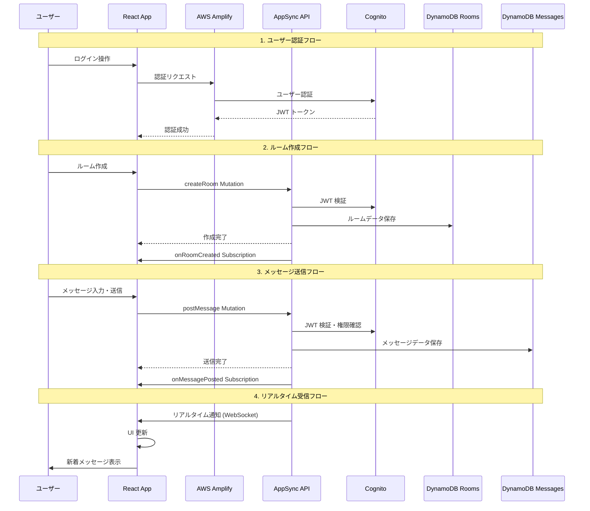

# 🌟 AWS AppSync×DynamoDB リアルタイムチャットアプリ

このプロジェクトは、**Amazon Web Services (AWS)** フルマネージドサービス（AppSync, DynamoDB, Cognito）＋IaC（Terraform）＋React（Amplify）で実装する**Slack風リアルタイムチャットアプリ**の学習用リポジトリです。

## 📱 何ができるアプリ？

- 🏠 **チャットルームを作る**: 好きな名前でルームを作成
- 💬 **リアルタイムでメッセージ**: LINEのように即座にメッセージが届く
- 👥 **複数人でチャット**: 同じルームにいる人全員でおしゃべり
- 📋 **ルーム一覧**: 自分が作ったルームや参加したルームを一覧表示
- ⏰ **メッセージ履歴**: 過去のメッセージもちゃんと見れる
- 🔐 **安全なログイン**: メールアドレスとパスワードで安全にログイン
- 🆕 **ユーザー登録**: 新しくアカウントを作成して利用開始

## � 技術スタック

- **GraphQL API**: AWS AppSync（スキーマ・JavaScriptリゾルバー）
- **データストア**: Amazon DynamoDB（Room/Messageテーブル＋GSI）
- **ユーザー認証**: Amazon Cognito（User Pool + Identity Pool）
- **フロントエンド**: React＋Vite＋AWS Amplify v6
- **IaC**: Terraform（Infrastructure as Code）
- **CI/CD**: GitHub Actions等（自動デプロイ可能）

## 🏗️ システムアーキテクチャ

### 全体アーキテクチャ図

```mermaid
architecture-beta
    group frontend(computer)[Frontend Layer]
    group aws(cloud)[AWS Cloud Services]
    group data(database)[Data Layer]
    group auth(shield)[Authentication]
    group infra(server)[Infrastructure]

    service react(internet)[React App] in frontend
    service amplify(server)[AWS Amplify] in frontend
    
    service appsync(api)[AppSync GraphQL API] in aws
    service cognito(users)[Cognito User Pool] in auth
    service identity(key)[Cognito Identity Pool] in auth
    
    service dynamodb_rooms(database)[DynamoDB Rooms] in data
    service dynamodb_messages(database)[DynamoDB Messages] in data
    
    service terraform(server)[Terraform] in infra
    service cloudwatch(monitor)[CloudWatch] in infra

    react:R --> L:amplify
    amplify:R --> L:appsync
    appsync:B --> T:cognito
    appsync:B --> T:identity
    appsync:R --> L:dynamodb_rooms
    appsync:R --> L:dynamodb_messages
    terraform:T --> B:appsync
    terraform:R --> L:dynamodb_rooms
    terraform:R --> L:dynamodb_messages
    terraform:T --> B:cognito
    cloudwatch:L --> R:appsync
```

### データフロー図



## 🚀 アプリを動かしてみよう！

### ステップ1: 必要なものをダウンロード
```bash
# Node.js の部品をダウンロード
npm install
```

### ステップ2: AWS（雲サービス）に必要な機能を作る
```bash
# 自動で作るスクリプトを実行
npm run deploy

# または手動で作る場合
cd infra
terraform init
terraform apply
```

### ステップ3: 設定ファイルを作る
```bash
# 設定例をコピーして、自分用の設定ファイルを作る
cp .env.example .env

# .env ファイルを開いて、ステップ2で表示された値を入力する
```

### ステップ4: アプリを起動する
```bash
# ローカルサーバーを起動（ブラウザで http://localhost:3000 を開く）
npm run dev
```

## 📁 プロジェクト構成

```
.
├── doc/                           # 📚 詳細ドキュメント・テンプレート
│   ├── readme_app_sync_chat_app.md    # 🏗️ 詳細技術仕様書（実装例・コード含む）
│   ├── API追加ガイド.md               # 📖 API追加の使い方ガイド
│   ├── API追加テンプレート.md          # 🚀 クイックスタートガイド
│   └── templates/                    # 📋 各種テンプレートファイル
│       ├── graphql-schema-template.md
│       ├── terraform-template.md
│       ├── javascript-resolver-template.md
│       └── react-frontend-template.md
├── src/                           # 📱 アプリの画面とロジック
│   ├── components/                # 🧩 画面の部品たち
│   │   ├── MyRooms.jsx           # 🏠 ルーム一覧画面
│   │   ├── ChatRoom.jsx          # 💬 チャット画面
│   │   └── AuthForm.jsx          # 🔐 ログイン・新規登録画面
│   ├── graphql/                   # 📡 サーバーとの通信設定
│   │   ├── queries.js            # 📖 データを「読む」ための命令
│   │   ├── mutations.js          # ✏️ データを「変更する」ための命令
│   │   └── subscriptions.js      # 🔔 リアルタイム通知の設定
│   ├── App.jsx                    # 🏠 アプリ全体をコントロールするメインファイル
│   └── main.jsx                   # 🚀 アプリの起動ファイル
├── infra/                         # ☁️ AWS（雲サービス）の設定
│   ├── main.tf                   # ⚙️ 基本設定
│   ├── dynamodb.tf               # 🗄️ データベースの設定
│   ├── appsync.tf                # 📡 API サーバーの設定
│   ├── cognito.tf                # 🔐 ユーザー認証の設定
│   ├── resolvers.tf              # 🔄 データ処理ロジックの設定
│   └── outputs.tf                # 📋 作成したサービスの情報出力
├── resolvers/                     # 🧠 サーバー側のデータ処理ロジック
├── schema.graphql                 # 📝 データの設計図
└── vite.config.js                # ⚡ 開発用ツールの設定
```

## 📚 ドキュメント構成

### 学習レベル別ガイド

1. **📖 このREADME**: 全体概要・クイックスタート
2. **📋 doc/API追加テンプレート.md**: 新機能追加のクイックガイド
3. **📖 doc/API追加ガイド.md**: 段階的な実装手順（詳細版）
4. **🏗️ doc/readme_app_sync_chat_app.md**: 技術仕様書（実装例・アーキテクチャ図付き）
5. **📂 doc/templates/**: 実装用テンプレートファイル集

### テンプレート活用方法

新しいAPI機能を追加したい場合：
1. `doc/API追加テンプレート.md` でクイックスタート
2. `doc/templates/` から必要なテンプレートをコピー
3. `doc/API追加ガイド.md` で詳細な手順を確認

## 🛠 実装されている機能

- ✅ **ユーザー認証**: Cognito完全統合（新規登録・ログイン・ログアウト）
- ✅ **チャットルームの作成**: 認証ユーザーが好きな名前でルームを作成
- ✅ **リアルタイムメッセージング**: WebSocketベースの瞬時メッセージ配信
- ✅ **ルーム一覧表示**: 自分が作成したルーム・参加したルームを分けて表示
- ✅ **メッセージ履歴表示**: DynamoDB GSIを活用した高速な履歴取得
- ✅ **リアルタイム通知**: GraphQL Subscriptionsによる新着通知
- ✅ **認可制御**: JWT トークンベースの安全なAPI アクセス制御

## 🏗️ アーキテクチャの特徴

### DynamoDB設計のポイント

- **Roomテーブル**: 
  - Primary Key: `id`
  - GSI: `owner-index` → 自分が作成したルームを高速検索
  
- **Messageテーブル**: 
  - Primary Key: `id`
  - GSI: `user-index` → 自分が発言したルームを取得
  - GSI: `room-index` (roomId + createdAt) → ルームのメッセージ一覧を時系列順で取得

### クエリパターンとパフォーマンス

1. **自分の作成ルーム一覧**: `owner-index`で1回のクエリ
2. **自分の参加ルーム一覧**: `user-index`でメッセージ履歴から抽出
3. **ルーム内メッセージ履歴**: `room-index`で時系列ソート済み取得

### GraphQL API 設計

```graphql
# 主要な型定義
type Room {
  id: ID!
  name: String!
  owner: String!
  createdAt: AWSDateTime!
}

type Message {
  id: ID!
  text: String!
  user: String!
  createdAt: AWSDateTime!
  roomId: ID!
}

# Mutation（データ変更）
type Mutation {
  createRoom(name: String!): Room
  postMessage(roomId: ID!, text: String!): Message
}

# Query（データ取得）
type Query {
  myOwnedRooms: [Room]
  myActiveRooms: [Room]
  listMessages(roomId: ID!, limit: Int): [Message]
}

# Subscription（リアルタイム通知）
type Subscription {
  onRoomCreated: Room
  onMessagePosted(roomId: ID!): Message
}
```

## 📚 技術の詳細説明

### フロントエンド技術

- 🎨 **React + Vite**: モダンなコンポーネントベース開発 + 高速ビルド
- ⚡ **AWS Amplify v6**: GraphQL クライアント + 認証連携
- 🔔 **GraphQL Subscriptions**: WebSocketベースのリアルタイム通信
- � **カスタムフック**: 状態管理とAPI呼び出しの効率化

### バックエンド技術

- 🌐 **AWS AppSync**: マネージドGraphQL API + リアルタイム機能
- 🧠 **JavaScript Resolvers**: VTL不要の直感的なリゾルバー実装
- 🗄️ **Amazon DynamoDB**: NoSQL + GSI戦略による高速クエリ
- 🔐 **Amazon Cognito**: JWT ベースの安全な認証・認可

### インフラ技術

- 🏗️ **Terraform**: Infrastructure as Code（IaC）
- ☁️ **AWS Serverless**: サーバー管理不要のフルマネージド構成
- 📊 **CloudWatch**: ログ管理 + パフォーマンス監視

## 🔧 開発・デバッグのベストプラクティス

### AppSync JavaScript リゾルバーのポイント

- **認証情報の取得**: `ctx.identity?.username`でログインユーザーを特定
- **エラーハンドリング**: バリデーション＋適切な例外スロー
- **GSI活用**: 複雑な検索条件はGSIで事前最適化
- **バッチ処理**: 複数ルーム情報取得時は`batchGet`で効率化

### フロントエンド実装のポイント

- **リアルタイム更新**: `onMessagePosted`サブスクリプションで即座に反映
- **状態管理**: `useState`+`useEffect`でローカル状態とサーバー状態を同期
- **パフォーマンス**: 必要な時のみAPIコール、適切なキャッシュ戦略
- **認証フロー**: Amplify Auth の状態管理でセッション維持

### Terraform でのリソース管理

- **モジュール分割**: 機能別にファイルを分割（cognito.tf, dynamodb.tf等）
- **アウトプット活用**: 他のリソースから参照可能な値を output で定義
- **環境別設定**: terraform.tfvars でパラメーター管理

## 🆕 Cognito認証システム

### 👤 新規ユーザー登録フロー
1. アプリにアクセス → 「新規登録」ボタンをクリック
2. 名前、メールアドレス、パスワードを入力
3. 登録したメールアドレスに確認コードが送信される
4. 確認コードを入力してアカウントを有効化

### 🔑 ログイン・セッション管理
1. メールアドレスとパスワードを入力
2. JWT トークンが自動で管理される
3. ブラウザリロード時もセッション維持
4. トークン期限切れ時は自動再認証

### 🚪 ログアウト
- 画面右上の「ログアウト」ボタンでセッション終了
- ローカルストレージからトークン情報をクリア

## 🚀 CI/CD・本番運用

### 自動デプロイフロー

1. **コード変更**: GraphQLスキーマ、リゾルバー、フロントエンド
2. **GitHub Actions**: Terraform + Amplify自動デプロイ
3. **テスト**: スキーマバリデーション、リゾルバーユニットテスト
4. **本番反映**: 段階的ロールアウト

### 監視・ログ戦略

- **CloudWatch**: AppSync APIのレスポンス時間、エラー率
- **X-Ray**: 分散トレーシングでボトルネック特定
- **DynamoDB Metrics**: 読み込み/書き込みキャパシティ監視
- **Cognito Analytics**: ユーザー認証の成功率・失敗率

### セキュリティ考慮事項

- **JWT 検証**: 全てのAPI コールでトークン検証
- **CORS 設定**: フロントエンドドメインのみ許可
- **Rate Limiting**: DDoS 攻撃対策
- **IAM Roles**: 最小権限の原則に基づく権限設定

## 🎓 学習ポイント（何を学べるか）

このプロジェクトを通して、以下の現代的なクラウドネイティブ開発技術を学ぶことができます：

### フロントエンド技術
- 📱 **React開発**: モダンなWebアプリの作り方
- ⚡ **リアルタイム通信**: WebSocketを使った即座のデータ同期
- � **認証連携**: JWTトークンベースの安全なAPI通信
- 🎯 **状態管理**: ローカル状態とサーバー状態の同期戦略

### バックエンド・API技術
- 📡 **GraphQL設計**: 効率的なAPI設計とスキーマ定義
- 🧠 **リゾルバー実装**: JavaScript でのビジネスロジック実装
- 🗄️ **NoSQL設計**: DynamoDB + GSI を活用したスケーラブルなデータ設計
- ⚡ **パフォーマンス最適化**: バッチ処理とクエリ最適化

### クラウド・インフラ技術
- ☁️ **サーバーレス開発**: AWSマネージドサービスの活用
- 🏗️ **Infrastructure as Code**: Terraformによる再現可能なインフラ構築
- 📊 **監視・運用**: CloudWatch を使った本格的な監視体制
- 🛡️ **セキュリティ**: 認証・認可・アクセス制御の実装

## 📝 今後の改善予定・拡張案

### 🚀 機能拡張
- [x] 🔐 **Cognito認証の実装**: より安全なユーザー認証システム ✅ **完了！**
- [ ] 🛡️ **高度な認可制御**: ルームオーナー権限、招待制ルーム
- [ ] 📎 **ファイル添付機能**: S3 + Pre-signed URL による画像・動画送信
- [ ] 😊 **絵文字・リアクション**: メッセージに対するリアクション機能
- [ ] 🔔 **プッシュ通知**: SNS + Service Worker によるブラウザ通知
- [ ] 👥 **ユーザープロフィール**: アバター画像、ステータスメッセージ
- [ ] 🔍 **メッセージ検索**: ElasticSearch 連携による高度な検索機能

### ⚡ パフォーマンス最適化
- [ ] 🗄️ **DynamoDB設計見直し**: 複合GSI、パーティション分散戦略
- [ ] 📡 **GraphQL最適化**: DataLoader、N+1問題解決
- [ ] 🌐 **CDN活用**: CloudFront + S3 で静的コンテンツ配信
- [ ] 💾 **キャッシュ戦略**: AppSync Cache、ブラウザキャッシュ最適化

### 🧪 開発効率向上
- [ ] � **TypeScript導入**: GraphQL Code Generator による型安全性
- [ ] 🧪 **テスト自動化**: Jest + React Testing Library
- [ ] 🎭 **E2Eテスト**: Playwright + モックAPI
- [ ] � **モバイル対応**: React Native + Expo による統合開発

### 🏗️ DevOps・運用改善  
- [ ] � **デプロイメント自動化**: GitHub Actions による完全自動化
- [ ] 🌍 **マルチ環境対応**: dev/staging/prod 環境の分離
- [ ] � **詳細監視**: カスタムメトリクス、アラート設定
- [ ] � **セキュリティ強化**: WAF、セキュリティヘッダー

## 🆘 トラブルシューティング

### よくある問題と解決方法

#### 🔧 セットアップ関連
1. **「npm install でエラーが出る」**
   - Node.js 18+ がインストールされているか確認
   - `npm cache clean --force` を試してみる
   - `rm -rf node_modules package-lock.json && npm install`

2. **「terraform apply でエラーが出る」**
   - AWS CLI の認証情報が正しく設定されているか確認: `aws sts get-caller-identity`
   - AWS の利用権限があるか確認（IAM Policy）
   - リージョン設定を確認: `aws configure get region`

#### 🖥️ 実行時エラー  
3. **「アプリが真っ白で何も表示されない」**
   - ブラウザの開発者ツール（F12）でコンソールエラーを確認
   - `.env` ファイルの設定値が正しいか確認
   - Cognito User Pool ID, App Client ID の確認

4. **「認証エラーが発生する」**
   - Cognito User Pool の設定確認
   - JWT トークンの有効期限確認
   - CORS 設定の確認（AppSync API）

#### 📡 API関連
5. **「GraphQL クエリでエラーが出る」**
   - AppSync API の認証設定確認
   - リゾルバーの実装ログ確認（CloudWatch）
   - DynamoDB テーブルとGSIの存在確認

6. **「リアルタイム通信が動かない」**
   - Subscription の認証設定確認  
   - WebSocket 接続の確認
   - ネットワーク環境（プロキシ・ファイアウォール）の確認

### 詳細デバッグ方法

#### CloudWatch でのログ確認
```bash
# AppSync のログを確認
aws logs describe-log-groups --log-group-name-prefix "/aws/appsync"

# 特定のログストリームを確認  
aws logs get-log-events --log-group-name "/aws/appsync/apis/[API-ID]" --log-stream-name "[STREAM-NAME]"
```

#### DynamoDB データの確認
```bash
# テーブル一覧確認
aws dynamodb list-tables

# テーブルの内容確認
aws dynamodb scan --table-name Room --limit 10
aws dynamodb scan --table-name Message --limit 10
```

### 追加学習リソース

#### 🏗️ アーキテクチャ・設計
- 📖 **AWS Well-Architected Framework**: https://aws.amazon.com/architecture/well-architected/
- 🏛️ **DynamoDB設計パターン**: https://docs.aws.amazon.com/amazondynamodb/latest/developerguide/best-practices.html
- 📡 **GraphQL ベストプラクティス**: https://graphql.org/learn/best-practices/

#### 💻 実装技術
- 📖 **React公式ドキュメント**: https://ja.react.dev/learn
- ☁️ **AWS AppSync 開発者ガイド**: https://docs.aws.amazon.com/appsync/
- 🧠 **JavaScript Resolvers**: https://docs.aws.amazon.com/appsync/latest/devguide/resolver-context-reference.html
- 🏗️ **Terraform AWS Provider**: https://registry.terraform.io/providers/hashicorp/aws/latest/docs

#### 🔐 セキュリティ
- 🛡️ **Amazon Cognito 開発者ガイド**: https://docs.aws.amazon.com/cognito/
- 🔒 **JWT セキュリティベストプラクティス**: https://auth0.com/blog/a-look-at-the-latest-draft-for-jwt-bcp/

#### 📊 運用・監視
- 📈 **CloudWatch 最適化ガイド**: https://docs.aws.amazon.com/AmazonCloudWatch/
- 🔍 **AWS X-Ray による分散トレーシング**: https://docs.aws.amazon.com/xray/

## 💡 コントリビューション・フィードバック

### 貢献方法
1. 🍴 **Fork**: このリポジトリをフォーク
2. 🌿 **ブランチ作成**: `git checkout -b feature/amazing-feature`
3. 💻 **実装**: 機能追加・バグ修正・ドキュメント改善
4. 🧪 **テスト**: 変更内容をテスト
5. 📝 **コミット**: `git commit -m 'Add some amazing feature'`
6. 🚀 **プッシュ**: `git push origin feature/amazing-feature`
7. 🔄 **プルリクエスト**: GitHub でプルリクエストを作成

### フィードバック歓迎
- 🐛 **バグ報告**: Issues でバグを報告
- 💡 **機能要望**: 新機能のアイデアを共有
- 📚 **ドキュメント改善**: わかりにくい箇所の指摘
- 🎯 **パフォーマンス改善**: 最適化の提案

## 📄 ライセンス・お問い合わせ

- 🆓 **ライセンス**: MIT License - 学習・個人利用・商用利用自由
- 💬 **質問・相談**: [GitHub Issues](https://github.com/your-repo/issues) でお気軽にどうぞ
- 🤝 **コラボレーション**: プルリクエストや機能提案大歓迎！
- 📧 **直接連絡**: [your-email@example.com](mailto:your-email@example.com)

---

**🌟 Happy Coding! モダンなクラウドネイティブ開発を楽しく学びましょう！ 🌟**

### 🚀 Quick Start コマンド

```bash
# 1. 依存関係インストール
npm install

# 2. AWSリソース作成（初回のみ）
npm run deploy

# 3. 環境変数設定
cp .env.example .env
# .env ファイルを編集して Terraform output の値を設定

# 4. 開発サーバー起動
npm run dev
# ✨ http://localhost:3000 でアプリが起動！
```
