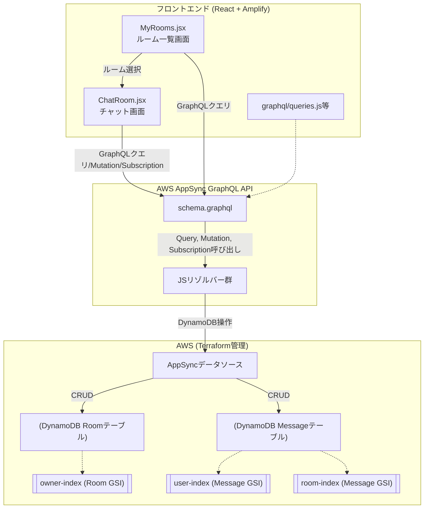

# AppSync×DynamoDBチャットアプリ構成成果物サマリ

---

## 1. GraphQLスキーマ

```graphql
# Message型: チャットメッセージ
 type Message {
   id: ID!
   text: String!
   user: String!
   createdAt: AWSDateTime!
   roomId: ID!
 }

# Room型: チャットルーム
 type Room {
   id: ID!
   name: String!
   owner: String!
   createdAt: AWSDateTime!
   messages: [Message]
 }

# Mutation: 投稿・ルーム作成
 type Mutation {
   createRoom(name: String!): Room
   postMessage(roomId: ID!, text: String!): Message
 }

# Query: 取得系
 type Query {
   myOwnedRooms: [Room]
   myActiveRooms: [Room]
   getRoom(id: ID!): Room
   listMessages(roomId: ID!, limit: Int): [Message]
 }

# Subscription: リアルタイム受信
 type Subscription {
   onRoomCreated: Room @aws_subscribe(mutations: ["createRoom"])
   onMessagePosted(roomId: ID!): Message @aws_subscribe(mutations: ["postMessage"])
 }
```

---

## 2. DynamoDBテーブル設計（Terraform）

### Roomテーブル
```hcl
resource "aws_dynamodb_table" "room" {
  name         = "Room"
  billing_mode = "PAY_PER_REQUEST"
  hash_key     = "id"

  attribute { name = "id"; type = "S" }
  attribute { name = "owner"; type = "S" }
  attribute { name = "createdAt"; type = "S" }

  global_secondary_index {
    name            = "owner-index"
    hash_key        = "owner"
    projection_type = "ALL"
  }
}
```

### Messageテーブル
```hcl
resource "aws_dynamodb_table" "message" {
  name         = "Message"
  billing_mode = "PAY_PER_REQUEST"
  hash_key     = "id"

  attribute { name = "id"; type = "S" }
  attribute { name = "roomId"; type = "S" }
  attribute { name = "user"; type = "S" }
  attribute { name = "createdAt"; type = "S" }

  global_secondary_index {
    name            = "user-index"
    hash_key        = "user"
    projection_type = "ALL"
  }

  global_secondary_index {
    name            = "room-index"
    hash_key        = "roomId"
    range_key       = "createdAt"
    projection_type = "ALL"
  }
}
```

---

## 3. AppSyncリゾルバー例（JS）

### createRoom Mutation
```js
export const handler = (ctx) => {
  const username = ctx.identity?.username || "guest";
  const id = uuid();
  const createdAt = new Date().toISOString();
  return {
    operation: 'PutItem',
    key: { id },
    attributeValues: {
      id, name: ctx.args.name, owner: username, createdAt
    }
  };
};
```

### myOwnedRooms Query
```js
export const handler = (ctx) => {
  const username = ctx.identity?.username;
  if (!username) throw new Error("認証ユーザーのみ");
  return {
    operation: "Query",
    query: { owner: { eq: username } },
    index: "owner-index"
  };
};
```

### myActiveRooms Query（2段階クエリ例・擬似コード）
```js
export const handler = async (ctx) => {
  const username = ctx.identity?.username;
  if (!username) throw new Error("認証ユーザーのみ");
  // 1. 自分の投稿したメッセージ(roomIdリスト抽出)
  const messagesResult = await ctx.appsync.dynamodb.query({
    operation: "Query",
    index: "user-index",
    query: { user: { eq: username } },
    limit: 1000
  });
  const roomIds = [...new Set(messagesResult.items.map(msg => msg.roomId))];
  // 2. ルーム情報をまとめて取得
  const roomsResult = await ctx.appsync.dynamodb.batchGet({
    keys: roomIds.map(id => ({ id })),
    table: "Room"
  });
  return roomsResult.items;
};
```

### postMessage Mutation
```js
export const handler = (ctx) => {
  const user = ctx.identity?.username || "guest";
  if (!ctx.args.text || ctx.args.text.length > 500) {
    throw new Error("textは1～500文字で入力してください");
  }
  const id = uuid();
  const createdAt = new Date().toISOString();
  return {
    operation: 'PutItem',
    key: { id },
    attributeValues: {
      id,
      text: ctx.args.text,
      user,
      createdAt,
      roomId: ctx.args.roomId
    }
  };
};
```

---

## 4. フロントエンド主要ファイル例（React+Amplify）

### MyRooms.jsx
```jsx
import React, { useEffect, useState } from 'react';
import { generateClient } from 'aws-amplify/api';
import { myOwnedRooms, myActiveRooms } from './graphql/queries';

const client = generateClient();

export default function MyRooms({ username, onRoomSelect }) {
  const [ownedRooms, setOwnedRooms] = useState([]);
  const [activeRooms, setActiveRooms] = useState([]);

  useEffect(() => {
    client.graphql({ query: myOwnedRooms })
      .then(res => setOwnedRooms(res.data.myOwnedRooms));
    client.graphql({ query: myActiveRooms })
      .then(res => setActiveRooms(res.data.myActiveRooms));
  }, []);

  const allRooms = [
    ...ownedRooms,
    ...activeRooms.filter(r => !ownedRooms.some(or => or.id === r.id))
  ];

  return (
    <div style={{ maxWidth: 480, margin: "0 auto" }}>
      <h3>自分のルーム</h3>
      {allRooms.length === 0 && <div>参加したルームはありません。</div>}
      <ul>
        {allRooms.map(room => (
          <li key={room.id}>
            <button
              style={{ background: "#fafafa", border: "1px solid #ccc", padding: 8, borderRadius: 8, width: "100%", textAlign: "left", margin: "6px 0" }}
              onClick={() => onRoomSelect(room.id)}
            >
              <b>{room.name}</b> <br />
              ルームID: {room.id} <br />
              作成者: {room.owner} <br />
              作成日: {new Date(room.createdAt).toLocaleString()}
            </button>
          </li>
        ))}
      </ul>
    </div>
  );
}
```

### ChatRoom.jsx
（前述のものを参照、AmplifyクライアントでlistMessages, postMessage, onMessagePostedを利用）

---

## 5. 関係図（アーキテクチャ概要）



