# チャットアプリ - システムアーキテクチャ図集

このドキュメントでは、チャットアプリの様々なアーキテクチャ図をMermaidを使用して詳細に説明します。

## 1. 全体アーキテクチャ

### 1.1 高レベルアーキテクチャ

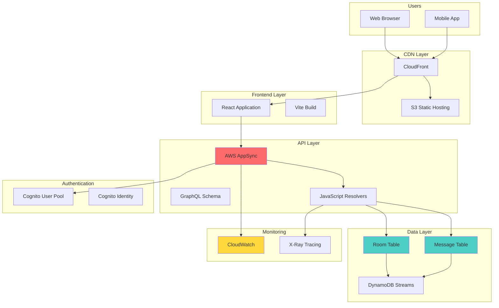

### 1.2 データフロー概要

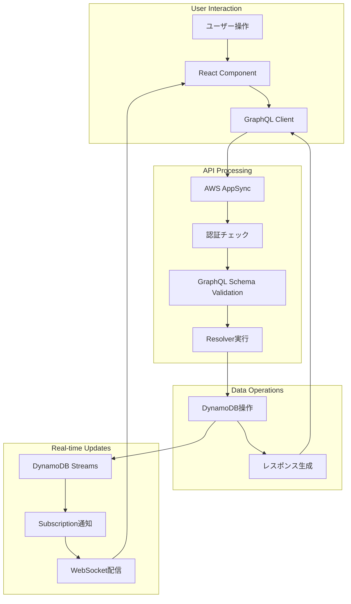

## 2. 認証・認可フロー

### 2.1 ユーザー認証フロー

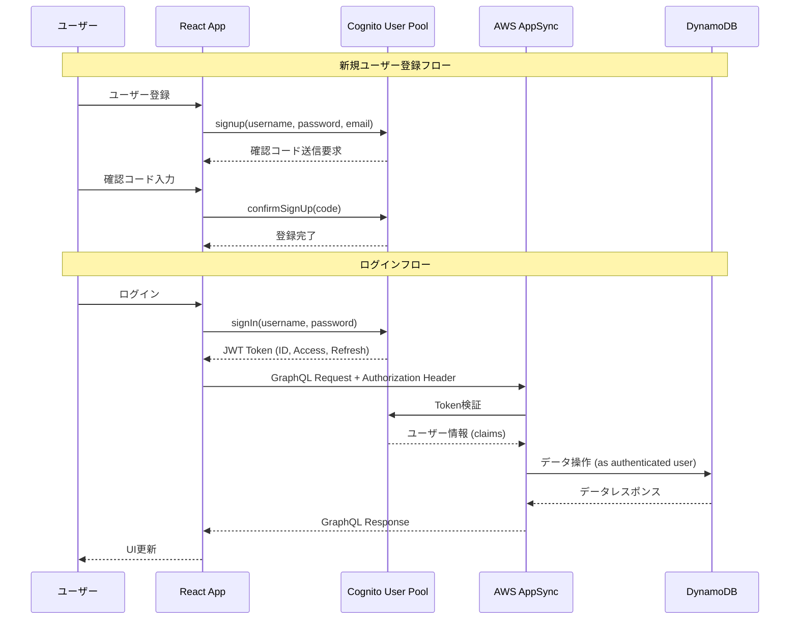

### 2.2 トークンリフレッシュフロー

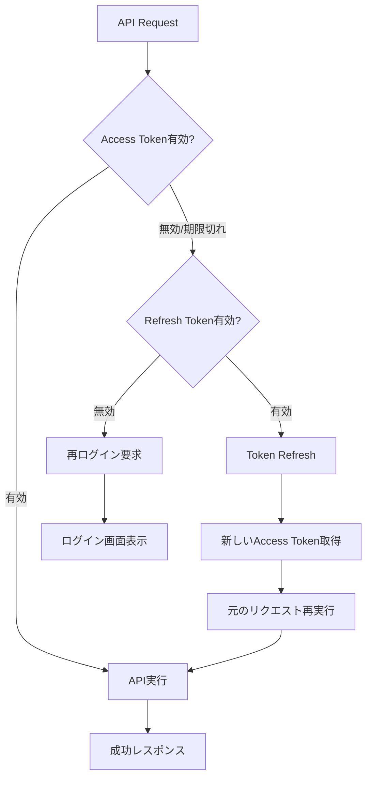

## 3. リアルタイム通信アーキテクチャ

### 3.1 WebSocket接続とSubscription

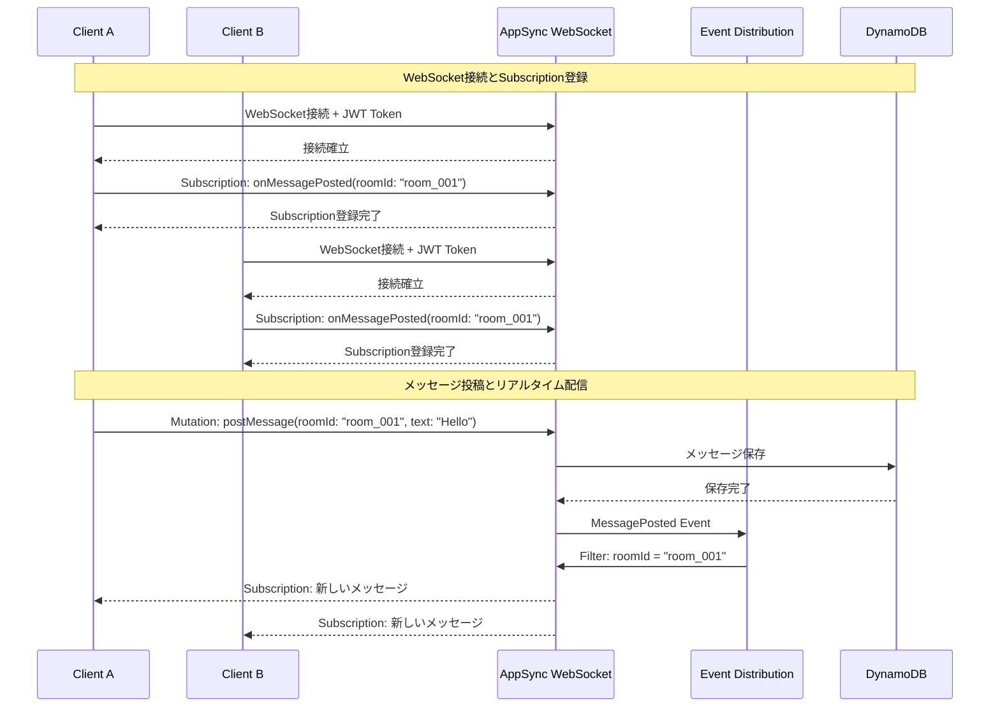

### 3.2 イベント配信メカニズム

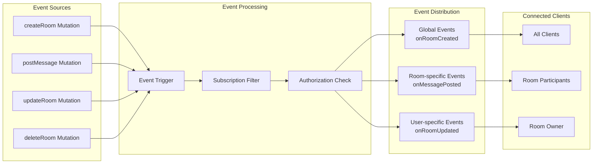

## 4. データ処理パイプライン

### 4.1 メッセージ処理パイプライン

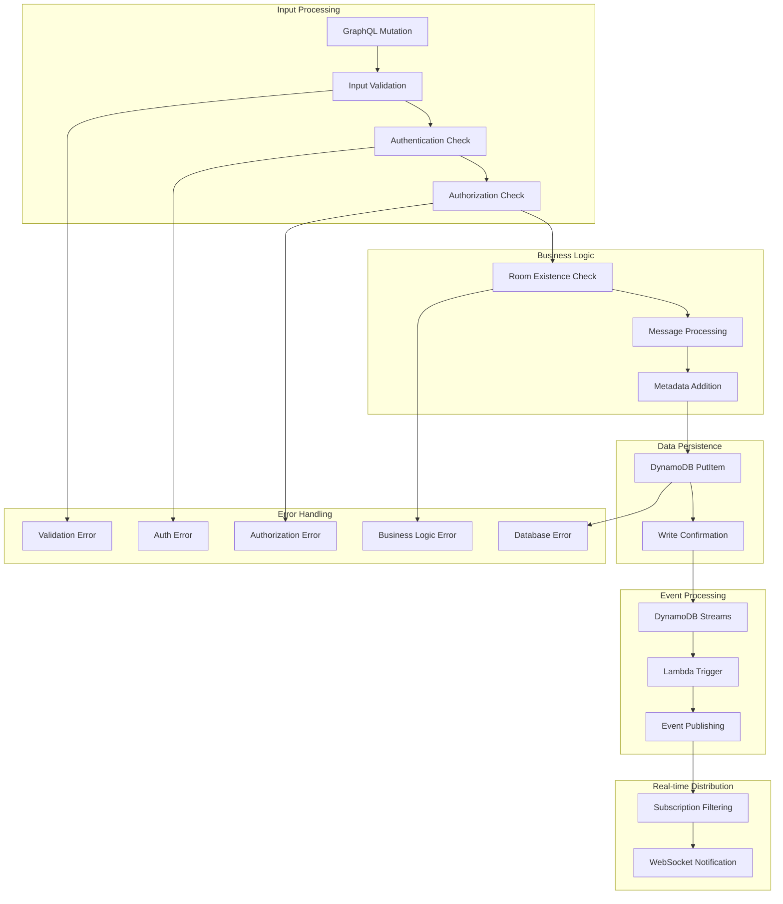

### 4.2 複雑クエリ処理（myActiveRooms）

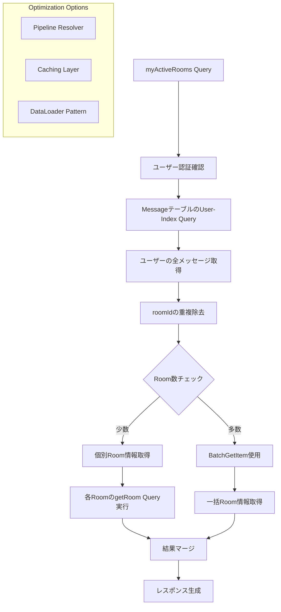

## 5. 監視・ログ・メトリクス

### 5.1 監視アーキテクチャ

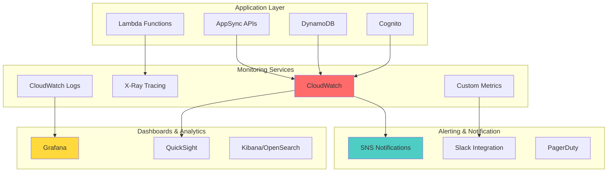

### 5.2 ログ集約パイプライン

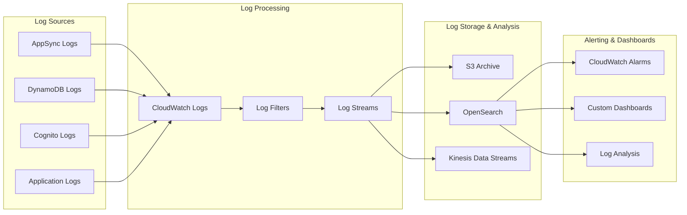

## 6. セキュリティアーキテクチャ

### 6.1 多層防御アーキテクチャ

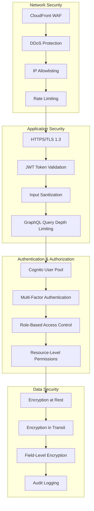

### 6.2 データ暗号化フロー

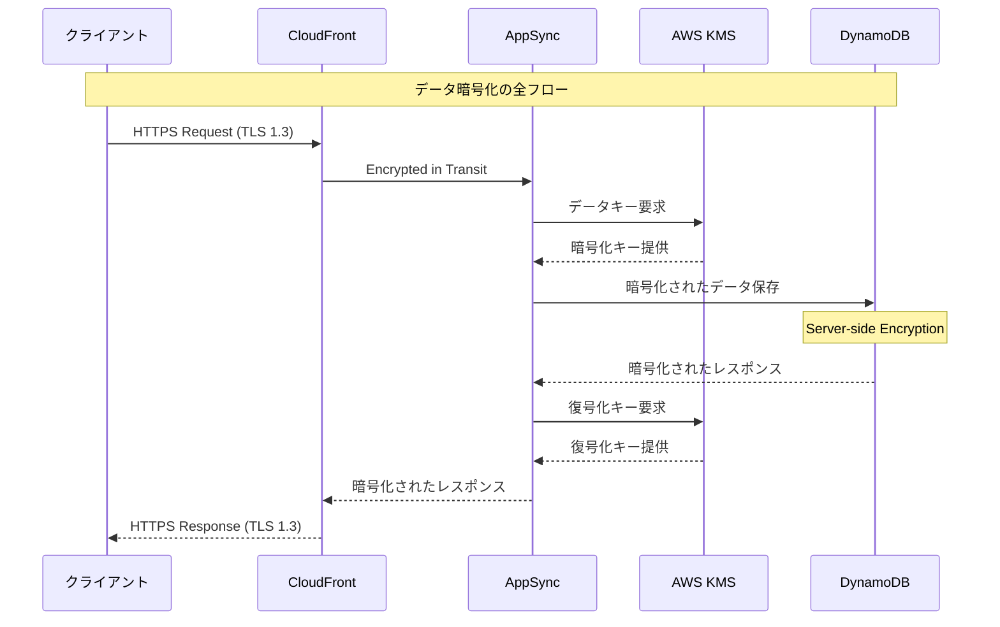

## 8. 災害復旧・バックアップアーキテクチャ

### 8.1 マルチリージョン構成

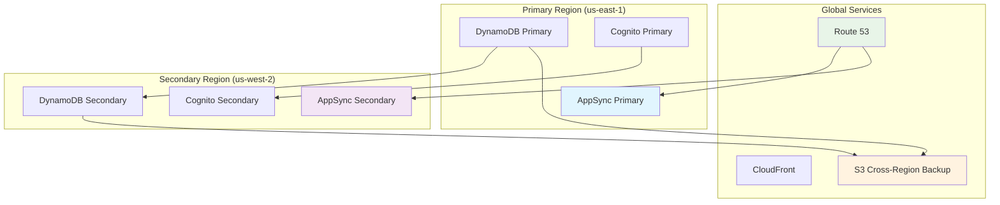

### 8.2 自動フェイルオーバー仕組み

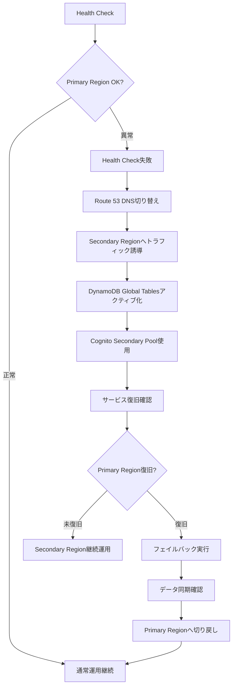

## 9. 開発・デプロイメントパイプライン

### 9.1 CI/CDパイプライン

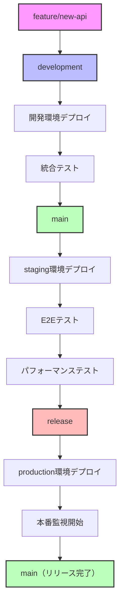

### 9.2 デプロイメントアーキテクチャ

```mermaid
flowchart LR
    subgraph "Source Control"
        A[GitHub Repository] --> B[Pull Request]
        B --> C[Code Review]
        C --> D[Merge to Main]
    end
    
    subgraph "CI Pipeline"
        D --> E[GitHub Actions]
        E --> F[Linting & Testing]
        F --> G[Build Application]
        G --> H[Infrastructure as Code]
    end
    
    subgraph "CD Pipeline"
        H --> I[Deploy to Staging]
        I --> J[Integration Tests]
        J --> K[Security Scans]
        K --> L[Deploy to Production]
    end
    
    subgraph "Monitoring"
        L --> M[Deployment Monitoring]
        M --> N[Health Checks]
        N --> O[Rollback if Needed]
    end
```

---

*このドキュメントは、チャットアプリのシステムアーキテクチャを包括的に図解しています。各図は実際の実装と対応しており、システムの理解と保守に役立ちます。*
