# チャットアプリ - システムアーキテクチャ図集

このドキュメントでは、チャットアプリの様々なアーキテクチャ図をMermaidを使用して詳細に説明します。

## 1. 全体アーキテクチャ

### 1.1 高レベルアーキテクチャ


### 1.2 データフロー概要

```mermaid
flowchart TB
    subgraph "User Interaction"
        A[ユーザー操作] --> B[React Component]
        B --> C[GraphQL Client]
    end
    
    subgraph "API Processing"
        C --> D[AWS AppSync]
        D --> E[認証チェック]
        E --> F[GraphQL Schema Validation]
        F --> G[Resolver実行]
    end
    
    subgraph "Data Operations"
        G --> H[DynamoDB操作]
        H --> I[レスポンス生成]
    end
    
    subgraph "Real-time Updates"
        H --> J[DynamoDB Streams]
        J --> K[Subscription通知]
        K --> L[WebSocket配信]
    end
    
    I --> C
    L --> B
```

## 2. 認証・認可フロー

### 2.1 ユーザー認証フロー

```mermaid
sequenceDiagram
    participant User as ユーザー
    participant React as React App
    participant Cognito as Cognito User Pool
    participant AppSync as AWS AppSync
    participant DynamoDB as DynamoDB
    
    Note over User,DynamoDB: 新規ユーザー登録フロー
    
    User->>React: ユーザー登録
    React->>Cognito: signup(username, password, email)
    Cognito-->>React: 確認コード送信要求
    
    User->>React: 確認コード入力
    React->>Cognito: confirmSignUp(code)
    Cognito-->>React: 登録完了
    
    Note over User,DynamoDB: ログインフロー
    
    User->>React: ログイン
    React->>Cognito: signIn(username, password)
    Cognito-->>React: JWT Token (ID, Access, Refresh)
    
    React->>AppSync: GraphQL Request + Authorization Header
    AppSync->>Cognito: Token検証
    Cognito-->>AppSync: ユーザー情報 (claims)
    
    AppSync->>DynamoDB: データ操作 (as authenticated user)
    DynamoDB-->>AppSync: データレスポンス
    AppSync-->>React: GraphQL Response
    React-->>User: UI更新
```

### 2.2 トークンリフレッシュフロー

```mermaid
flowchart TB
    A[API Request] --> B{Access Token有効?}
    B -->|有効| C[API実行]
    B -->|無効/期限切れ| D{Refresh Token有効?}
    
    D -->|有効| E[Token Refresh]
    D -->|無効| F[再ログイン要求]
    
    E --> G[新しいAccess Token取得]
    G --> H[元のリクエスト再実行]
    H --> C
    
    F --> I[ログイン画面表示]
    C --> J[成功レスポンス]
```

## 3. リアルタイム通信アーキテクチャ

### 3.1 WebSocket接続とSubscription

```mermaid
sequenceDiagram
    participant ClientA as Client A
    participant ClientB as Client B
    participant AppSync as AppSync WebSocket
    participant EventBus as Event Distribution
    participant DynamoDB as DynamoDB
    
    Note over ClientA,DynamoDB: WebSocket接続とSubscription登録
    
    ClientA->>AppSync: WebSocket接続 + JWT Token
    AppSync-->>ClientA: 接続確立
    
    ClientA->>AppSync: Subscription: onMessagePosted(roomId: "room_001")
    AppSync-->>ClientA: Subscription登録完了
    
    ClientB->>AppSync: WebSocket接続 + JWT Token  
    AppSync-->>ClientB: 接続確立
    
    ClientB->>AppSync: Subscription: onMessagePosted(roomId: "room_001")
    AppSync-->>ClientB: Subscription登録完了
    
    Note over ClientA,DynamoDB: メッセージ投稿とリアルタイム配信
    
    ClientA->>AppSync: Mutation: postMessage(roomId: "room_001", text: "Hello")
    AppSync->>DynamoDB: メッセージ保存
    DynamoDB-->>AppSync: 保存完了
    
    AppSync->>EventBus: MessagePosted Event
    EventBus->>AppSync: Filter: roomId = "room_001"
    
    AppSync-->>ClientA: Subscription: 新しいメッセージ
    AppSync-->>ClientB: Subscription: 新しいメッセージ
```

### 3.2 イベント配信メカニズム


## 4. データ処理パイプライン

### 4.1 メッセージ処理パイプライン


### 4.2 複雑クエリ処理（myActiveRooms）

```mermaid
flowchart TB
    A[myActiveRooms Query] --> B[ユーザー認証確認]
    B --> C[MessageテーブルのUser-Index Query]
    C --> D[ユーザーの全メッセージ取得]
    D --> E[roomIdの重複除去]
    E --> F{Room数チェック}
    
    F -->|少数| G[個別Room情報取得]
    F -->|多数| H[BatchGetItem使用]
    
    G --> I[各RoomのgetRoom Query実行]
    H --> J[一括Room情報取得]
    
    I --> K[結果マージ]
    J --> K
    
    K --> L[レスポンス生成]
    
    subgraph "Optimization Options"
        M[Pipeline Resolver]
        N[Caching Layer]
        O[DataLoader Pattern]
    end
```

## 5. 監視・ログ・メトリクス

### 5.1 監視アーキテクチャ


### 5.2 ログ集約パイプライン


## 6. セキュリティアーキテクチャ

### 6.1 多層防御アーキテクチャ


### 6.2 データ暗号化フロー

```mermaid
sequenceDiagram
    participant Client as クライアント
    participant CloudFront as CloudFront
    participant AppSync as AppSync
    participant KMS as AWS KMS
    participant DynamoDB as DynamoDB
    
    Note over Client,DynamoDB: データ暗号化の全フロー
    
    Client->>CloudFront: HTTPS Request (TLS 1.3)
    CloudFront->>AppSync: Encrypted in Transit
    
    AppSync->>KMS: データキー要求
    KMS-->>AppSync: 暗号化キー提供
    
    AppSync->>DynamoDB: 暗号化されたデータ保存
    Note over DynamoDB: Server-side Encryption
    
    DynamoDB-->>AppSync: 暗号化されたレスポンス
    AppSync->>KMS: 復号化キー要求
    KMS-->>AppSync: 復号化キー提供
    
    AppSync-->>CloudFront: 暗号化されたレスポンス
    CloudFront-->>Client: HTTPS Response (TLS 1.3)
```

## 8. 災害復旧・バックアップアーキテクチャ

### 8.1 マルチリージョン構成


### 8.2 自動フェイルオーバー仕組み

```mermaid
flowchart TB
    A[Health Check] --> B{Primary Region OK?}
    B -->|正常| C[通常運用継続]
    B -->|異常| D[Health Check失敗]
    
    D --> E[Route 53 DNS切り替え]
    E --> F[Secondary Regionへトラフィック誘導]
    F --> G[DynamoDB Global Tablesアクティブ化]
    G --> H[Cognito Secondary Pool使用]
    
    H --> I[サービス復旧確認]
    I --> J{Primary Region復旧?}
    J -->|復旧| K[フェイルバック実行]
    J -->|未復旧| L[Secondary Region継続運用]
    
    K --> M[データ同期確認]
    M --> N[Primary Regionへ切り戻し]
    N --> C
```

## 9. 開発・デプロイメントパイプライン

### 9.1 CI/CDパイプライン

```mermaid
flowchart TD
    A["feature/new-api"] --> B["development"]
    B --> C["開発環境デプロイ"]
    C --> D["統合テスト"]
    D --> E["main"]
    E --> F["staging環境デプロイ"]
    F --> G["E2Eテスト"]
    G --> H["パフォーマンステスト"]
    H --> I["release"]
    I --> J["production環境デプロイ"]
    J --> K["本番監視開始"]
    K --> L["main（リリース完了）"]
    
    style A fill:#f9f,stroke:#333,stroke-width:2px
    style B fill:#bbf,stroke:#333,stroke-width:2px
    style E fill:#bfb,stroke:#333,stroke-width:2px
    style I fill:#fbb,stroke:#333,stroke-width:2px
    style L fill:#bfb,stroke:#333,stroke-width:2px
```

### 9.2 デプロイメントアーキテクチャ


## 📁 インフラストラクチャ最適化アーキテクチャ

### Terraform最適化後のファイル構造

```mermaid
flowchart TB
    subgraph "Infrastructure as Code (最適化済み)"
        subgraph "設定管理"
            MAIN[main.tf<br/>プロバイダー設定]
            VARS[variables.tf<br/>変数定義・バリデーション]
            LOCALS[locals.tf<br/>計算値・変換]
            OUTPUTS[outputs.tf<br/>出力値定義]
            TFVARS[terraform.tfvars.example<br/>設定テンプレート]
        end
        
        subgraph "セキュリティ"
            IAM[iam.tf<br/>権限制御・最小権限]
        end
        
        subgraph "サービス別設定"
            DDB[dynamodb.tf<br/>DynamoDB最適化]
            COGNITO[cognito_optimized.tf<br/>認証強化]
            APPSYNC[appsync_optimized.tf<br/>GraphQL API最適化]
            LAMBDA[lambda_optimized.tf<br/>Lambda関数最適化]
            RESOLVERS[resolvers_optimized.tf<br/>リゾルバー設定]
        end
        
        subgraph "テンプレート"
            TEMPLATES[resolver_templates/<br/>リゾルバーテンプレート]
        end
    end
    
    MAIN --> VARS
    VARS --> LOCALS
    LOCALS --> OUTPUTS
    
    IAM --> DDB
    IAM --> COGNITO
    IAM --> APPSYNC
    IAM --> LAMBDA
    
    APPSYNC --> RESOLVERS
    RESOLVERS --> TEMPLATES
```

### インフラ最適化の効果

```mermaid
flowchart LR
    subgraph "Before (最適化前)"
        B1[単一ファイル混在]
        B2[基本設定のみ]
        B3[手動設定多数]
        B4[最小限の監視]
    end
    
    subgraph "After (最適化後)"
        A1[責務別ファイル分割]
        A2[包括的設定・監視]
        A3[自動化・バリデーション]
        A4[CloudWatch統合]
    end
    
    B1 --> A1
    B2 --> A2  
    B3 --> A3
    B4 --> A4
    
    A1 --> BENEFIT1[保守性向上]
    A2 --> BENEFIT2[運用効率化]
    A3 --> BENEFIT3[品質保証]
    A4 --> BENEFIT4[監視強化]
```

### 環境別設定管理

```mermaid
flowchart TB
    subgraph "Development Environment"
        DEV_CONFIG[terraform.tfvars<br/>environment = "dev"]
        DEV_FEATURES[
            - API Key認証併用
            - 短期ログ保持
            - 最小リソース
            - デバッグログ
        ]
    end
    
    subgraph "Production Environment"
        PROD_CONFIG[terraform.tfvars<br/>environment = "prod"]
        PROD_FEATURES[
            - Cognito認証のみ
            - 長期ログ保持
            - スケーラブルリソース
            - CloudWatch強化
            - X-Ray有効
        ]
    end
    
    subgraph "Shared Infrastructure"
        SHARED[
            - DynamoDB設計
            - IAM最小権限
            - 暗号化設定
            - タグ戦略
        ]
    end
    
    DEV_CONFIG --> SHARED
    PROD_CONFIG --> SHARED
```

### セキュリティ強化アーキテクチャ

```mermaid
flowchart TB
    subgraph "セキュリティ層"
        subgraph "認証・認可"
            COGNITO_SEC[Cognito強化<br/>- MFA対応<br/>- パスワードポリシー<br/>- アカウント復旧]
            IAM_SEC[IAM最小権限<br/>- サービス別ロール<br/>- 条件付きアクセス<br/>- リソース限定]
        end
        
        subgraph "データ保護"
            ENCRYPT[暗号化<br/>- DynamoDB暗号化<br/>- Lambda暗号化<br/>- ログ暗号化]
            BACKUP[バックアップ<br/>- Point-in-Time Recovery<br/>- 自動バックアップ<br/>- 環境別設定]
        end
        
        subgraph "監視・追跡"
            CLOUDWATCH[CloudWatch<br/>- ログ監視<br/>- アラーム設定<br/>- ダッシュボード]
            XRAY[X-Ray<br/>- 分散トレーシング<br/>- パフォーマンス監視<br/>- エラー追跡]
        end
    end
    
    COGNITO_SEC --> IAM_SEC
    IAM_SEC --> ENCRYPT
    ENCRYPT --> BACKUP
    BACKUP --> CLOUDWATCH
    CLOUDWATCH --> XRAY
```

---

*このドキュメントは、チャットアプリのシステムアーキテクチャを包括的に図解しています。Terraform最適化により、保守性・安全性・運用効率が大幅に向上しました。*
