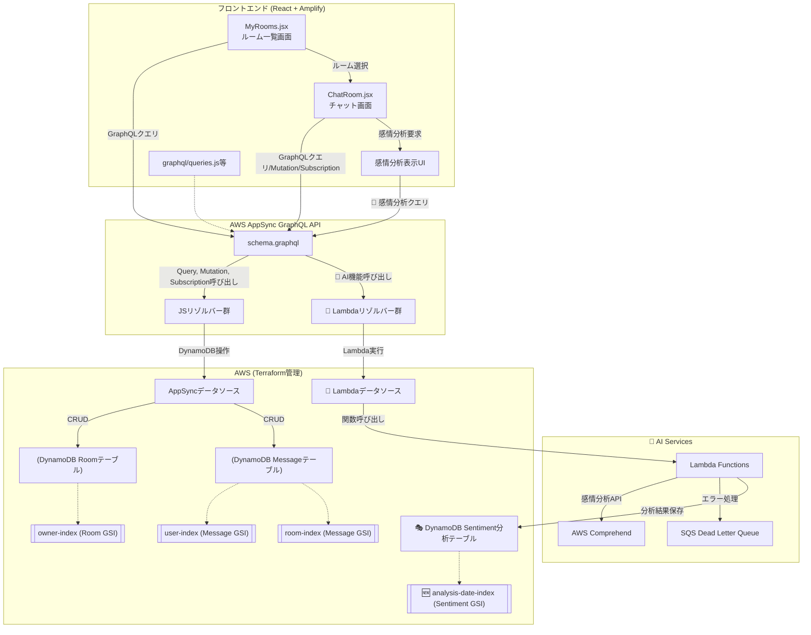
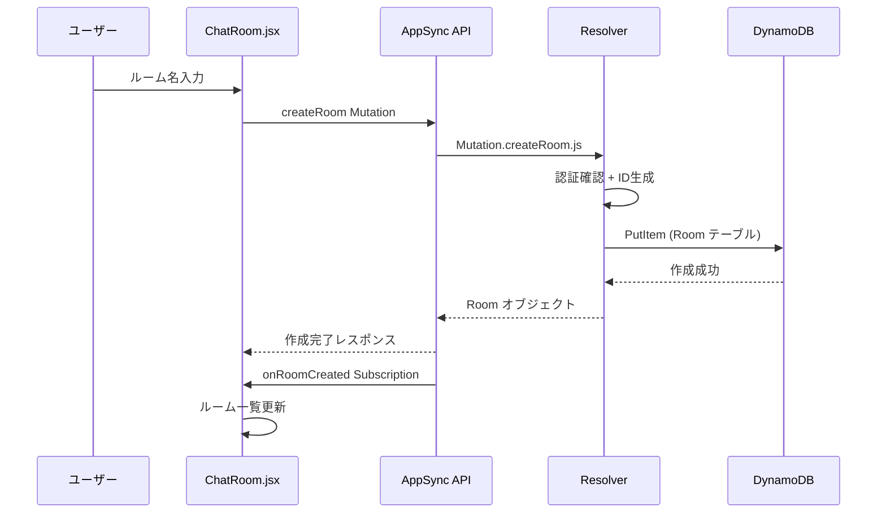
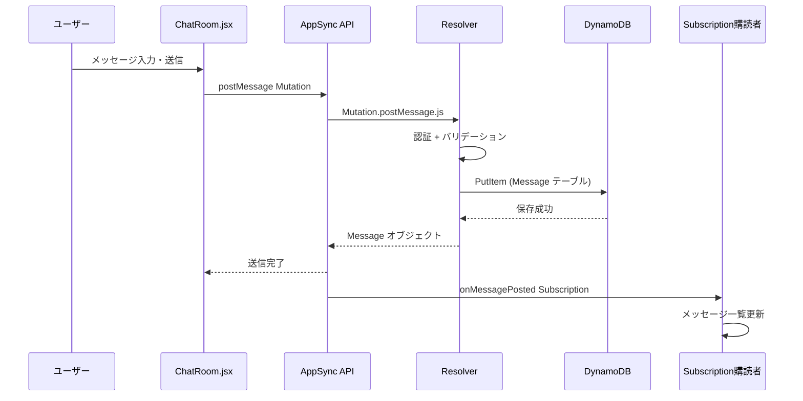
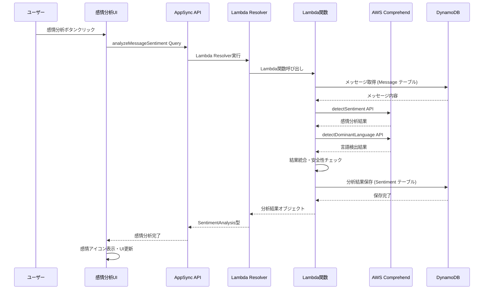
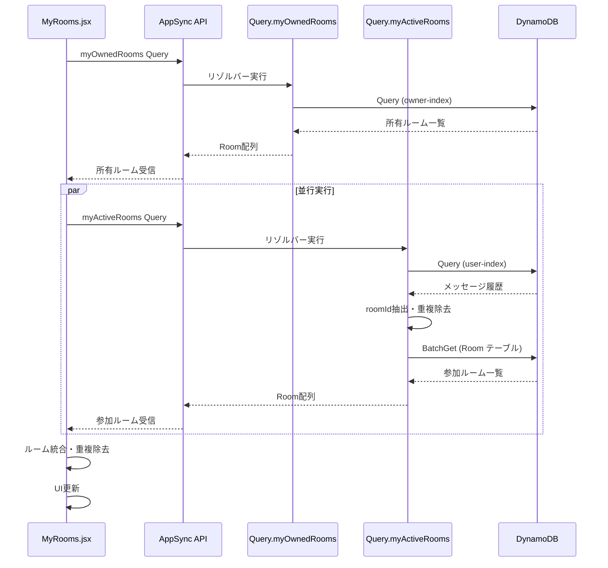
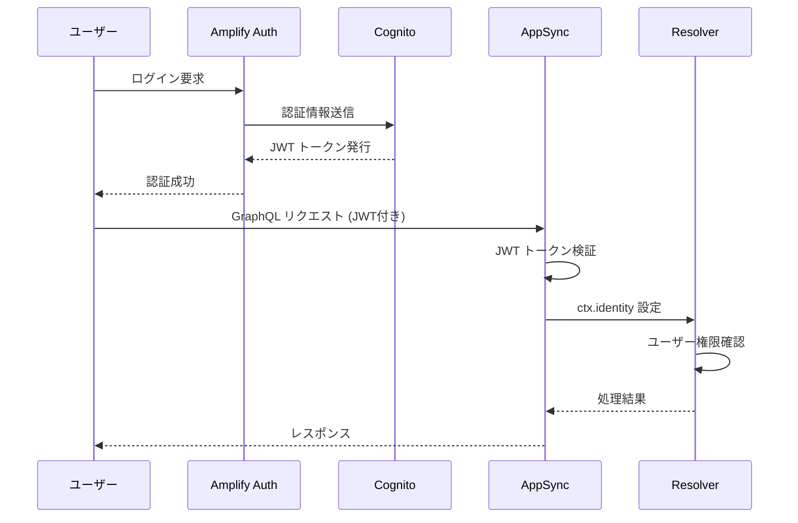

# 🔄 システム処理フロー詳細解説

[](#graphql-api)
[](#dynamodb-設計)
[](#aws-アーキテクチャ)

このドキュメントでは、AWS AppSync チャットアプリのシステム処理フロー図の各パーツについて詳細に解説します。

---

## 📊 システム全体フロー図



---

## 🎨 フロントエンド層 (React + Amplify)

### 1. ChatRoom.jsx - チャット画面コンポーネント

#### 🔍 **主要機能**
- リアルタイムメッセージ表示
- メッセージ送信機能
- リアルタイム購読（Subscription）
- メッセージ履歴取得

#### 📡 **GraphQL操作**
```javascript
// メッセージ一覧取得 (Query)
const { data } = await client.graphql({
  query: listMessages,
  variables: { roomId, limit: 100 }
});

// メッセージ送信 (Mutation)
await client.graphql({
  query: postMessage,
  variables: { roomId, text: newMessage }
});

// リアルタイム購読 (Subscription)
const subscription = client.graphql({
  query: onMessagePosted,
  variables: { roomId }
}).subscribe({
  next: (data) => {
    const newMsg = data.data.onMessagePosted;
    setMessages(prev => [...prev, newMsg]);
  }
});
```

#### 🔄 **処理フロー**
1. **初期化**: コンポーネント マウント時にメッセージ履歴を取得
2. **購読開始**: `onMessagePosted` サブスクリプションを開始
3. **メッセージ送信**: ユーザー入力 → `postMessage` Mutation実行
4. **リアルタイム受信**: サブスクリプション経由で新着メッセージを受信
5. **UI更新**: 状態更新によりリアルタイムでメッセージ表示

#### 🛠️ **技術詳細**
- **状態管理**: `useState` でメッセージリストを管理
- **副作用処理**: `useEffect` でサブスクリプション管理
- **クリーンアップ**: コンポーネント アンマウント時にサブスクリプション解除

### 2. MyRooms.jsx - ルーム一覧画面コンポーネント

#### 🔍 **主要機能**
- 自分が作成したルーム一覧表示
- 自分が参加したルーム一覧表示
- ルーム選択機能
- ルーム情報の統合表示

#### 📡 **GraphQL操作**
```javascript
// 自分が作成したルーム取得
client.graphql({ query: myOwnedRooms })
  .then(res => setOwnedRooms(res.data.myOwnedRooms));

// 自分が参加したルーム取得
client.graphql({ query: myActiveRooms })
  .then(res => setActiveRooms(res.data.myActiveRooms));
```

#### 🔄 **処理フロー**
1. **データ取得**: 2つのクエリを並行実行
   - `myOwnedRooms`: owner-index GSI を使用
   - `myActiveRooms`: user-index GSI を使用
2. **データ統合**: 重複を除いてルーム一覧を統合
3. **UI表示**: ルームカード形式で一覧表示
4. **ナビゲーション**: ルーム選択時に `ChatRoom` コンポーネントに遷移

#### 🛠️ **技術詳細**
- **重複除去**: `filter` + `some` でルーム重複を排除
- **条件付きレンダリング**: ルームが存在しない場合のメッセージ表示
- **イベントハンドリング**: `onRoomSelect` コールバック経由でルーム選択を通知

### 3. 🤖 感情分析表示UI - AI機能統合コンポーネント

#### 🔍 **主要機能**
- メッセージの感情分析結果表示
- 感情スコアの視覚化（感情アイコン、信頼度表示）
- 言語検出結果の表示
- コンテンツ安全性の警告表示

#### 📡 **GraphQL操作**
```javascript
// 感情分析実行 (Lambda リゾルバー)
const { data } = await client.graphql({
  query: analyzeMessageSentiment,
  variables: { messageId }
});

// 分析結果例
const sentimentResult = {
  sentiment: "POSITIVE",      // 感情タイプ
  confidence: 0.8542,        // 信頼度
  scores: {
    positive: 0.8542,        // ポジティブ度
    negative: 0.0234,        // ネガティブ度
    neutral: 0.1123,         // 中立度
    mixed: 0.0101           // 混合度
  },
  language: "ja",            // 検出言語
  isAppropriate: true,       // コンテンツ安全性
  processingTime: 245        // 処理時間(ms)
};
```

#### 🔄 **AI処理フロー**
1. **分析要求**: ユーザーがメッセージの感情分析を要求
2. **Lambda実行**: AppSync → Lambda リゾルバー → Lambda関数
3. **Comprehend呼び出し**: Lambda → AWS Comprehend API
4. **結果保存**: DynamoDB Sentiment分析テーブルにキャッシュ
5. **UI更新**: 感情アイコンとスコア表示

#### 🛠️ **技術詳細**
- **非同期処理**: Promise-based での分析結果取得
- **エラーハンドリング**: 分析失敗時のフォールバック表示
- **キャッシュ活用**: 既存分析結果の再利用でパフォーマンス向上

### 4. graphql/ ディレクトリ - GraphQL定義ファイル群

#### 📁 **ファイル構成**
```
graphql/
├── queries.js      # データ取得クエリ
├── mutations.js    # データ変更ミューテーション
└── subscriptions.js # リアルタイム購読
```

#### 📄 **queries.js - データ取得**
```javascript
export const myOwnedRooms = `
  query MyOwnedRooms {
    myOwnedRooms {
      id name owner createdAt
    }
  }
`;

export const listMessages = `
  query ListMessages($roomId: ID!, $limit: Int) {
    listMessages(roomId: $roomId, limit: $limit) {
      id text user createdAt roomId
    }
  }
`;

// 🤖 AI機能: 感情分析クエリ
export const analyzeMessageSentiment = `
  query AnalyzeMessageSentiment($messageId: ID!) {
    analyzeMessageSentiment(messageId: $messageId) {
      messageId sentiment confidence
      scores { positive negative neutral mixed }
      language languageConfidence
      isAppropriate flags
      analyzedAt processingTime
    }
  }
`;
```

#### 📄 **mutations.js - データ変更**
```javascript
export const createRoom = `
  mutation CreateRoom($name: String!) {
    createRoom(name: $name) {
      id name owner createdAt
    }
  }
`;

export const postMessage = `
  mutation PostMessage($roomId: ID!, $text: String!) {
    postMessage(roomId: $roomId, text: $text) {
      id text user createdAt roomId
    }
  }
`;
```

#### 📄 **subscriptions.js - リアルタイム購読**
```javascript
export const onMessagePosted = `
  subscription OnMessagePosted($roomId: ID!) {
    onMessagePosted(roomId: $roomId) {
      id text user createdAt roomId
    }
  }
`;
```

---

## 🌐 AppSync GraphQL API層

### 1. schema.graphql - GraphQLスキーマ定義

#### 🏗️ **スキーマ構造**
```graphql
# 型定義
type Room {
  id: ID!
  name: String!
  owner: String!
  createdAt: AWSDateTime!
}

type Message {
  id: ID!
  text: String!
  user: String!
  createdAt: AWSDateTime!
  roomId: ID!
}

# API操作定義
type Query {
  myOwnedRooms: [Room]
  myActiveRooms: [Room]
  listMessages(roomId: ID!, limit: Int): [Message]
}

type Mutation {
  createRoom(name: String!): Room
  postMessage(roomId: ID!, text: String!): Message
}

type Subscription {
  onRoomCreated: Room
  onMessagePosted(roomId: ID!): Message
}
```

#### 🎯 **設計ポイント**
- **型安全性**: 厳密な型定義によるAPI契約
- **スケーラビリティ**: limit パラメータによるページネーション対応
- **リアルタイム**: Subscription による即座のデータ同期
- **認証連携**: JWT ベースの認証情報をリゾルバーで活用

### 2. JSリゾルバー群 - ビジネスロジック実装

#### 📝 **リゾルバーの役割**
1. **認証・認可**: JWT トークン検証
2. **データ変換**: GraphQL ↔ DynamoDB データ変換
3. **ビジネスロジック**: バリデーション、計算処理
4. **エラーハンドリング**: 適切な例外処理

#### 🔍 **Query リゾルバー例**
```javascript
// Query.myOwnedRooms.js
export const handler = (ctx) => {
  const username = ctx.identity?.username;
  if (!username) throw new Error("認証ユーザーのみ");
  
  return {
    operation: "Query",
    query: { owner: { eq: username } },
    index: "owner-index"
  };
};
```

#### ✏️ **Mutation リゾルバー例**
```javascript
// Mutation.createRoom.js
export const handler = (ctx) => {
  const username = ctx.identity?.username || "guest";
  const id = uuid();
  const createdAt = new Date().toISOString();
  
  return {
    operation: 'PutItem',
    key: { id },
    attributeValues: {
      id, 
      name: ctx.args.name, 
      owner: username, 
      createdAt
    }
  };
};
```

#### 🔔 **Subscription の仕組み**
```graphql
type Subscription {
  onMessagePosted(roomId: ID!): Message 
    @aws_subscribe(mutations: ["postMessage"])
}
```
- **自動トリガー**: `postMessage` Mutation 実行時に自動発火
- **フィルタリング**: `roomId` による購読者フィルタリング
- **WebSocket**: 低遅延のリアルタイム通信

---

## 🤖 AI Services層 (Lambda + AWS Comprehend)

### 1. Lambda Functions - 高度な処理制御

#### 🔍 **Lambda リゾルバーの特徴**
- **外部サービス連携**: AWS Comprehend との統合
- **複雑な非同期処理**: バッチ処理、リトライ戦略
- **高度なエラーハンドリング**: グレースフルデグラデーション
- **キャッシュ戦略**: DynamoDB での結果保存

#### 📡 **感情分析Lambda関数**
```javascript
// Lambda_analyzeMessageSentiment.js
exports.handler = async (event, context) => {
  const { messageId } = event.arguments;
  const startTime = Date.now();
  
  try {
    // 1. メッセージ取得
    const message = await getMessageFromDynamoDB(messageId);
    
    // 2. AWS Comprehend で感情分析
    const sentimentResult = await comprehend.detectSentiment({
      Text: message.text,
      LanguageCode: 'ja'
    }).promise();
    
    // 3. 言語検出
    const languageResult = await comprehend.detectDominantLanguage({
      Text: message.text
    }).promise();
    
    // 4. 結果をDynamoDBに保存
    const analysisData = {
      messageId,
      sentiment: sentimentResult.Sentiment,
      confidence: sentimentResult.SentimentScore[sentimentResult.Sentiment],
      scores: sentimentResult.SentimentScore,
      language: languageResult.Languages[0]?.LanguageCode,
      languageConfidence: languageResult.Languages[0]?.Score,
      isAppropriate: checkContentSafety(message.text),
      analyzedAt: new Date().toISOString(),
      processingTime: Date.now() - startTime
    };
    
    await saveSentimentAnalysis(analysisData);
    return analysisData;
    
  } catch (error) {
    console.error('感情分析エラー:', error);
    throw new Error('感情分析に失敗しました');
  }
};
```

#### 🔄 **Lambda 処理フロー**
1. **入力検証**: messageId の妥当性チェック
2. **メッセージ取得**: DynamoDB から元メッセージ取得
3. **AI分析**: Comprehend API 呼び出し
   - 感情分析 (detectSentiment)
   - 言語検出 (detectDominantLanguage)
4. **結果保存**: DynamoDB Sentiment分析テーブルに保存
5. **レスポンス**: 分析結果をGraphQLに返却

### 2. AWS Comprehend - 自然言語処理

#### 🧠 **提供機能**
- **感情分析**: POSITIVE/NEGATIVE/NEUTRAL/MIXED の4段階
- **言語検出**: 25以上の言語に対応
- **エンティティ抽出**: 人名、地名、組織名等の抽出
- **キーフレーズ抽出**: 重要なフレーズの特定

#### 📊 **分析結果例**
```json
{
  "Sentiment": "POSITIVE",
  "SentimentScore": {
    "Positive": 0.8542,
    "Negative": 0.0234,
    "Neutral": 0.1123,
    "Mixed": 0.0101
  },
  "LanguageCode": "ja",
  "Confidence": 0.9876
}
```

### 3. SQS Dead Letter Queue - エラー処理

#### 🛡️ **障害対応**
- **Lambda失敗時**: エラーメッセージをSQSに送信
- **リトライ戦略**: 指数バックオフによる再試行
- **監視・アラート**: CloudWatch でエラー追跡

---

## 🗄️ AWS インフラ層 (Terraform管理)

### 1. DynamoDB テーブル設計

#### 🏠 **Roomテーブル**
```hcl
resource "aws_dynamodb_table" "room" {
  name         = "Room"
  billing_mode = "PAY_PER_REQUEST"
  hash_key     = "id"

  attribute { name = "id"; type = "S" }
  attribute { name = "owner"; type = "S" }

  global_secondary_index {
    name            = "owner-index"
    hash_key        = "owner"
    projection_type = "ALL"
  }
}
```

**クエリパターン**:
- **Primary Key**: `id` による単一ルーム取得
- **owner-index GSI**: `owner` による所有ルーム一覧取得

#### 💬 **Messageテーブル**
```hcl
resource "aws_dynamodb_table" "message" {
  name         = "Message"
  billing_mode = "PAY_PER_REQUEST"
  hash_key     = "id"

  attribute { name = "id"; type = "S" }
  attribute { name = "roomId"; type = "S" }
  attribute { name = "user"; type = "S" }
  attribute { name = "createdAt"; type = "S" }

  global_secondary_index {
    name            = "user-index"
    hash_key        = "user"
    projection_type = "ALL"
  }

  global_secondary_index {
    name            = "room-index"
    hash_key        = "roomId"
    range_key       = "createdAt"
    projection_type = "ALL"
  }
}
```

**クエリパターン**:
- **Primary Key**: `id` による単一メッセージ取得
- **user-index GSI**: `user` による参加ルーム特定
- **room-index GSI**: `roomId` + `createdAt` による時系列メッセージ取得

#### 🎭 **Sentiment分析テーブル**
```hcl
resource "aws_dynamodb_table" "sentiment_analysis" {
  name         = "SentimentAnalysis"
  billing_mode = "PAY_PER_REQUEST"
  hash_key     = "messageId"

  attribute { name = "messageId"; type = "S" }
  attribute { name = "analyzedAt"; type = "S" }

  global_secondary_index {
    name               = "analyzedAt-index"
    hash_key           = "analyzedAt"
    projection_type    = "ALL"
  }

  # TTL設定（分析結果の自動削除：90日後）
  ttl {
    attribute_name = "ttl"
    enabled        = true
  }
}
```

**クエリパターン**:
- **Primary Key**: `messageId` による分析結果取得
- **analyzedAt-index GSI**: 日付別分析結果の時系列取得
- **TTL**: 90日後の自動データ削除でストレージ最適化

### 2. GSI (Global Secondary Index) 戦略

#### 🎯 **owner-index (Roomテーブル)**
```javascript
// 使用例: 自分が作成したルーム一覧
{
  operation: "Query",
  query: { owner: { eq: "user123" } },
  index: "owner-index"
}
```

**効果**:
- **高速検索**: オーナー別ルーム検索が O(1)
- **スケーラビリティ**: ルーム数増加に対応
- **コスト効率**: 必要なデータのみ取得

#### 👤 **user-index (Messageテーブル)**
```javascript
// 使用例: 自分が発言したルーム特定
{
  operation: "Query",
  query: { user: { eq: "user123" } },
  index: "user-index",
  limit: 1000
}
```

**用途**:
- **参加ルーム特定**: メッセージ履歴からルーム抽出
- **アクティビティ追跡**: ユーザーの発言履歴
- **統計情報**: ユーザー別メッセージ数集計

#### 🕒 **room-index (Messageテーブル)**
```javascript
// 使用例: ルーム内メッセージ履歴（時系列順）
{
  operation: "Query",
  query: { 
    roomId: { eq: "room123" },
    createdAt: { between: ["2024-01-01", "2024-12-31"] }
  },
  index: "room-index",
  scanIndexForward: true  // 時系列順ソート
}
```

**効果**:
- **時系列ソート**: `createdAt` による自動ソート
- **範囲検索**: 期間指定でのメッセージ取得
- **ページネーション**: `limit` + `nextToken` 対応

### 3. AppSyncデータソース

#### 🔌 **データソース設定**
```hcl
resource "aws_appsync_datasource" "dynamodb_room" {
  api_id           = aws_appsync_graphql_api.chat_api.id
  name             = "RoomDataSource"
  service_role_arn = aws_iam_role.appsync_role.arn
  type             = "AMAZON_DYNAMODB"

  dynamodb_config {
    table_name = aws_dynamodb_table.room.name
  }
}
```

**機能**:
- **自動接続**: AppSync と DynamoDB の自動連携
- **権限管理**: IAM ロールによる最小権限制御
- **パフォーマンス**: 直接DynamoDB接続による低遅延

---

## 🔄 データフロー詳細解析

### 1. ルーム作成フロー



**処理詳細**:
1. **入力検証**: フロントエンドでルーム名バリデーション
2. **認証確認**: リゾルバーで JWT トークン検証
3. **ID生成**: UUID による一意ID生成
4. **データ保存**: DynamoDB への PutItem 操作
5. **リアルタイム通知**: Subscription による即座の通知

### 2. メッセージ送信フロー



**処理詳細**:
1. **文字数制限**: 1-500文字のバリデーション
2. **認証確認**: ログインユーザーの確認
3. **タイムスタンプ**: ISO8601形式での作成日時記録
4. **GSI更新**: user-index, room-index への自動反映
5. **リアルタイム配信**: 同一ルーム購読者への即座の通知

### 3. 🤖 感情分析フロー



**処理詳細**:
1. **キャッシュ確認**: 既存分析結果の有無チェック
2. **メッセージ取得**: DynamoDB から元メッセージ取得
3. **AI分析実行**: Comprehend API で感情・言語分析
4. **安全性チェック**: 不適切コンテンツの検出
5. **結果保存**: DynamoDB Sentiment テーブルにキャッシュ
6. **UI反映**: 感情アイコンとスコアの表示

### 4. ルーム一覧取得フロー



---

## 🛡️ セキュリティ・認証フロー

### 1. JWT認証フロー



### 2. 認可制御

#### 🔒 **リゾルバーレベル認可**
```javascript
export const handler = (ctx) => {
  const username = ctx.identity?.username;
  if (!username) {
    throw new Error("認証が必要です");
  }
  
  // ユーザー固有のデータのみアクセス許可
  return {
    operation: "Query",
    query: { owner: { eq: username } },
    index: "owner-index"
  };
};
```

#### 🛡️ **データレベル保護**
- **行レベルセキュリティ**: ユーザー固有データの分離
- **フィールドレベル制御**: 機密情報の隠蔽
- **動的認可**: リクエスト内容に応じた権限制御

---

## 📈 監視・ログ戦略

### 1. CloudWatch メトリクス

#### 📊 **重要指標**
- **API使用率**: リクエスト数・エラー率
- **レスポンス時間**: 平均・P95・P99レイテンシ
- **DynamoDB使用量**: 読み込み・書き込みキャパシティ
- **Subscription接続数**: アクティブ接続数

### 2. ログ設計

#### 📝 **構造化ログ**
```json
{
  "timestamp": "2024-01-01T00:00:00Z",
  "level": "INFO",
  "operation": "postMessage",
  "user": "user123",
  "roomId": "room456",
  "duration": 45,
  "success": true
}
```

#### 🔍 **トレーシング**
- **X-Ray統合**: 分散トレーシング
- **相関ID**: リクエスト横断の追跡
- **エラー詳細**: スタックトレース・コンテキスト

---

このドキュメントにより、システム処理フローの各パーツの詳細な動作を理解し、効果的な開発・運用が可能になります。
