# チャットアプリ - API設計詳細書（GraphQL）

## 1. API アーキテクチャ概要

このチャットアプリのAPIは、GraphQLを使用したモダンなAPI設計を採用し、AWS AppSyncによるサーバーレス実装を実現しています。

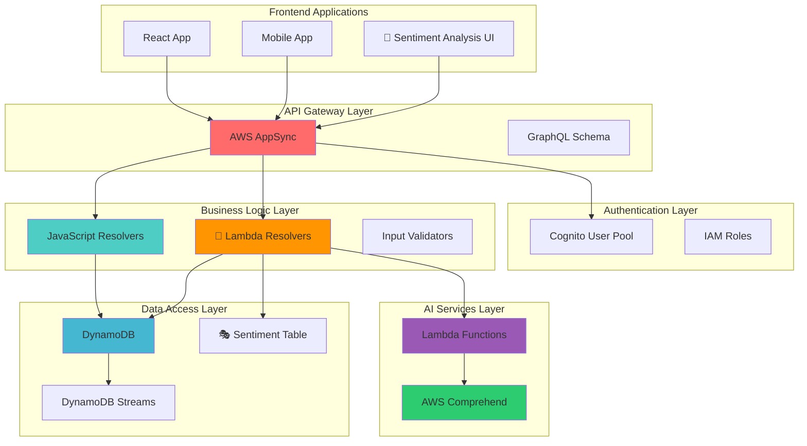
```mermaid
flowchart TB
    subgraph "Frontend Applications"
        A[React App]
        B[Mobile App]
        SA[🤖 Sentiment Analysis UI]
    end
    
    subgraph "API Gateway Layer"
        C[AWS AppSync]
        D[GraphQL Schema]
    end
    
    subgraph "Authentication Layer"
        E[Cognito User Pool]
        F[IAM Roles]
    end
    
    subgraph "Business Logic Layer"
        G[JavaScript Resolvers]
        LR[🤖 Lambda Resolvers]
        H[Input Validators]
    end
    
    subgraph "AI Services Layer"
        L[Lambda Functions]
        COM[AWS Comprehend]
    end
    
    subgraph "Data Access Layer"
        I[DynamoDB]
        J[DynamoDB Streams]
        ST[🎭 Sentiment Table]
    end
    
    A --> C
    B --> C
    SA --> C
    C --> E
    C --> G
    C --> LR
    LR --> L
    L --> COM
    G --> I
    LR --> I
    LR --> ST
    I --> J
    
    style C fill:#ff6b6b
    style G fill:#4ecdc4
    style LR fill:#ff9500
    style I fill:#45b7d1
    style L fill:#9b59b6
    style COM fill:#2ecc71
```

## 2. GraphQL スキーマ設計

### 2.1 スキーマファーストアプローチ

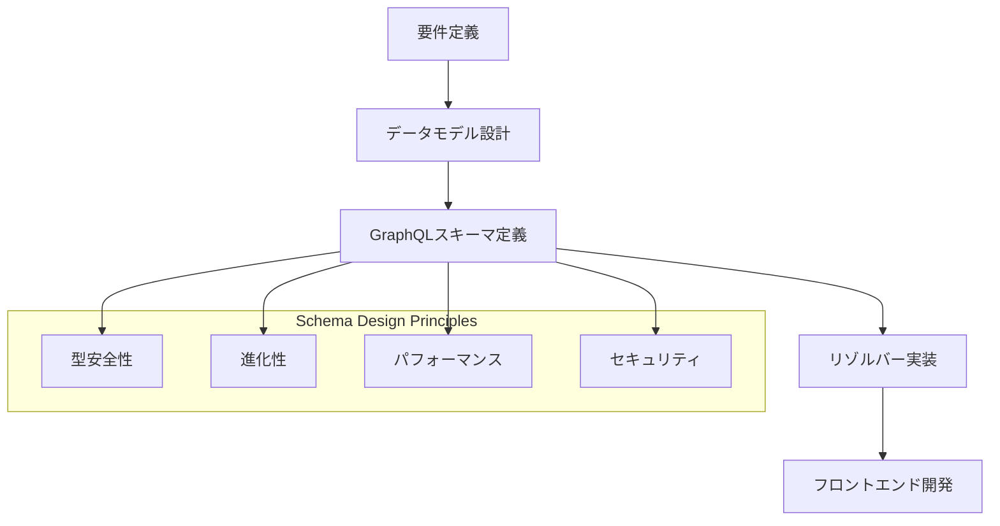
```mermaid
flowchart TB
    A[要件定義] --> B[データモデル設計]
    B --> C[GraphQLスキーマ定義]
    C --> D[リゾルバー実装]
    D --> E[フロントエンド開発]
    
    subgraph "Schema Design Principles"
        F[型安全性]
        G[進化性]
        H[パフォーマンス]
        I[セキュリティ]
    end
    
    C --> F
    C --> G
    C --> H
    C --> I
```

### 2.2 型システム設計

```mermaid
classDiagram
    class Message {
        +ID! id
        +String! text
        +String! user
        +AWSDateTime! createdAt
        +ID! roomId
        +Room room
        +SentimentAnalysis sentiment
    }
    
    class Room {
        +ID! id
        +String! name
        +String! owner
        +AWSDateTime! createdAt
        +[Message] messages
    }
    
    class SentimentAnalysis {
        +ID! messageId
        +String! sentiment
        +SentimentScore! sentimentScore
        +String! language
        +Float! languageConfidence
        +Boolean! isAppropriate
        +[String] moderationFlags
        +AWSDateTime! analyzedAt
    }
    
    class SentimentScore {
        +Float! positive
        +Float! negative
        +Float! neutral
        +Float! mixed
    }
    
    class Query {
        +[Room] myOwnedRooms
        +[Room] myActiveRooms
        +Room getRoom(id: ID!)
        +[Message] listMessages(roomId: ID!, limit: Int)
    }
    
    class Mutation {
        +Room createRoom(name: String!)
        +Message postMessage(roomId: ID!, text: String!)
        +SentimentAnalysis analyzeMessageSentiment(messageId: ID!, text: String!)
    }
    
    class Subscription {
        +Room onRoomCreated
        +Message onMessagePosted(roomId: ID!)
    }
    
    Message ||--|| Room : belongsTo
    Message ||--o| SentimentAnalysis : hasAnalysis
    SentimentAnalysis ||--|| SentimentScore : contains

## 3. Query操作設計

### 3.1 データ取得パターン

```mermaid
sequenceDiagram
    participant Client as クライアント
    participant AppSync as AWS AppSync
    participant Resolver as リゾルバー
    participant DynamoDB as DynamoDB
    participant Cache as キャッシュ
    
    Note over Client,Cache: myOwnedRooms クエリフロー
    
    Client->>AppSync: Query myOwnedRooms
    AppSync->>Resolver: request(ctx)
    
    alt キャッシュヒット
        Resolver->>Cache: キャッシュチェック
        Cache-->>Resolver: キャッシュデータ
    else キャッシュミス
        Resolver->>DynamoDB: Query owner-index
        DynamoDB-->>Resolver: ルーム一覧
        Resolver->>Cache: キャッシュ更新
    end
    
    Resolver->>AppSync: response(ctx)
    AppSync-->>Client: ルーム一覧データ
```

### 3.2 複雑なクエリパターン

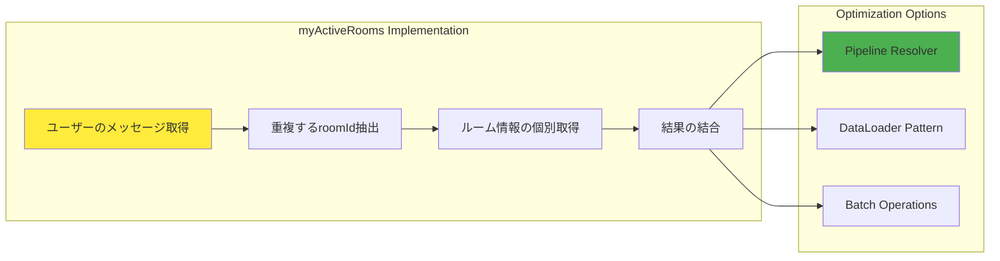
```mermaid
flowchart LR
    subgraph "myActiveRooms Implementation"
        A[ユーザーのメッセージ取得] --> B[重複するroomId抽出]
        B --> C[ルーム情報の個別取得]
        C --> D[結果の結合]
    end
    
    subgraph "Optimization Options"
        E[Pipeline Resolver]
        F[DataLoader Pattern]
        G[Batch Operations]
    end
    
    D --> E
    D --> F
    D --> G
    
    style A fill:#ffeb3b
    style E fill:#4caf50
```

## 4. Mutation操作設計

### 4.1 データ変更フロー

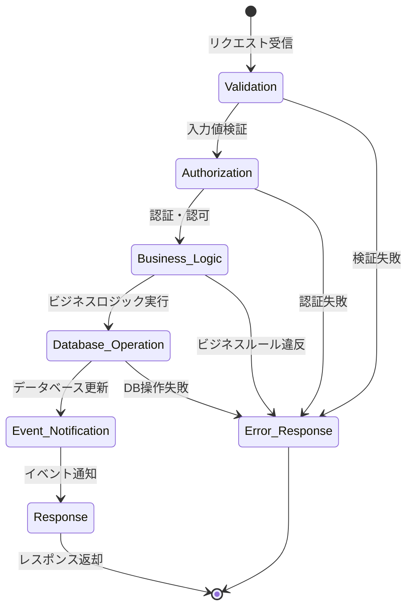
```mermaid
stateDiagram-v2
    [*] --> Validation: リクエスト受信
    Validation --> Authorization: 入力値検証
    Authorization --> Business_Logic: 認証・認可
    Business_Logic --> Database_Operation: ビジネスロジック実行
    Database_Operation --> Event_Notification: データベース更新
    Event_Notification --> Response: イベント通知
    Response --> [*]: レスポンス返却
    
    Validation --> Error_Response: 検証失敗
    Authorization --> Error_Response: 認証失敗
    Business_Logic --> Error_Response: ビジネスルール違反
    Database_Operation --> Error_Response: DB操作失敗
    Error_Response --> [*]
```

### 4.2 createRoom Mutation詳細

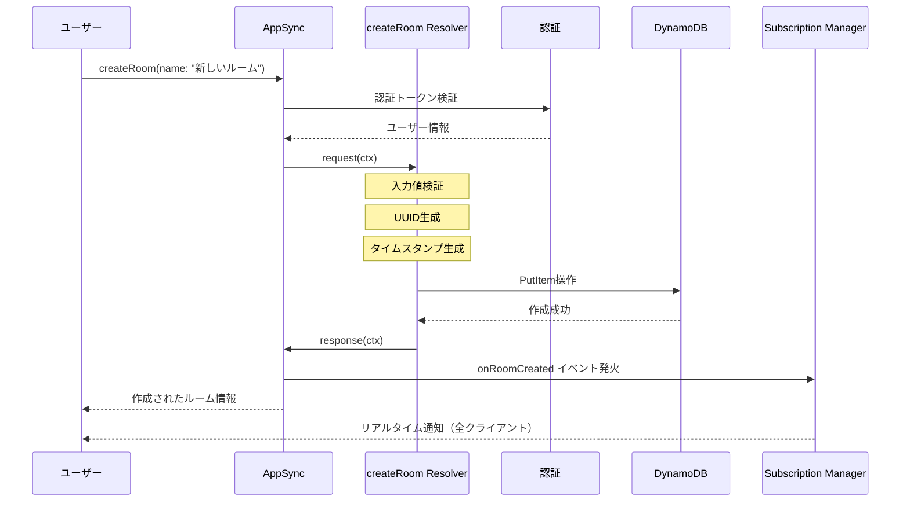
```mermaid
sequenceDiagram
    participant User as ユーザー
    participant AppSync as AppSync
    participant Resolver as createRoom Resolver
    participant Cognito as 認証
    participant DynamoDB as DynamoDB
    participant Subscription as Subscription Manager
    
    User->>AppSync: createRoom(name: "新しいルーム")
    AppSync->>Cognito: 認証トークン検証
    Cognito-->>AppSync: ユーザー情報
    
    AppSync->>Resolver: request(ctx)
    Note over Resolver: 入力値検証
    Note over Resolver: UUID生成
    Note over Resolver: タイムスタンプ生成
    
    Resolver->>DynamoDB: PutItem操作
    DynamoDB-->>Resolver: 作成成功
    
    Resolver->>AppSync: response(ctx)
    AppSync->>Subscription: onRoomCreated イベント発火
    AppSync-->>User: 作成されたルーム情報
    
    Subscription-->>User: リアルタイム通知（全クライアント）
```

### 4.3 postMessage Mutation詳細

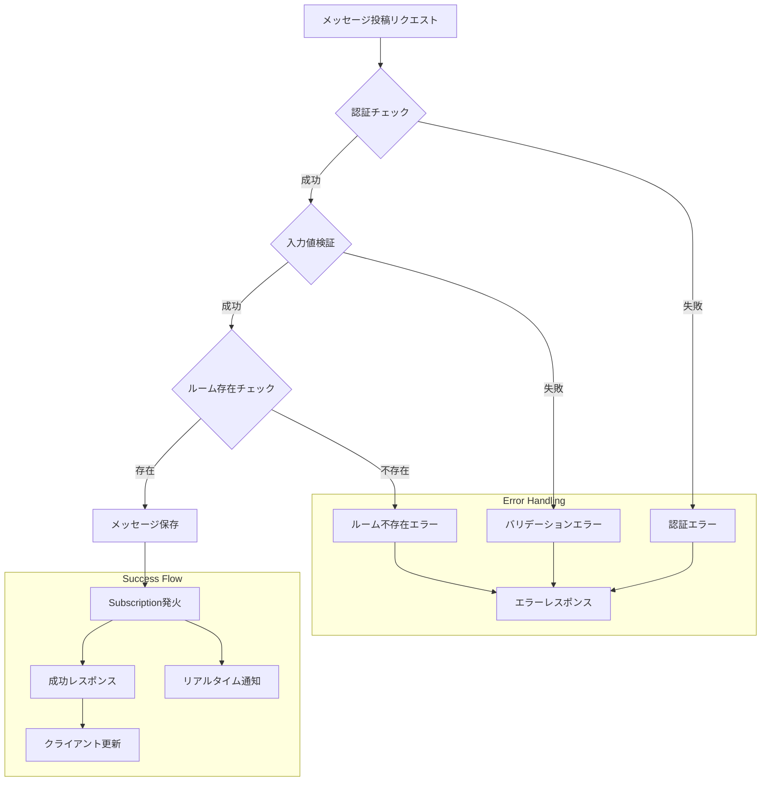
```mermaid
flowchart TB
    A[メッセージ投稿リクエスト] --> B{認証チェック}
    B -->|成功| C{入力値検証}
    B -->|失敗| D[認証エラー]
    
    C -->|成功| E{ルーム存在チェック}
    C -->|失敗| F[バリデーションエラー]
    
    E -->|存在| G[メッセージ保存]
    E -->|不存在| H[ルーム不存在エラー]
    
    G --> I[Subscription発火]
    I --> J[成功レスポンス]
    
    subgraph "Error Handling"
        D --> K[エラーレスポンス]
        F --> K
        H --> K
    end
    
    subgraph "Success Flow"
        J --> L[クライアント更新]
        I --> M[リアルタイム通知]
    end
```

## 5. Subscription設計

### 5.1 リアルタイム通信アーキテクチャ

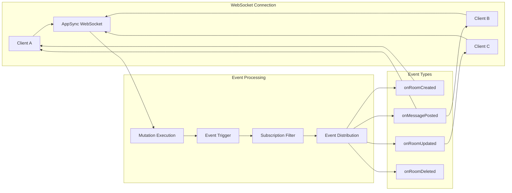
```mermaid
flowchart LR
    subgraph "WebSocket Connection"
        A[Client A] --> B[AppSync WebSocket]
        C[Client B] --> B
        D[Client C] --> B
    end
    
    subgraph "Event Processing"
        E[Mutation Execution] --> F[Event Trigger]
        F --> G[Subscription Filter]
        G --> H[Event Distribution]
    end
    
    subgraph "Event Types"
        I[onRoomCreated]
        J[onMessagePosted]
        K[onRoomUpdated]
        L[onRoomDeleted]
    end
    
    B --> E
    H --> I
    H --> J
    H --> K
    H --> L
    
    I --> A
    J --> A
    J --> C
    K --> D
```

### 5.2 Subscription フィルタリング

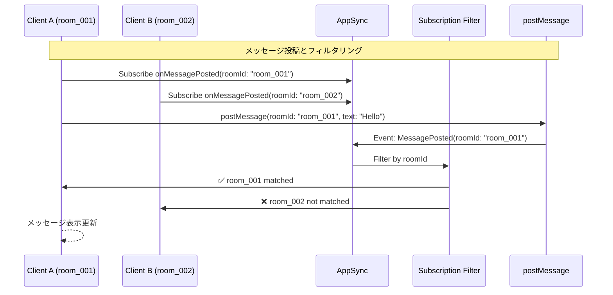
```mermaid
sequenceDiagram
    participant ClientA as Client A (room_001)
    participant ClientB as Client B (room_002)  
    participant AppSync as AppSync
    participant Filter as Subscription Filter
    participant Mutation as postMessage
    
    Note over ClientA,Mutation: メッセージ投稿とフィルタリング
    
    ClientA->>AppSync: Subscribe onMessagePosted(roomId: "room_001")
    ClientB->>AppSync: Subscribe onMessagePosted(roomId: "room_002")
    
    ClientA->>Mutation: postMessage(roomId: "room_001", text: "Hello")
    Mutation->>AppSync: Event: MessagePosted(roomId: "room_001")
    
    AppSync->>Filter: Filter by roomId
    Filter->>ClientA: ✅ room_001 matched
    Filter->>ClientB: ❌ room_002 not matched
    
    ClientA-->>ClientA: メッセージ表示更新
```

## 6. Resolver実装パターン

### 6.1 JavaScript Resolver構造

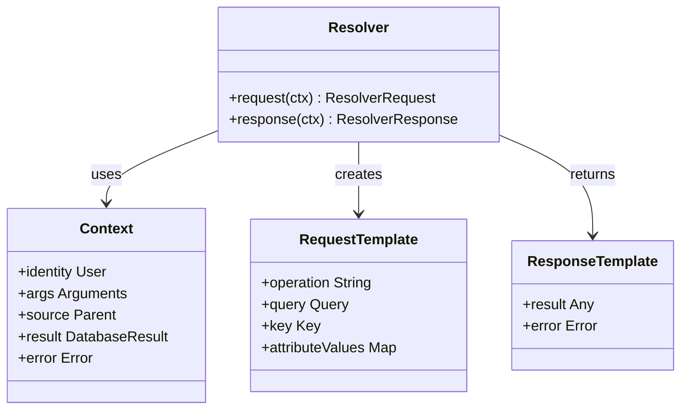
```mermaid
classDiagram
    class Resolver {
        +request(ctx) ResolverRequest
        +response(ctx) ResolverResponse
    }
    
    class Context {
        +identity User
        +args Arguments
        +source Parent
        +result DatabaseResult
        +error Error
    }
    
    class RequestTemplate {
        +operation String
        +query Query
        +key Key
        +attributeValues Map
    }
    
    class ResponseTemplate {
        +result Any
        +error Error
    }
    
    Resolver --> Context : uses
    Resolver --> RequestTemplate : creates
    Resolver --> ResponseTemplate : returns
```

### 6.2 エラーハンドリングパターン

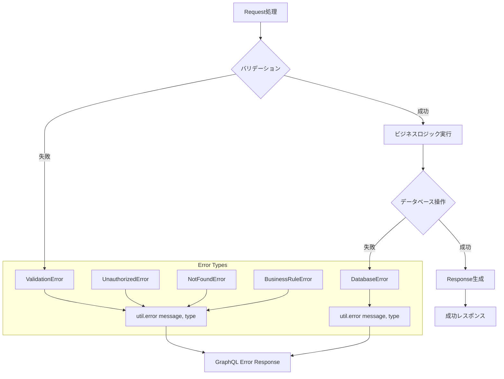
```mermaid
flowchart TB
    A[Request処理] --> B{バリデーション}
    B -->|成功| C[ビジネスロジック実行]
    B -->|失敗| D[ValidationError]
    
    C --> E{データベース操作}
    E -->|成功| F[Response生成]
    E -->|失敗| G[DatabaseError]
    
    F --> H[成功レスポンス]
    
    subgraph "Error Types"
        D --> I[util.error message, type]
        G --> J[util.error message, type]
        K[UnauthorizedError] --> I
        L[NotFoundError] --> I
        M[BusinessRuleError] --> I
    end
    
    I --> N[GraphQL Error Response]
    J --> N
```

## 7. 認証・認可設計

### 7.1 JWT トークンベース認証

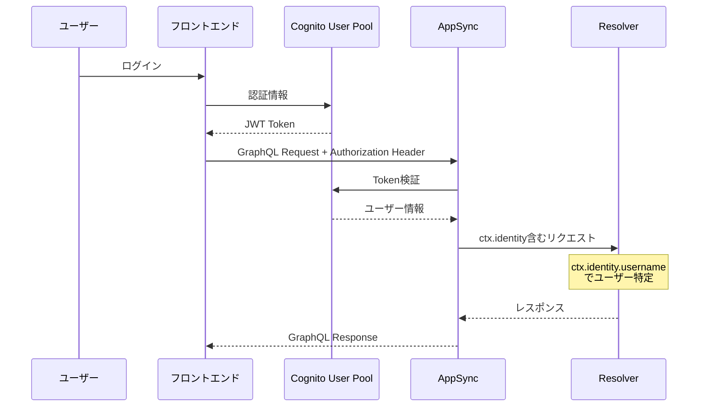
```mermaid
sequenceDiagram
    participant User as ユーザー
    participant Frontend as フロントエンド
    participant Cognito as Cognito User Pool
    participant AppSync as AppSync
    participant Resolver as Resolver
    
    User->>Frontend: ログイン
    Frontend->>Cognito: 認証情報
    Cognito-->>Frontend: JWT Token
    
    Frontend->>AppSync: GraphQL Request + Authorization Header
    AppSync->>Cognito: Token検証
    Cognito-->>AppSync: ユーザー情報
    
    AppSync->>Resolver: ctx.identity含むリクエスト
    Note over Resolver: ctx.identity.username<br/>でユーザー特定
    
    Resolver-->>AppSync: レスポンス
    AppSync-->>Frontend: GraphQL Response
```

### 7.2 リソースレベル認可

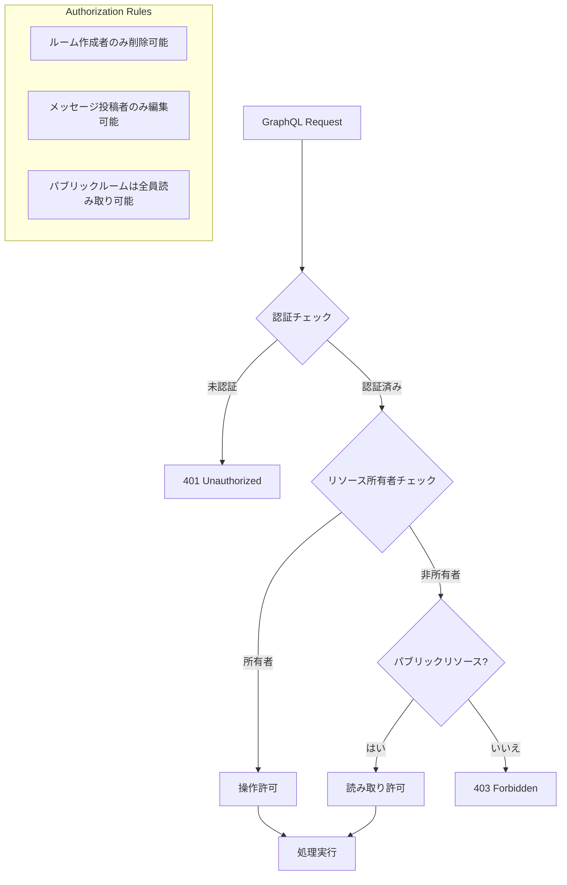
```mermaid
flowchart TB
    A[GraphQL Request] --> B{認証チェック}
    B -->|未認証| C[401 Unauthorized]
    B -->|認証済み| D{リソース所有者チェック}
    
    D -->|所有者| E[操作許可]
    D -->|非所有者| F{パブリックリソース?}
    
    F -->|はい| G[読み取り許可]
    F -->|いいえ| H[403 Forbidden]
    
    E --> I[処理実行]
    G --> I
    
    subgraph "Authorization Rules"
        J[ルーム作成者のみ削除可能]
        K[メッセージ投稿者のみ編集可能]
        L[パブリックルームは全員読み取り可能]
    end
```

## 8. リアルタイム機能設計

### 9.1 WebSocket接続管理

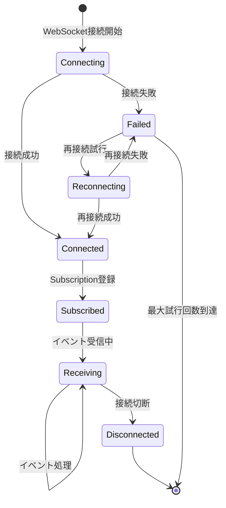
```mermaid
stateDiagram-v2
    [*] --> Connecting: WebSocket接続開始
    Connecting --> Connected: 接続成功
    Connecting --> Failed: 接続失敗
    
    Connected --> Subscribed: Subscription登録
    Subscribed --> Receiving: イベント受信中
    
    Receiving --> Receiving: イベント処理
    Receiving --> Disconnected: 接続切断
    
    Failed --> Reconnecting: 再接続試行
    Reconnecting --> Connected: 再接続成功
    Reconnecting --> Failed: 再接続失敗
    
    Disconnected --> [*]
    Failed --> [*]: 最大試行回数到達
```

### 9.2 イベント配信パターン

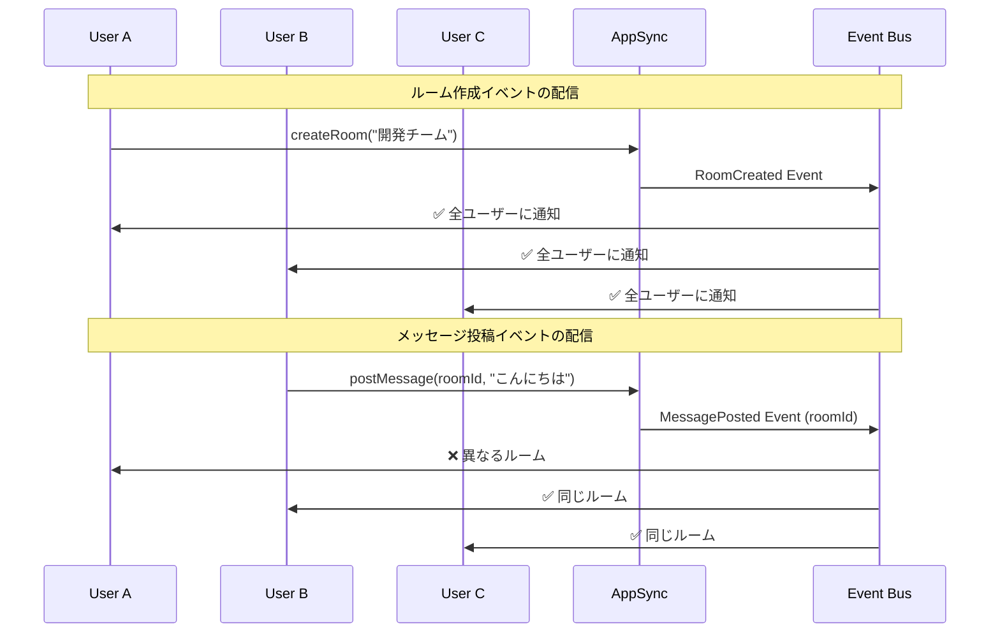
```mermaid
sequenceDiagram
    participant UserA as User A
    participant UserB as User B
    participant UserC as User C
    participant AppSync as AppSync
    participant EventBus as Event Bus
    
    Note over UserA,EventBus: ルーム作成イベントの配信
    
    UserA->>AppSync: createRoom("開発チーム")
    AppSync->>EventBus: RoomCreated Event
    
    EventBus->>UserA: ✅ 全ユーザーに通知
    EventBus->>UserB: ✅ 全ユーザーに通知
    EventBus->>UserC: ✅ 全ユーザーに通知
    
    Note over UserA,EventBus: メッセージ投稿イベントの配信
    
    UserB->>AppSync: postMessage(roomId, "こんにちは")
    AppSync->>EventBus: MessagePosted Event (roomId)
    
    EventBus->>UserA: ❌ 異なるルーム
    EventBus->>UserB: ✅ 同じルーム
    EventBus->>UserC: ✅ 同じルーム
```

## 10. スキーマ進化戦略

### 10.1 バージョニング戦略

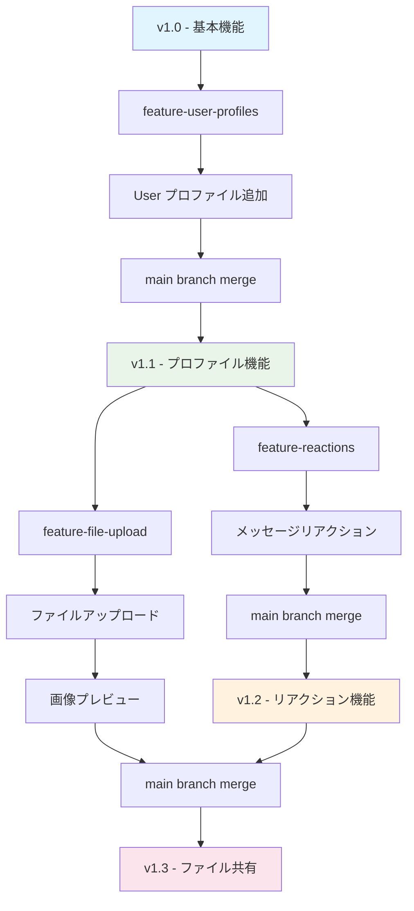
```mermaid
flowchart TD
    A[v1.0 - 基本機能] --> B[feature-user-profiles]
    B --> C[User プロファイル追加]
    C --> D[main branch merge]
    D --> E[v1.1 - プロファイル機能]
    
    E --> F[feature-file-upload]
    F --> G[ファイルアップロード]
    G --> H[画像プレビュー]
    
    E --> I[feature-reactions]
    I --> J[メッセージリアクション]
    J --> K[main branch merge]
    K --> L[v1.2 - リアクション機能]
    
    H --> M[main branch merge]
    L --> M
    M --> N[v1.3 - ファイル共有]
    
    style A fill:#e1f5fe
    style E fill:#e8f5e8
    style L fill:#fff3e0
    style N fill:#fce4ec
```

### 10.2 後方互換性の保持

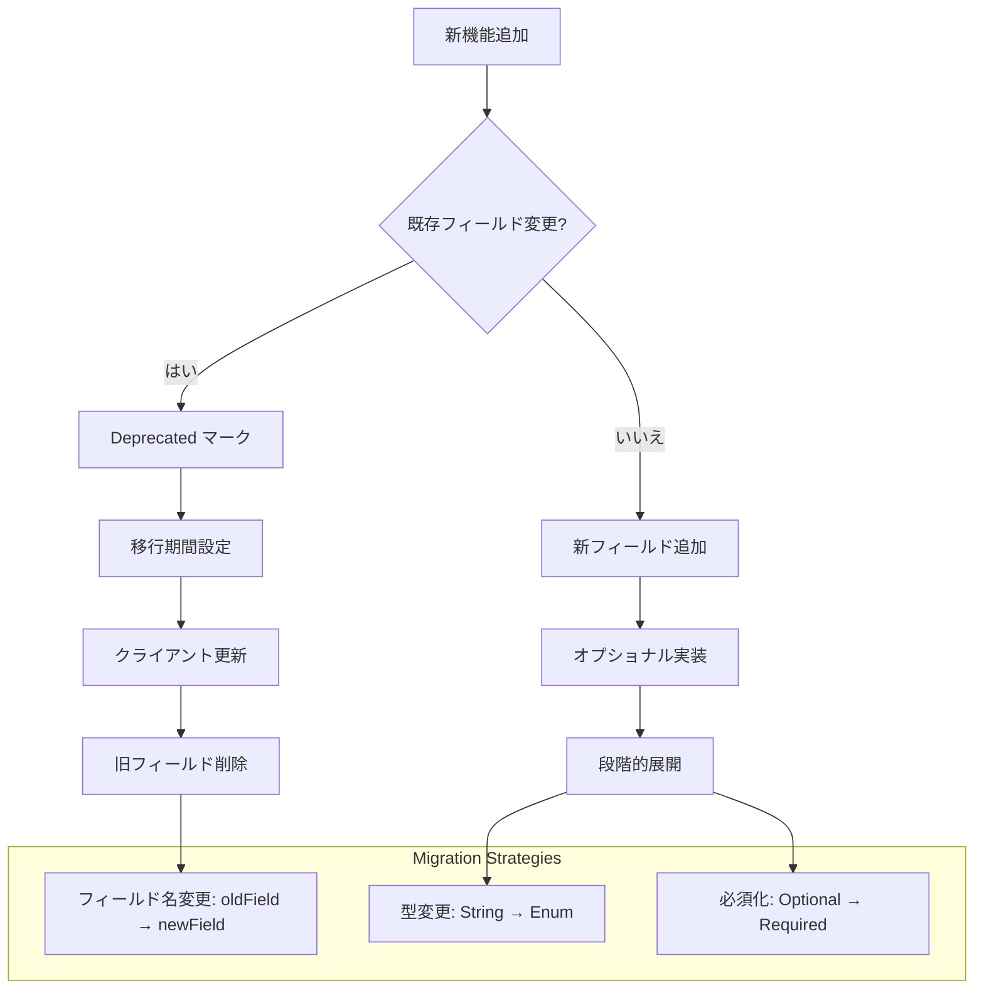
```mermaid
flowchart TB
    A[新機能追加] --> B{既存フィールド変更?}
    B -->|はい| C[Deprecated マーク]
    B -->|いいえ| D[新フィールド追加]
    
    C --> E[移行期間設定]
    E --> F[クライアント更新]
    F --> G[旧フィールド削除]
    
    D --> H[オプショナル実装]
    H --> I[段階的展開]
    
    subgraph "Migration Strategies"
        J[フィールド名変更: oldField → newField]
        K[型変更: String → Enum]
        L[必須化: Optional → Required]
    end
    
    G --> J
    I --> K
    I --> L
```

## 11. エラーハンドリング設計

### 11.1 エラー分類

```mermaid
flowchart TD
    Root["🚨 GraphQL Errors"] --> A["🔴 Client Errors (4xx)"]
    Root --> B["⚠️ Server Errors (5xx)"]
    Root --> C["📋 Business Logic Errors"]
    
    A --> A1["ValidationError"]
    A1 --> A11["入力値不正"]
    A1 --> A12["必須フィールド不足"]
    A1 --> A13["型不一致"]
    
    A --> A2["AuthenticationError"]
    A2 --> A21["認証トークン無効"]
    A2 --> A22["トークン期限切れ"]
    A2 --> A23["未認証アクセス"]
    
    A --> A3["AuthorizationError"]
    A3 --> A31["権限不足"]
    A3 --> A32["リソースアクセス拒否"]
    A3 --> A33["操作権限なし"]
    
    B --> B1["InternalError"]
    B1 --> B11["予期しないエラー"]
    B1 --> B12["システム障害"]
    B1 --> B13["設定エラー"]
    
    B --> B2["ServiceUnavailableError"]
    B2 --> B21["データベース接続エラー"]
    B2 --> B22["外部サービス障害"]
    B2 --> B23["タイムアウト"]
    
    C --> C1["BusinessRuleViolation"]
    C1 --> C11["ビジネスルール違反"]
    C1 --> C12["データ整合性エラー"]
    C1 --> C13["制約違反"]
    
    style Root fill:#ff9999,stroke:#333,stroke-width:3px
    style A fill:#ffcccc,stroke:#333,stroke-width:2px
    style B fill:#ffffcc,stroke:#333,stroke-width:2px
    style C fill:#ccffcc,stroke:#333,stroke-width:2px
```

### 11.2 エラーレスポンス形式

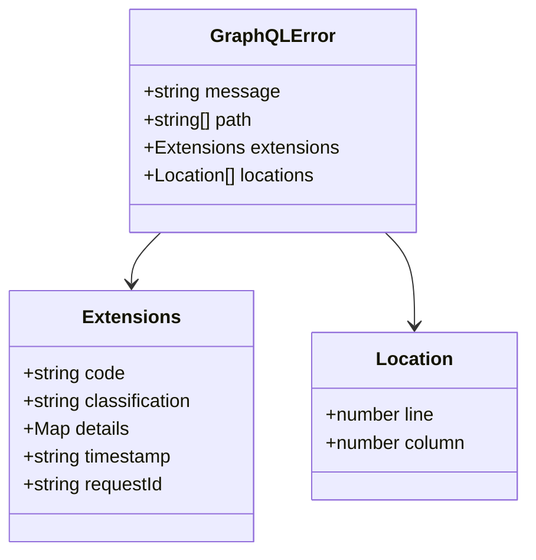
```mermaid
classDiagram
    class GraphQLError {
        +string message
        +string[] path
        +Extensions extensions
        +Location[] locations
    }
    
    class Extensions {
        +string code
        +string classification
        +Map details
        +string timestamp
        +string requestId
    }
    
    class Location {
        +number line
        +number column
    }
    
    GraphQLError --> Extensions
    GraphQLError --> Location
```

## 12. 監視・観測性

### 12.1 メトリクス収集

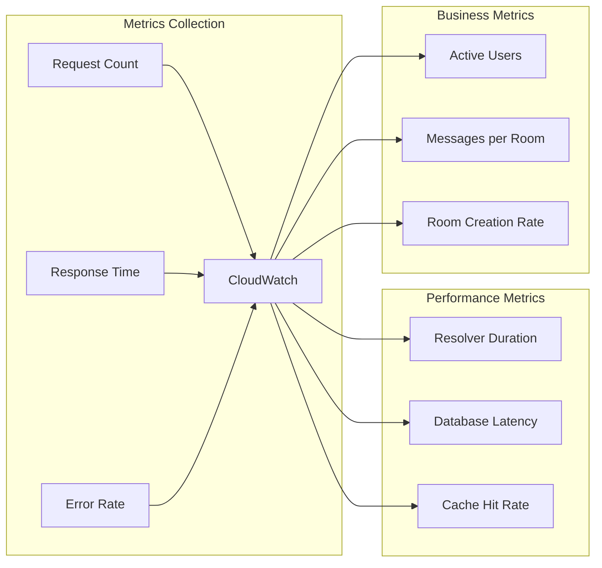
```mermaid
flowchart LR
    subgraph "Metrics Collection"
        A[Request Count] --> D[CloudWatch]
        B[Response Time] --> D
        C[Error Rate] --> D
    end
    
    subgraph "Performance Metrics"
        E[Resolver Duration]
        F[Database Latency]
        G[Cache Hit Rate]
    end
    
    subgraph "Business Metrics"
        H[Active Users]
        I[Messages per Room]
        J[Room Creation Rate]
    end
    
    D --> E
    D --> F
    D --> G
    D --> H
    D --> I
    D --> J
```

### 12.2 ログ分析

```mermaid
sequenceDiagram
    participant Request as GraphQL Request
    participant AppSync as AppSync
    participant CloudWatch as CloudWatch Logs
    participant XRay as X-Ray Tracing
    participant Dashboard as Monitoring Dashboard
    
    Request->>AppSync: GraphQL操作
    AppSync->>CloudWatch: 構造化ログ出力
    AppSync->>XRay: トレース情報記録
    
    CloudWatch->>Dashboard: ログ集計・可視化
    XRay->>Dashboard: パフォーマンス分析
    
    Note over CloudWatch,Dashboard: リアルタイム監視とアラート
```

## 13. API テスト戦略

### 13.1 テストピラミッド

```mermaid
flowchart TB
    subgraph "Testing Strategy"
        A[E2E Tests<br/>統合テスト] --> B[Integration Tests<br/>API テスト]
        B --> C[Unit Tests<br/>Resolver テスト]
    end
    
    subgraph "Test Tools"
        D[Cypress/Playwright]
        E[GraphQL Playground]
        F[Jest/Vitest]
    end
    
    A --> D
    B --> E
    C --> F
    
    subgraph "Coverage Areas"
        G[認証フロー]
        H[データ整合性]
        I[パフォーマンス]
        J[エラーハンドリング]
    end
```

### 13.2 GraphQL特有のテスト

```mermaid
sequenceDiagram
    participant Test as テストスイート
    participant Schema as Schema Validation
    participant Resolver as Resolver Test
    participant Integration as Integration Test
    participant E2E as E2E Test
    
    Test->>Schema: スキーマ構文チェック
    Schema-->>Test: ✅ Valid Schema
    
    Test->>Resolver: 個別Resolver実行
    Resolver-->>Test: ✅ Expected Output
    
    Test->>Integration: GraphQL操作実行
    Integration-->>Test: ✅ API Response
    
    Test->>E2E: ユーザーシナリオ実行
    E2E-->>Test: ✅ Full Flow Success
```

---

*このドキュメントは、チャットアプリのGraphQL API設計の詳細を説明しています。スケーラブルで保守性の高いAPI実装を実現するための設計原則とパターンを提供しています。*
