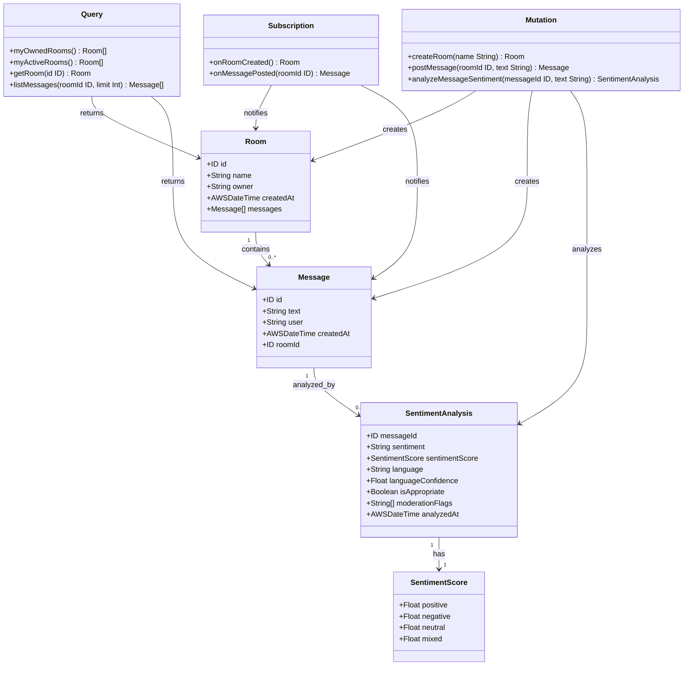
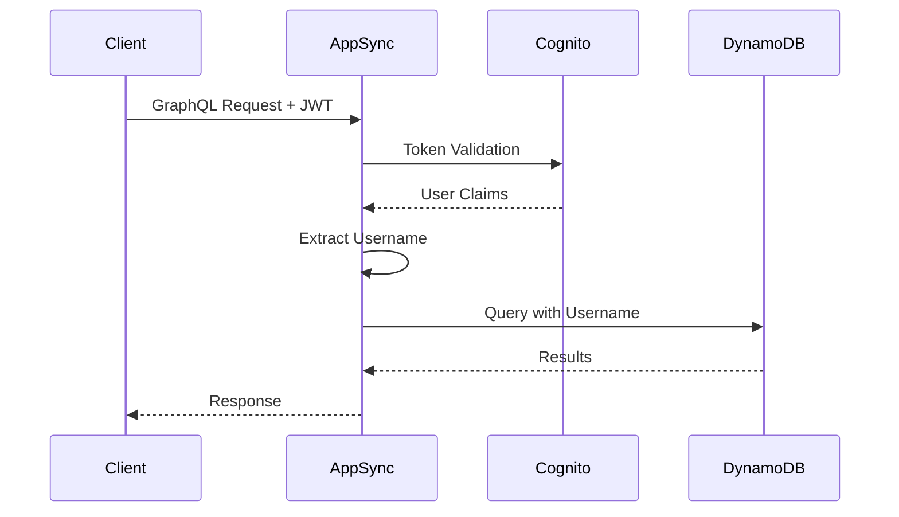
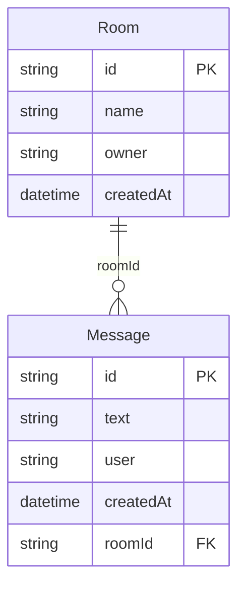

# 📋 GraphQLスキーマ設計書

## 📖 概要

本ドキュメントでは、AWS AppSync×DynamoDB リアルタイムチャットアプリで使用するGraphQLスキーマの詳細設計について説明します。

GraphQLスキーマは「データの設計図」として、フロントエンドとバックエンド間のAPI契約を定義する重要な役割を果たします。

## 🏗️ スキーマ全体構成



## 📊 型定義詳細

### 🏠 Room型（チャットルーム）

チャットルームの基本情報を表現する型です。

```graphql
type Room {
  id: ID!              # ルームの識別番号（必須、重複しない）
  name: String!        # ルームの名前（必須）
  owner: String!       # ルームを作った人の名前（必須）
  createdAt: AWSDateTime!  # ルームが作られた日時（必須、AWS形式）
  messages: [Message]  # このルームにあるメッセージの一覧（配列、任意）
}
```

#### フィールド詳細

| フィールド | 型 | 必須 | 説明 | 例 |
|-----------|---|-----|-----|---|
| `id` | `ID!` | ✅ | UUID形式のルーム識別子 | `"01234567-89ab-cdef-0123-456789abcdef"` |
| `name` | `String!` | ✅ | ユーザーが設定するルーム名 | `"開発チーム雑談"` |
| `owner` | `String!` | ✅ | ルーム作成者のCognito Username | `"user123"` |
| `createdAt` | `AWSDateTime!` | ✅ | ISO 8601形式のタイムスタンプ | `"2024-01-15T10:30:00.000Z"` |
| `messages` | `[Message]` | ❌ | ルーム内メッセージ一覧（リゾルバーで取得） | `[{id: "msg1", text: "Hello"}]` |

#### 設計上の考慮点

- **`id`の生成**: UUIDv4を使用して衝突を回避
- **`owner`の認証**: JWT トークンからの自動取得で改ざん防止
- **`messages`の遅延読み込み**: パフォーマンス向上のため別クエリで取得

### 💬 Message型（チャットメッセージ）

個々のチャットメッセージを表現する型です。

```graphql
type Message {
  id: ID!              # メッセージの識別番号（必須、重複しない）
  text: String!        # メッセージの本文（必須）
  user: String!        # メッセージを送った人の名前（必須）
  createdAt: AWSDateTime!  # メッセージが作られた日時（必須、AWS形式）
  roomId: ID!          # どのルームのメッセージか（必須）
}
```

#### フィールド詳細

| フィールド | 型 | 必須 | 説明 | 例 |
|-----------|---|-----|-----|---|
| `id` | `ID!` | ✅ | UUID形式のメッセージ識別子 | `"msg-01234567-89ab-cdef"` |
| `text` | `String!` | ✅ | メッセージ本文（最大1000文字） | `"こんにちは！プロジェクト順調ですね"` |
| `user` | `String!` | ✅ | 送信者のCognito Username | `"user456"` |
| `createdAt` | `AWSDateTime!` | ✅ | ISO 8601形式のタイムスタンプ | `"2024-01-15T10:35:00.000Z"` |
| `roomId` | `ID!` | ✅ | 所属ルームのID（外部キー） | `"room-01234567-89ab-cdef"` |

#### 設計上の考慮点

- **文字数制限**: フロントエンド・バックエンド双方でバリデーション
- **タイムスタンプ**: DynamoDBでソート条件として使用
- **外部キー**: `roomId`でルームとの関連を管理

## 🔍 Query定義（データ取得操作）

### `myOwnedRooms: [Room]`

**目的**: 認証ユーザーが作成したルームの一覧を取得

```graphql
query GetMyOwnedRooms {
  myOwnedRooms {
    id
    name
    owner
    createdAt
  }
}
```

**実装方式**:
- DynamoDB GSI `owner-index`を使用
- JWT トークンから`owner`を取得して検索

### `myActiveRooms: [Room]`

**目的**: 認証ユーザーが参加している（メッセージを送信したことがある）ルームの一覧を取得

```graphql
query GetMyActiveRooms {
  myActiveRooms {
    id
    name
    owner
    createdAt
  }
}
```

**実装方式**:
- パイプラインリゾルバーで効率的に取得
  1. Message テーブルの`user-index`で自分のメッセージを検索
  2. 重複除去してルームIDリストを作成
  3. Room テーブルからバッチ取得

### `getRoom(id: ID!): Room`

**目的**: 指定されたIDのルーム情報を取得

```graphql
query GetRoom($id: ID!) {
  getRoom(id: $id) {
    id
    name
    owner
    createdAt
    messages {
      id
      text
      user
      createdAt
    }
  }
}
```

**実装方式**:
- Room テーブルから直接取得
- `messages`フィールドは別リゾルバーで遅延読み込み

### `listMessages(roomId: ID!, limit: Int): [Message]`

**目的**: 指定されたルームのメッセージ一覧を取得

```graphql
query ListMessages($roomId: ID!, $limit: Int) {
  listMessages(roomId: $roomId, limit: $limit) {
    id
    text
    user
    createdAt
    roomId
  }
}
```

**実装方式**:
- Message テーブルの`room-index`を使用
- `createdAt`でソートして最新順に取得
- `limit`でページング対応

## ✏️ Mutation定義（データ変更操作）

### `createRoom(name: String!): Room`

**目的**: 新しいチャットルームを作成

```graphql
mutation CreateRoom($name: String!) {
  createRoom(name: $name) {
    id
    name
    owner
    createdAt
  }
}
```

**バリデーション**:
- `name`: 1-50文字の必須入力
- 特殊文字のサニタイズ
- 認証チェック（JWT トークン必須）

**実装フロー**:
1. JWT トークンから`owner`を取得
2. UUIDでルームIDを生成
3. 現在時刻を`createdAt`に設定
4. Room テーブルに保存
5. `onRoomCreated`サブスクリプションで通知

### `postMessage(roomId: ID!, text: String!): Message`

**目的**: 指定されたルームにメッセージを投稿

```graphql
mutation PostMessage($roomId: ID!, $text: String!) {
  postMessage(roomId: $roomId, text: $text) {
    id
    text
    user
    createdAt
    roomId
  }
}
```

**バリデーション**:
- `text`: 1-1000文字の必須入力
- `roomId`: 存在するルームかチェック
- 認証チェック（JWT トークン必須）

**実装フロー**:
1. JWT トークンから`user`を取得
2. ルームの存在確認
3. UUIDでメッセージIDを生成
4. 現在時刻を`createdAt`に設定
5. Message テーブルに保存
6. `onMessagePosted`サブスクリプションで通知

## 🔔 Subscription定義（リアルタイム通知）

### `onRoomCreated: Room`

**目的**: 新しいルームが作成された時の通知

```graphql
subscription OnRoomCreated {
  onRoomCreated {
    id
    name
    owner
    createdAt
  }
}
```

**動作仕組み**:
- `createRoom`ミューテーション実行時に自動発火
- 全接続クライアントに通知
- WebSocket接続必須

### `onMessagePosted(roomId: ID!): Message`

**目的**: 特定のルームに新しいメッセージが投稿された時の通知

```graphql
subscription OnMessagePosted($roomId: ID!) {
  onMessagePosted(roomId: $roomId) {
    id
    text
    user
    createdAt
    roomId
  }
}
```

**動作仕組み**:
- `postMessage`ミューテーション実行時に自動発火
- 指定された`roomId`を購読中のクライアントのみに通知
- WebSocket接続必須

## 🔒 認証・認可設計

### JWT トークンベース認証



### 認可ルール

| 操作 | 認証要否 | 追加認可ルール |
|-----|---------|---------------|
| `myOwnedRooms` | ✅ | なし（自分のデータのみ） |
| `myActiveRooms` | ✅ | なし（自分のデータのみ） |
| `getRoom` | ✅ | なし（全ルーム参照可能） |
| `listMessages` | ✅ | なし（全メッセージ参照可能） |
| `createRoom` | ✅ | なし |
| `postMessage` | ✅ | ルーム存在チェック |
| `onRoomCreated` | ✅ | なし |
| `onMessagePosted` | ✅ | なし |

## ⚡ パフォーマンス考慮事項

### DynamoDB GSI戦略



**GSI設計詳細**:

| GSI名 | パーティションキー | ソートキー | 用途 |
|-------|------------------|-----------|------|
| `owner-index` | owner | createdAt | 自分が作成したルーム検索 |
| `user-index` | user | createdAt | 自分が投稿したメッセージ検索 |
| `room-index` | roomId | createdAt | ルーム内メッセージ時系列取得 |

### クエリ最適化パターン

1. **Owner検索**: `owner-index`で1回のクエリ
2. **Active Rooms**: パイプラインリゾルバーでN+1問題解決
3. **Message History**: `room-index`でソート済み取得
4. **リアルタイム通知**: WebSocket効率化

## 🚀 拡張性設計

### 将来の機能拡張考慮

```graphql
# 将来追加予定のフィールド例
type Room {
  id: ID!
  name: String!
  owner: String!
  createdAt: AWSDateTime!
  # 拡張フィールド候補
  description: String      # ルーム説明
  isPrivate: Boolean      # プライベートルーム設定
  memberCount: Int        # メンバー数
  lastMessageAt: AWSDateTime  # 最後のメッセージ時刻
  tags: [String]          # ルームタグ
}

type Message {
  id: ID!
  text: String!
  user: String!
  createdAt: AWSDateTime!
  roomId: ID!
  # 拡張フィールド候補
  messageType: MessageType  # テキスト/画像/ファイル
  attachmentUrl: String     # 添付ファイルURL
  replyToId: ID            # 返信先メッセージID
  reactions: [Reaction]     # リアクション
  isEdited: Boolean        # 編集フラグ
}
```

### APIバージョニング戦略

- **下位互換性**: 既存フィールドの型変更禁止
- **Deprecation**: `@deprecated`ディレクティブ使用
- **段階的移行**: 新旧API併存期間の設定

## 📋 バリデーションルール

### 入力検証

```javascript
// バリデーション例
const validateRoomName = (name) => {
  if (!name || name.length < 1 || name.length > 50) {
    throw new Error('ルーム名は1-50文字で入力してください');
  }
  if (!/^[a-zA-Z0-9あ-んア-ヶ一-龯\s\-_]+$/.test(name)) {
    throw new Error('ルーム名に使用できない文字が含まれています');
  }
};

const validateMessageText = (text) => {
  if (!text || text.length < 1 || text.length > 1000) {
    throw new Error('メッセージは1-1000文字で入力してください');
  }
};
```

### セキュリティ対策

- **SQLインジェクション対策**: パラメータ化クエリ使用
- **XSS対策**: 入力値のHTMLエスケープ
- **Rate Limiting**: API呼び出し頻度制限
- **認証トークン検証**: 全API呼び出しで実施

---

このGraphQLスキーマ設計により、**型安全性**、**パフォーマンス**、**拡張性**を両立したAPIを実現しています。
