# チャットアプリ - データフロー設計書

このドキュメントでは、チャットアプリケーションにおける様々なデータフローを詳細に説明し、Mermaidを使用して視覚化します。

## 1. 基本データフロー概要

### 1.1 アプリケーション全体のデータフロー

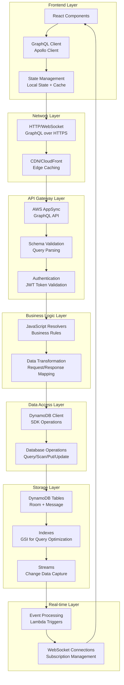

## 2. 認証・認可フロー詳細

### 2.1 新規ユーザー登録フロー

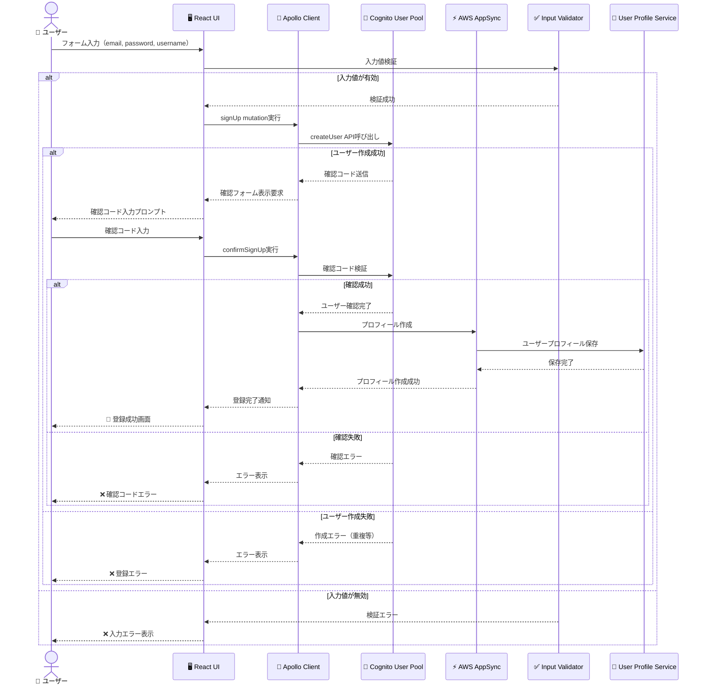

### 2.2 ログインとトークン管理フロー

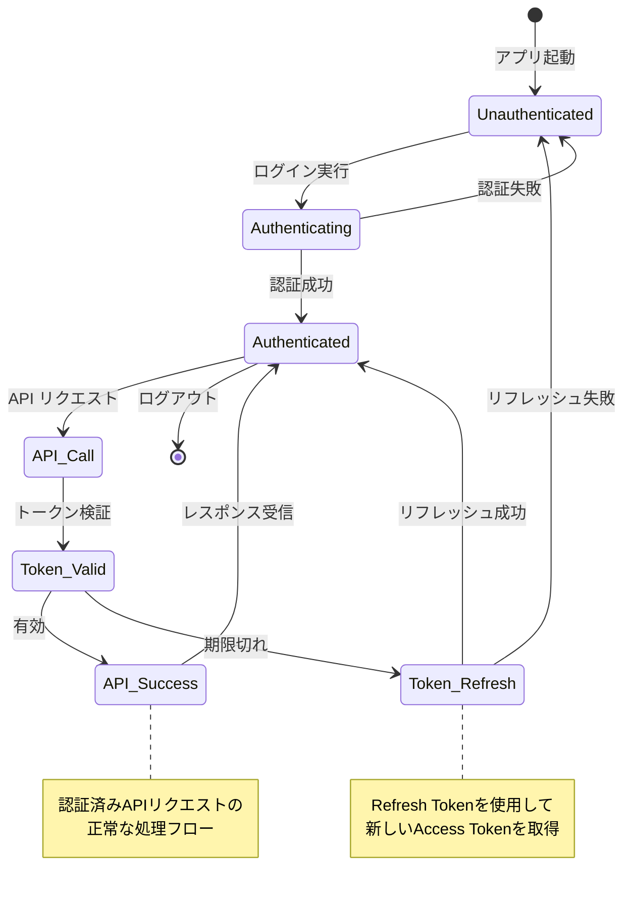

## 3. チャットルーム操作フロー

### 3.1 ルーム作成フロー

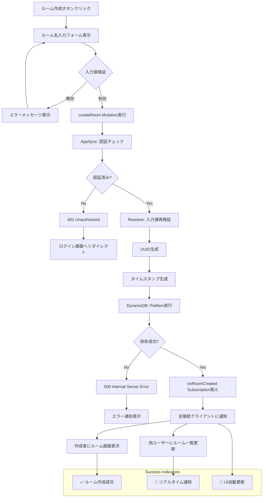

### 3.2 ルーム参加・退出フロー

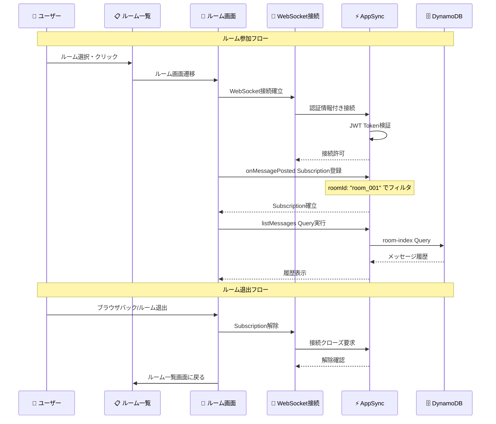

## 4. メッセージング・フロー

### 4.1 メッセージ投稿フロー詳細

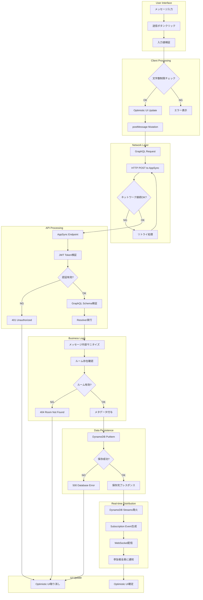

### 4.2 メッセージ受信・表示フロー

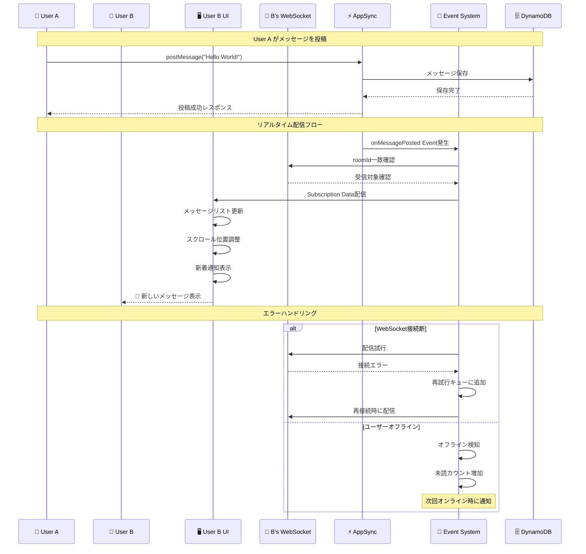

## 5. データ同期・整合性フロー

### 5.1 楽観的UI更新と同期

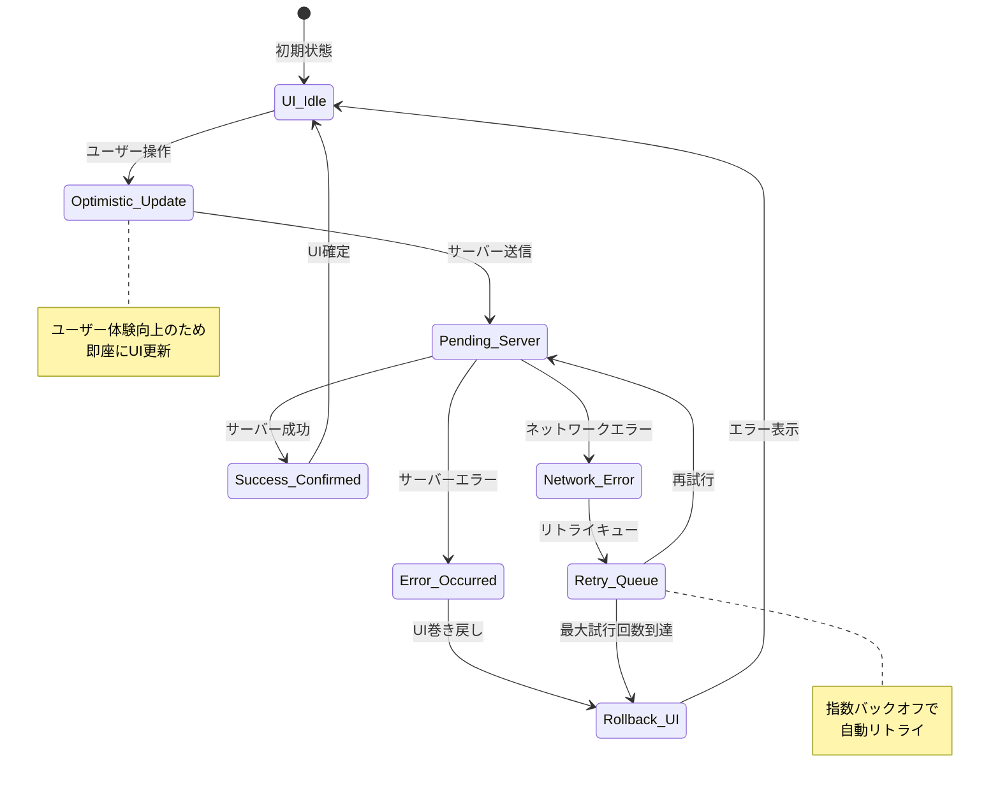

### 5.2 競合状態の解決フロー

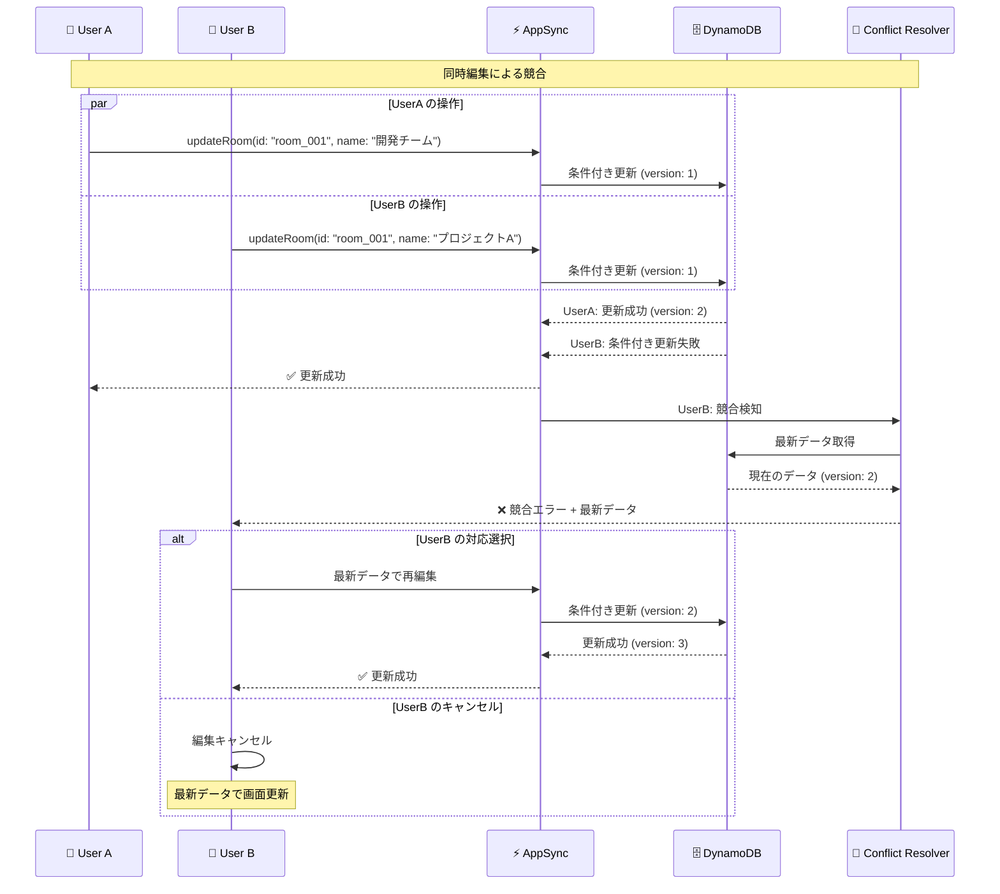

## 6. キャッシュ・パフォーマンス最適化フロー

### 6.1 多層キャッシュ戦略

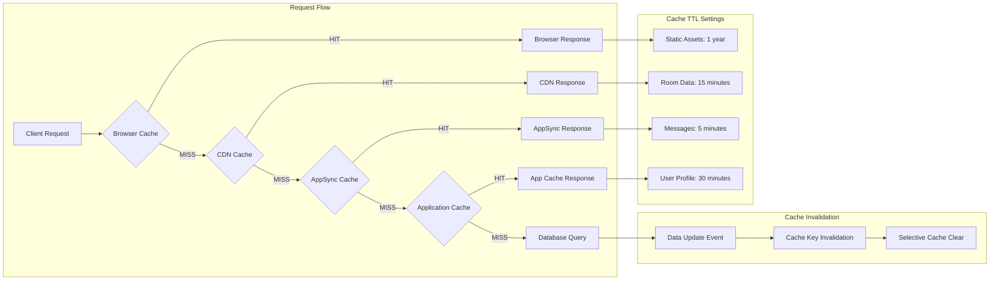

### 6.2 Apollo Client キャッシュフロー

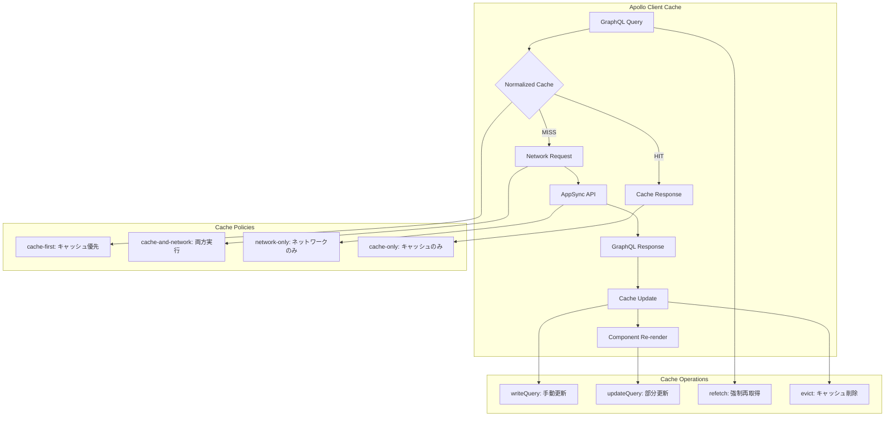

## 7. エラーハンドリング・フロー

### 7.1 エラー分類と処理フロー

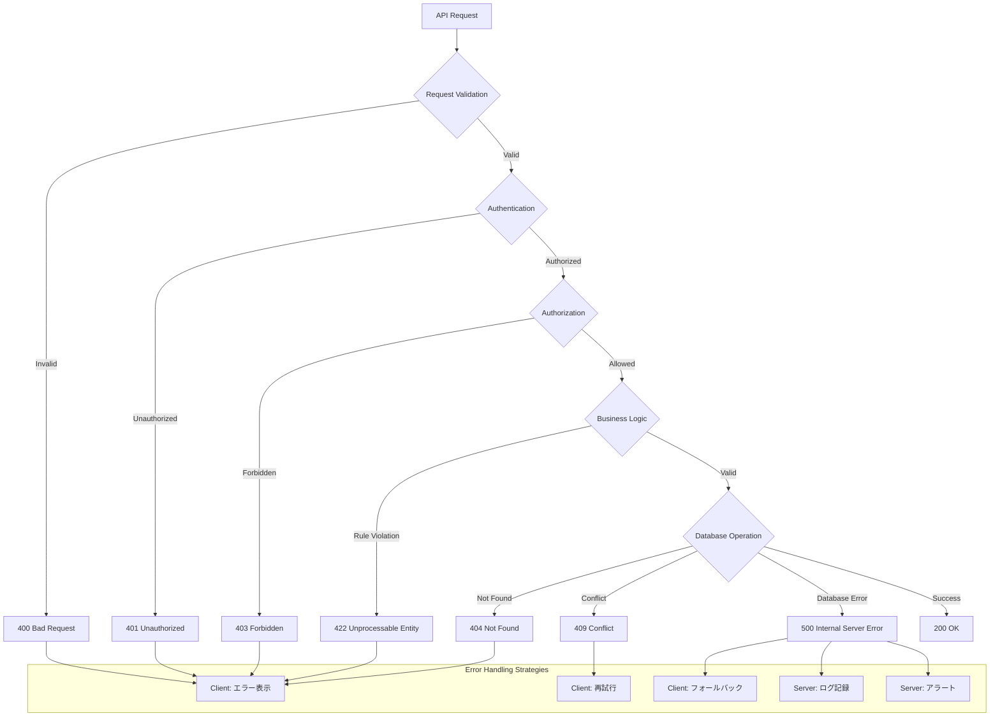

### 7.2 リアルタイム接続エラーハンドリング

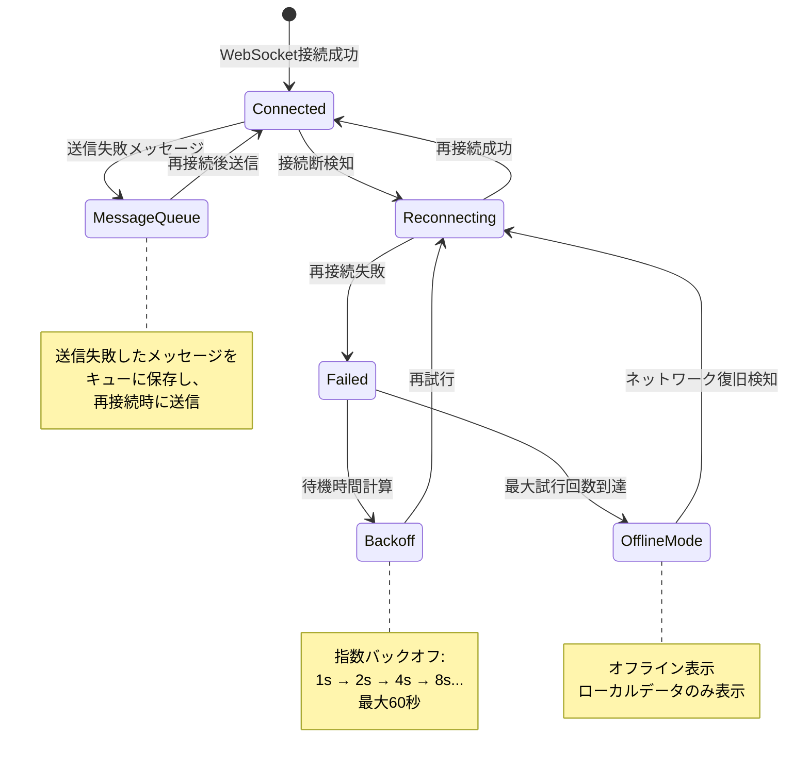

## 8. パフォーマンス監視・フロー

### 8.1 メトリクス収集フロー

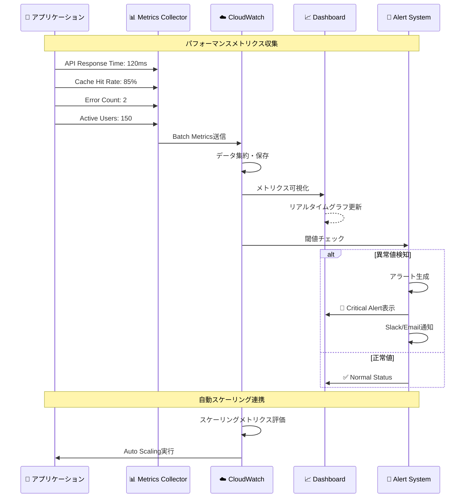

### 8.2 ユーザーエクスペリエンス監視

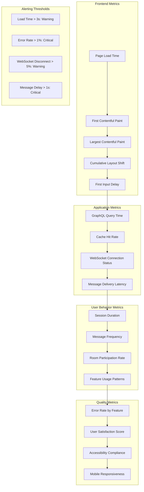

---

*このドキュメントは、チャットアプリケーションの全データフローを包括的に説明しています。各フローは実際の実装に基づいており、システムの動作理解と最適化に活用できます。*
