# チャットアプリ - データベース設計詳細書

## 1. システム概要

このチャットアプリは、AWS AppSyncとDynamoDBを使用したサーバーレスリアルタイムメッセージングシステムです。NoSQLデータベース設計の特徴を活かし、高いスケーラビリティと可用性を実現しています。

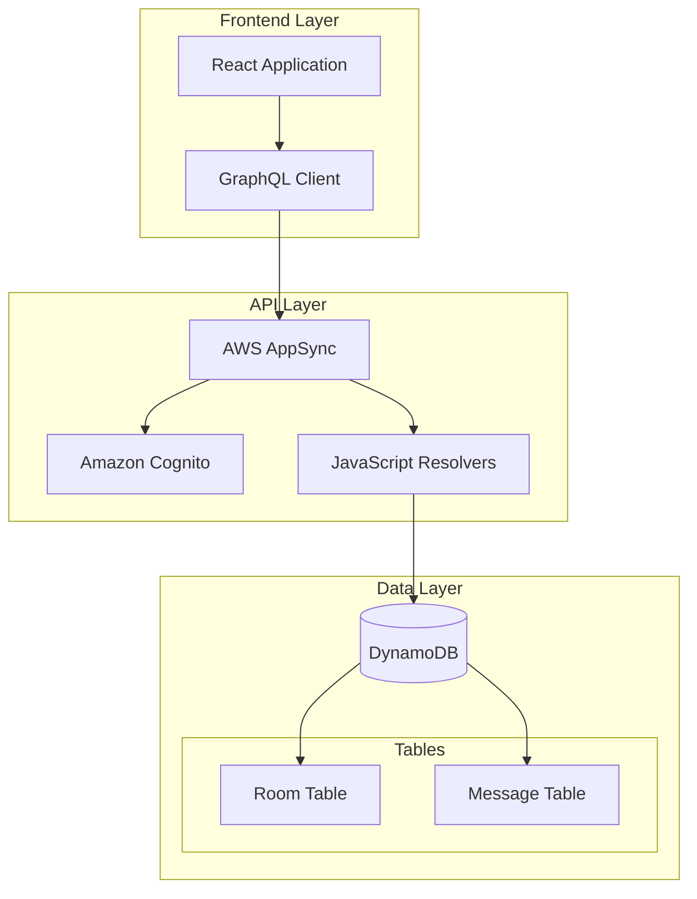

## 2. データベース技術選択理由

### 2.1 DynamoDB選択理由

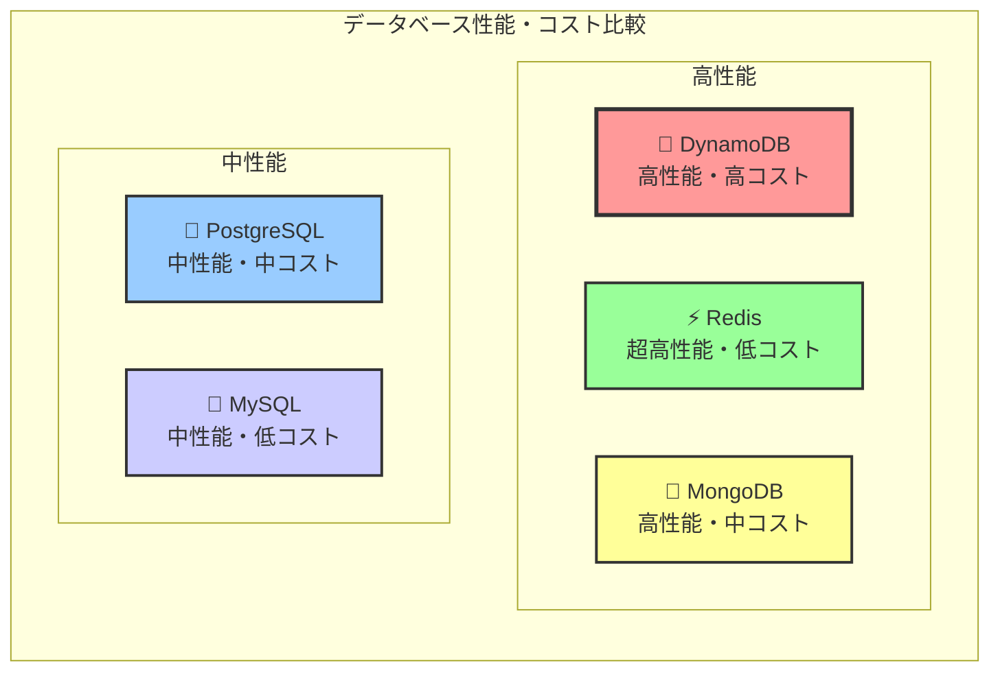

| 特徴 | DynamoDB | PostgreSQL | MongoDB |
|------|----------|------------|---------|
| スケーラビリティ | ★★★★★ | ★★★ | ★★★★ |
| レスポンス時間 | ★★★★★ | ★★★ | ★★★★ |
| 運用コスト | ★★★★ | ★★ | ★★★ |
| リアルタイム性 | ★★★★★ | ★★ | ★★★ |
| 学習コスト | ★★★ | ★★★★ | ★★★★ |

### 2.2 NoSQL設計原則

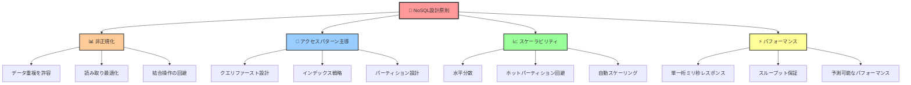

## 3. テーブル設計詳細

### 3.1 Roomテーブル設計

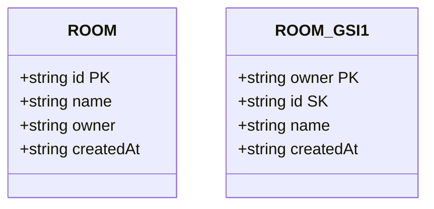

#### 3.1.1 アクセスパターン分析

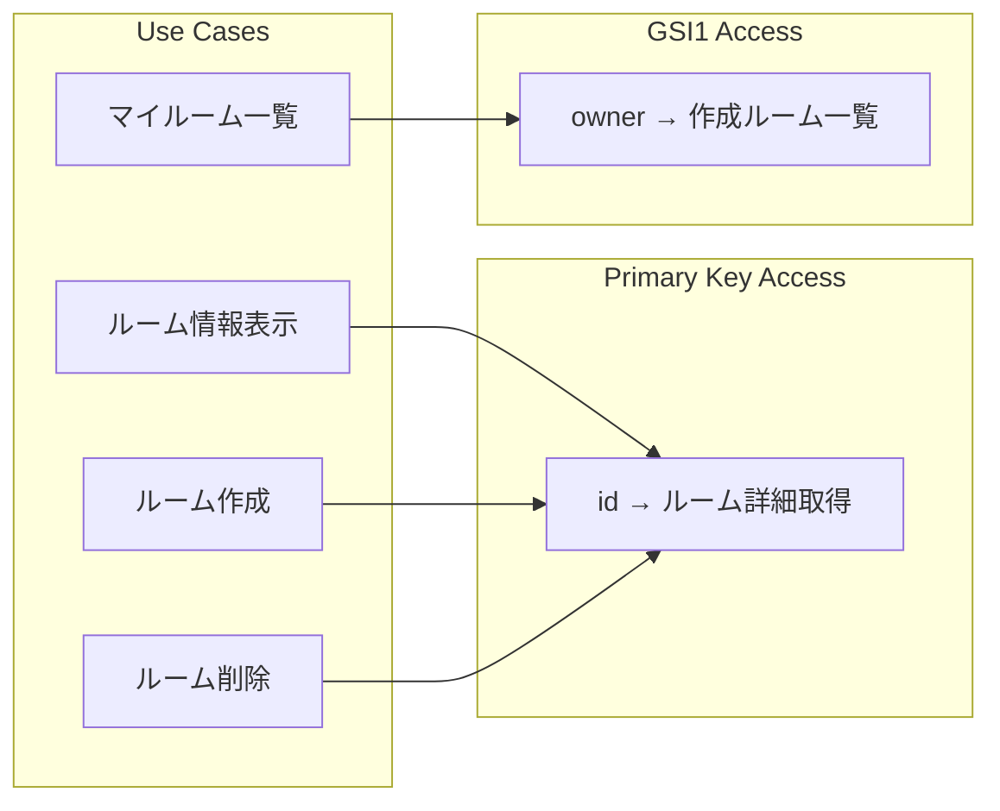

#### 3.1.2 データサンプル

| id | name | owner | createdAt |
|----|------|-------|-----------|
| `room_001` | "開発チーム" | "alice" | "2025-01-01T09:00:00Z" |
| `room_002` | "雑談部屋" | "bob" | "2025-01-02T10:30:00Z" |
| `room_003` | "プロジェクトA" | "alice" | "2025-01-03T14:15:00Z" |

### 3.2 Messageテーブル設計

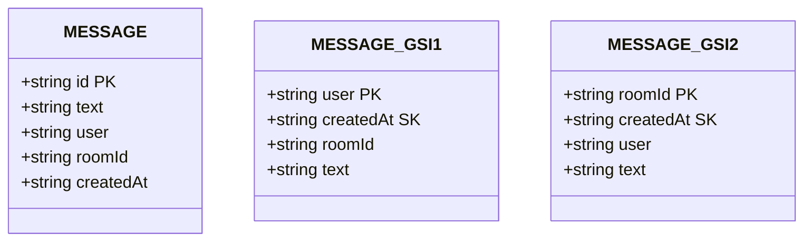

#### 3.2.1 アクセスパターン分析

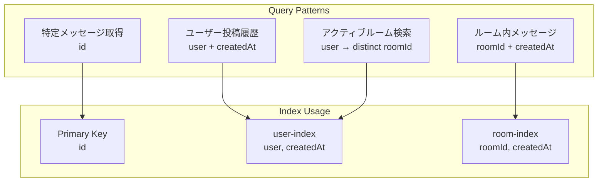

#### 3.2.2 時系列データの最適化

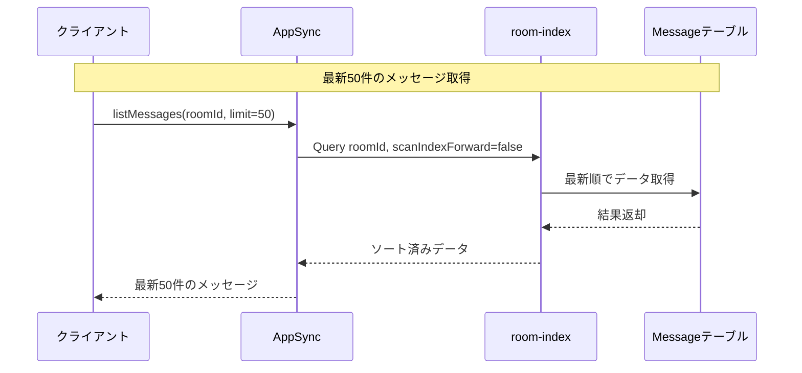

#### 3.2.3 データサンプル

| id | text | user | roomId | createdAt |
|----|------|------|--------|-----------|
| `msg_001` | "おはようございます！" | "alice" | "room_001" | "2025-01-01T09:05:00Z" |
| `msg_002` | "今日の進捗はどうですか？" | "bob" | "room_001" | "2025-01-01T09:10:00Z" |
| `msg_003` | "バグを修正しました" | "alice" | "room_001" | "2025-01-01T09:15:00Z" |

## 4. インデックス戦略

### 4.1 Global Secondary Index設計

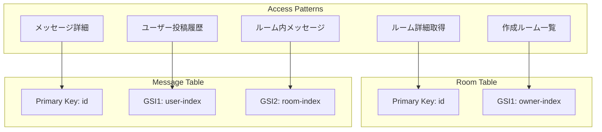

## 5. パーティション設計

### 5.1 ホットパーティション回避戦略

```mermaid
gantt
    title パーティション負荷分散シミュレーション
    dateFormat X
    axisFormat %H:%M
    
    section Partition A
    Low Load    :a1, 0, 8
    Medium Load :a2, 8, 4
    High Load   :a3, 12, 2
    Low Load    :a4, 14, 10
    
    section Partition B
    Medium Load :b1, 0, 6
    High Load   :b2, 6, 3
    Low Load    :b3, 9, 6
    Medium Load :b4, 15, 9
    
    section Partition C
    High Load   :c1, 0, 3
    Low Load    :c2, 3, 8
    Medium Load :c3, 11, 5
    High Load   :c4, 16, 8
```

### 5.2 スケーラビリティ考慮事項

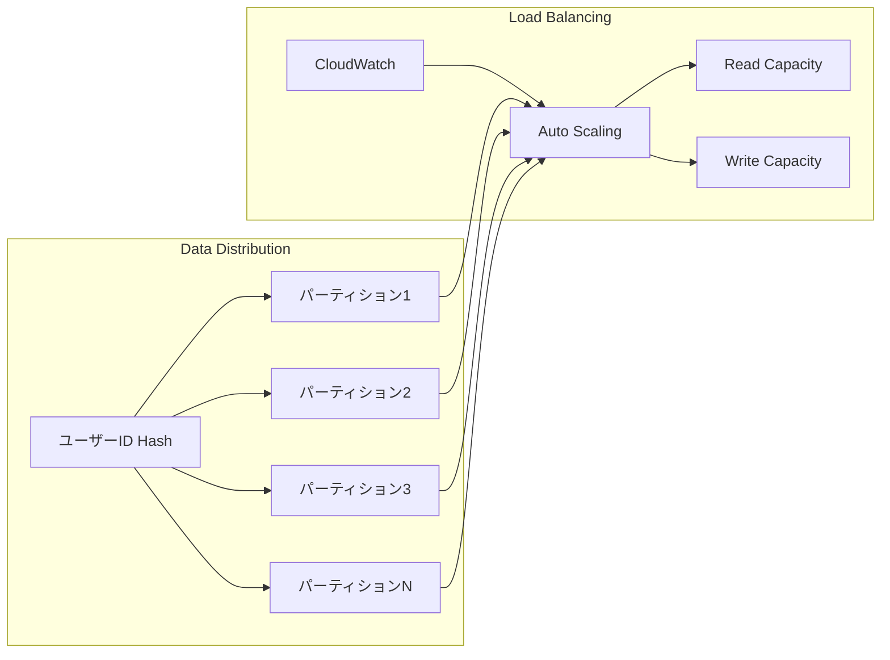

## 6. データモデリングパターン

### 6.1 One-to-Many関係の実装

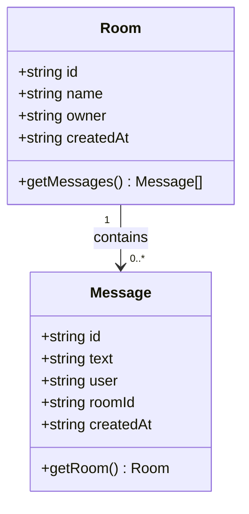

### 6.2 非正規化データパターン

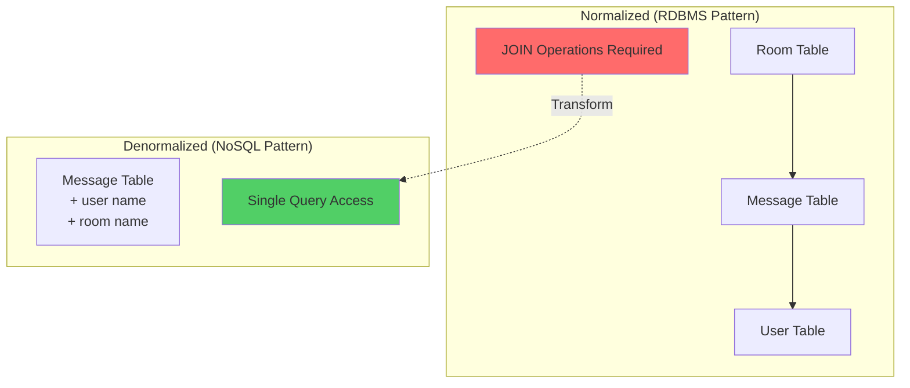

## 7. 容量設計

### 8.1 ストレージ容量見積もり

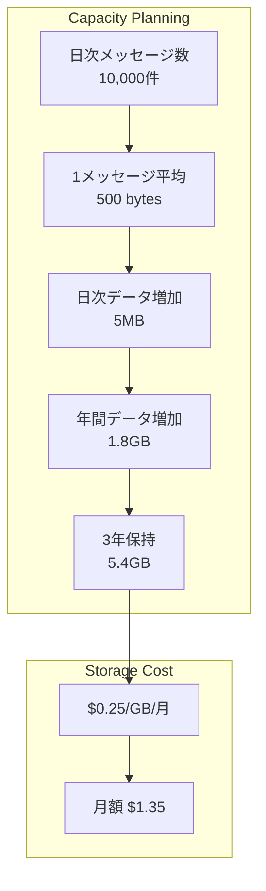

### 8.2 トラフィック設計

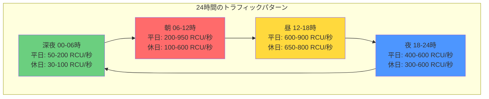

**トラフィック特性:**
- **ピーク時間**: 平日 09:00-10:00 (950 RCU/秒)
- **オフピーク**: 深夜 02:00-05:00 (50 RCU/秒)
- **休日パターン**: より均等な分散、ピークは低め

## 9. 監視・運用

### 9.1 メトリクス監視

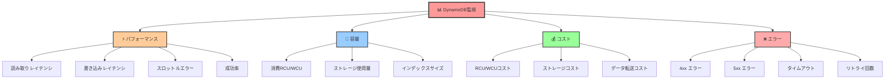

### 9.2 アラート設定

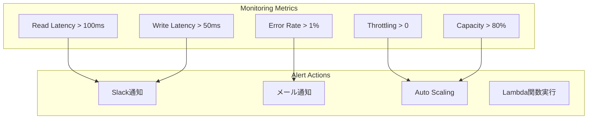

## 10. セキュリティ設計

### 10.1 データ保護

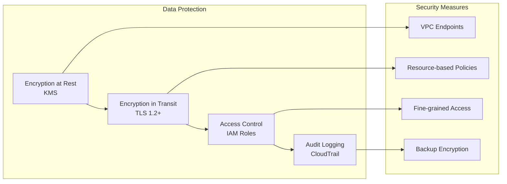

### 10.2 アクセス制御

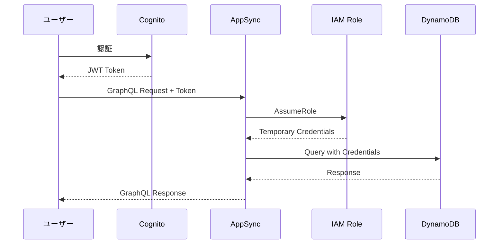

## 11. 災害復旧・バックアップ

### 11.1 バックアップ戦略

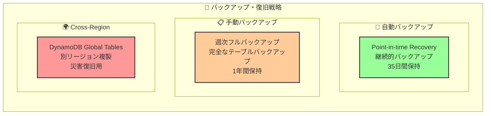

### 11.2 復旧手順

```mermaid
flowchart TB
    A[障害検知] --> B{影響範囲判定}
    B -->|部分障害| C[Point-in-time Recovery]
    B -->|全体障害| D[Cross-Region Failover]
    B -->|データ破損| E[手動バックアップから復旧]
    
    C --> F[データ整合性確認]
    D --> F
    E --> F
    
    F --> G[アプリケーション復旧確認]
    G --> H[監視システム復旧]
    H --> I[ユーザー通知]
```

---

*このドキュメントは、チャットアプリのDynamoDBデータベース設計の詳細を説明しています。NoSQL設計原則に基づき、スケーラブルで高性能なデータストアを実現しています。*
