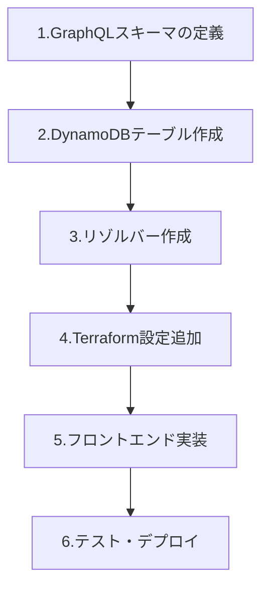

# 🚀 AWS AppSync API追加ガイド

このドキュメントでは、AWS AppSyncチャットアプリに新しいAPIを簡単に追加する方法を説明します。

## 📋 目次

1. [API追加の基本的な流れ](#api追加の基本的な流れ)
2. [テンプレートの使い方](#テンプレートの使い方)
3. [実装例：いいね機能](#実装例いいね機能)
4. [デプロイと確認手順](#デプロイと確認手順)
5. [トラブルシューティング](#トラブルシューティング)

## 🔄 API追加の基本的な流れ

新しいAPIを追加する際は、以下の順序で作業を進めます：



### 各ステップの詳細

1. **GraphQLスキーマの定義** (`schema.graphql`)
   - データ構造（Type）の定義
   - クエリ・ミューテーション・サブスクリプションの定義

2. **DynamoDBテーブル作成** (`infra/dynamodb.tf`)
   - テーブル設計とインデックス設定
   - Terraformでのリソース定義

3. **リゾルバー作成** (`resolvers/`)
   - JavaScriptでのデータ処理ロジック
   - リクエスト・レスポンス処理

4. **Terraform設定追加** (`infra/resolvers.tf`)
   - リゾルバーとデータソースの設定
   - AppSyncとの連携設定

5. **フロントエンド実装** (`src/`)
   - GraphQLクエリ・ミューテーション・サブスクリプション
   - Reactコンポーネントの作成

6. **テスト・デプロイ**
   - 動作確認とデバッグ
   - 本番環境への適用

## 📝 テンプレートの使い方

### ステップ1: テンプレートファイルを確認

以下のテンプレートファイルを参照してください：
- 📁 `doc/templates/` フォルダ内のテンプレートファイル

### ステップ2: 必要な部分をコピー

1. **GraphQLスキーマテンプレート** から必要な部分をコピー
2. **Terraformテンプレート** から必要な部分をコピー
3. **フロントエンドテンプレート** から必要な部分をコピー

### ステップ3: 自分の機能に合わせて修正

```javascript
// 例：いいね機能 → コメント機能に変更する場合
// Before:
type Like {
    id: ID!
    messageId: ID!
    userId: String!
}

// After:
type Comment {
    id: ID!
    messageId: ID!
    userId: String!
    content: String!  // コメント内容を追加
}
```

### ステップ4: 段階的に実装・テスト

各ステップを一つずつ実装し、動作確認を行いながら進めてください。

## 🎯 実装例：いいね機能

「いいね機能」を例に、実際の実装手順を説明します。

### Phase 1: 設計・準備

1. **要件定義**
   - ユーザーはメッセージにいいねできる
   - いいね数をリアルタイムで表示
   - 重複いいねは不可

2. **データ構造設計**
   ```
   Like テーブル:
   - id (主キー)
   - messageId (GSI)
   - userId (GSI) 
   - userName
   - createdAt
   ```

### Phase 2: バックエンド実装

1. **GraphQLスキーマ追加**
   - `Like` タイプの定義
   - `addLike`, `removeLike`, `getLikes` の定義

2. **DynamoDBテーブル作成**
   - Likesテーブルとインデックスの定義

3. **リゾルバー実装**
   - いいね追加・削除・取得のロジック

### Phase 3: フロントエンド実装

1. **GraphQL操作定義**
   - Mutation, Query, Subscription の定義

2. **UIコンポーネント作成**
   - LikeButtonコンポーネントの実装

3. **リアルタイム連携**
   - Subscriptionでの即座反映

### Phase 4: テスト・デプロイ

1. **単体テスト**
   - 各機能の個別動作確認

2. **統合テスト**
   - フロント・バックエンド連携確認

3. **本番デプロイ**
   - Terraformでのリソース作成

## 🛠 デプロイと確認手順

### 1. 事前チェック

```bash
# 現在の状態を確認
git status

# 変更内容を確認
git diff

# Node.js依存関係を確認
npm list
```

### 2. スキーマ検証

```bash
# GraphQLスキーマの文法チェック
npm run lint:graphql

# または手動でチェック
npx graphql-schema-linter schema.graphql
```

### 3. インフラデプロイ

```bash
# Terraformの作業ディレクトリに移動
cd infra

# 変更内容を事前確認（重要！）
terraform plan

# 問題なければ適用
terraform apply

# 出力された値を確認
terraform output
```

### 4. 環境変数更新

```bash
# 新しい環境変数があれば .env ファイルを更新
cp .env.example .env
# エディタで必要な値を設定
```

### 5. フロントエンドテスト

```bash
# 開発サーバーを起動
npm run dev

# ブラウザでテスト
# http://localhost:3000
```

### 6. API動作確認

AWS AppSync コンソールでGraphQLクエリをテスト：

```graphql
# テスト用クエリ例
mutation TestAddLike {
  addLike(
    messageId: "test-message-123"
    userId: "test-user-456" 
    userName: "テストユーザー"
  ) {
    id
    messageId
    userId
    userName
    createdAt
  }
}

query TestGetLikes {
  getLikes(messageId: "test-message-123") {
    id
    userId
    userName
    createdAt
  }
}
```

## 🧪 トラブルシューティング

### よくあるエラーと解決方法

#### 1. スキーマ関連エラー

**エラー**: `GraphQL schema validation failed`

**原因と解決方法**:
```
- 型名は大文字で始める（例：Like, Message）
- フィールド名は小文字で始める（例：messageId, userName）
- 必須フィールドには ! を付ける（例：id: ID!）
- コメントは # を使用（例：# これはコメント）
```

#### 2. Terraform関連エラー

**エラー**: `Error: Resource already exists`

**解決方法**:
```bash
# 既存リソースをTerraformにインポート
terraform import aws_dynamodb_table.likes existing-table-name

# または既存リソースを削除してから再作成
```

**エラー**: `Error: Insufficient permissions`

**解決方法**:
```bash
# AWS認証情報を確認
aws sts get-caller-identity

# 必要に応じてIAMポリシーを追加
```

#### 3. リゾルバー関連エラー

**エラー**: `DynamoDB operation failed`

**解決方法**:
```javascript
// CloudWatch Logsでエラー詳細を確認
// AWS Console > CloudWatch > Log groups > /aws/appsync/apis/[API-ID]

// よくある問題：
// 1. テーブル名の間違い
// 2. IAMロールの権限不足
// 3. データ型の不一致
```

#### 4. フロントエンド関連エラー

**エラー**: `GraphQL error: Cannot query field`

**解決方法**:
```javascript
// スキーマとクエリの整合性を確認
// 1. フィールド名のスペルミス
// 2. 必須パラメータの不足
// 3. 型の不一致
```

**エラー**: `Network error: Failed to fetch`

**解決方法**:
```javascript
// 1. .env ファイルの設定値を確認
// 2. AppSync APIの認証設定を確認
// 3. CORS設定を確認
```

#### 5. リアルタイム通知の問題

**エラー**: `Subscription not working`

**解決方法**:
```graphql
# 1. @aws_subscribe の mutations 設定を確認
type Subscription {
    onLikeAdded(messageId: ID): Like
        @aws_subscribe(mutations: ["addLike"])  # ここが正しいか確認
}

# 2. WebSocket接続の確認
# ブラウザの開発者ツールでWebSocket接続を確認
```

### デバッグのベストプラクティス

1. **段階的実装**
   - 一度に全部実装せず、機能を分割して実装
   - 各段階で動作確認を行う

2. **ログ活用**
   ```javascript
   // リゾルバーにログを追加
   export function request(ctx) {
       console.log('Request context:', JSON.stringify(ctx, null, 2));
       // ... 処理
   }
   
   export function response(ctx) {
       console.log('Response context:', JSON.stringify(ctx, null, 2));
       // ... 処理
   }
   ```

3. **テストデータ作成**
   ```bash
   # DynamoDBに直接テストデータを投入
   aws dynamodb put-item \
     --table-name your-table-name \
     --item '{"id": {"S": "test-id"}, "messageId": {"S": "test-message"}}'
   ```

## 📚 参考リソース

### 公式ドキュメント
- 📖 [AWS AppSync Developer Guide](https://docs.aws.amazon.com/appsync/)
- 📖 [GraphQL Schema Definition Language](https://graphql.org/learn/schema/)
- 📖 [DynamoDB Best Practices](https://docs.aws.amazon.com/amazondynamodb/latest/developerguide/best-practices.html)
- 📖 [Terraform AWS Provider](https://registry.terraform.io/providers/hashicorp/aws/latest/docs)

### 学習リソース
- 🎓 [GraphQL公式チュートリアル](https://graphql.org/learn/)
- 🎓 [React Query学習ガイド](https://tanstack.com/query/latest)
- 🎓 [AWS AppSync Workshop](https://appsync.workshop.aws/)

### ツール・拡張機能
- 🛠️ [GraphQL Language Service](https://marketplace.visualstudio.com/items?itemName=GraphQL.vscode-graphql) - VS Code拡張
- 🛠️ [Apollo Client DevTools](https://www.apollographql.com/docs/react/development-testing/developer-tooling/) - ブラウザ拡張
- 🛠️ [Terraform VS Code Extension](https://marketplace.visualstudio.com/items?itemName=HashiCorp.terraform)

## � フロントエンド・バックエンド整合性確認

新しいAPI機能を追加する際は、必ずフロントエンドとバックエンドの整合性を確認してください。

### ✅ 確認必須項目

1. **GraphQLスキーマの整合性**
   - パラメータの型と必須/任意の一致
   - レスポンス形式の統一
   - フィールド名の完全一致

2. **フロントエンド実装の確認**
   ```javascript
   // 正しいインポート例
   import { listMessages } from '../graphql/queries';
   import { postMessage, analyzeMessageSentimentMutation } from '../graphql/mutations';
   
   // パラメータの整合性確認
   const result = await client.graphql({
     query: analyzeMessageSentimentMutation,
     variables: {
       messageId,    // スキーマ: messageId: ID!
       text: messageText  // スキーマ: text: String!
     }
   });
   ```

3. **バックエンド設定の確認**
   ```hcl
   # resolvers.tf - 設定例
   resource "aws_appsync_resolver" "analyze_message_sentiment" {
     api_id      = aws_appsync_graphql_api.chat_api.id
     field       = "analyzeMessageSentiment"  # スキーマのフィールド名と一致
     type        = "Mutation"                 # 正しいオペレーション型
     data_source = aws_appsync_datasource.lambda_sentiment.name
   }
   ```

### 🚨 よくあるエラーと対処法

1. **インポート文の間違い**
   - ❌ QueryとMutationの混在
   - ✅ 適切なファイルからのインポート

2. **パラメータ名の不一致**
   - ❌ フロントエンド: `messageText` → バックエンド: `text`
   - ✅ 統一された命名規則の使用

3. **必須フィールドの欠如**
   - ❌ `text: String` → `text: String!`
   - ✅ 必須フィールドの正しい定義

### 📝 整合性確認チェックリスト

- [ ] GraphQLスキーマ定義完了
- [ ] フロントエンドGraphQL操作定義完了
- [ ] バックエンドResolver設定完了
- [ ] パラメータ名・型の完全一致確認
- [ ] レスポンス形式の統一確認
- [ ] インポート文の正確性確認
- [ ] エラーハンドリング実装完了

## �💡 次のステップ

1. **基本的なCRUD操作をマスター**
   - まずは简単な機能から始める
   - Create, Read, Update, Delete を一通り実装

2. **リアルタイム機能の理解**
   - Subscriptionの活用方法を学ぶ
   - WebSocketの基本概念を理解

3. **パフォーマンス最適化**
   - DynamoDBのクエリパターン最適化
   - GraphQLクエリの効率化

4. **セキュリティ強化**
   - 認証・認可の詳細設定
   - データ検証の実装

---

**🎯 このガイドを参考に、段階的にAPI機能を追加していきましょう！**
