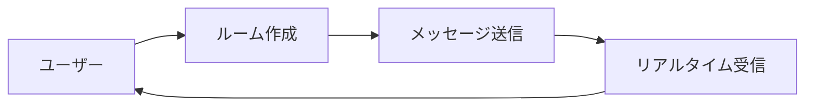

# 📚 GraphQLスキーマ 初心者ガイド

## 🤔 GraphQLって何？

**GraphQL**は、APIでデータをやり取りするための「言語」のようなものです。

従来のREST APIと比べて、**必要なデータだけを効率的に取得**できるのが特徴です。

### 🏠 身近な例で理解しよう

レストランで料理を注文することを考えてみましょう：

#### 従来のREST API（定食スタイル）
```
GET /user/123        → ユーザーの全情報（名前、年齢、住所、趣味...）
GET /user/123/rooms  → ルームの全情報（ID、名前、作成日時、メンバー...）
GET /room/456/messages → メッセージの全情報（ID、本文、送信者、時刻...）
```
**問題**: 名前だけ欲しいのに、不要な情報もたくさん送られてくる 😰

#### GraphQL（アラカルトスタイル）
```graphql
query {
  user(id: "123") {
    name          # 名前だけ欲しい
  }
  rooms {
    name         # ルーム名だけ欲しい
    messageCount # メッセージ数だけ欲しい
  }
}
```
**メリット**: 欲しい情報だけピンポイントで取得！ 🎯

## 📋 スキーマとは？

**スキーマ**は「データの設計図」です。

```graphql
# これがスキーマ（設計図）
type User {
  id: ID!           # ユーザーID（必須）
  name: String!     # 名前（必須）
  email: String     # メール（任意）
}
```

### 🏗️ 設計図の読み方

| 記号 | 意味 | 例 |
|-----|-----|---|
| `!` | 必須項目 | `name: String!` → 名前は必ず入力 |
| `[]` | 配列（リスト） | `rooms: [Room]` → ルームのリスト |
| `#` | コメント | `# これは説明文` |

## 🎯 このアプリのスキーマを理解しよう

### 📱 アプリの基本構成



### 🏠 Room（ルーム）- チャット部屋

```graphql
type Room {
  id: ID!              # ルームの番号（自動で決まる）
  name: String!        # ルームの名前（「開発部」とか）
  owner: String!       # 作った人の名前
  createdAt: AWSDateTime!  # 作った日時
  messages: [Message]  # このルームのメッセージ一覧
}
```

**身近な例**: LINEのグループトーク
- `id`: グループの識別番号
- `name`: 「家族」「会社の同期」などのグループ名
- `owner`: グループを作った人
- `createdAt`: グループを作った日時
- `messages`: そのグループ内の全メッセージ

### 💬 Message（メッセージ）- 個々の発言

```graphql
type Message {
  id: ID!              # メッセージの番号（自動で決まる）
  text: String!        # メッセージの内容
  user: String!        # 誰が送ったか
  createdAt: AWSDateTime!  # いつ送ったか
  roomId: ID!          # どのルームのメッセージか
}
```

**身近な例**: LINEの個々のメッセージ
- `id`: メッセージの識別番号
- `text`: 「おはよう！」などのメッセージ内容
- `user`: 送信者の名前
- `createdAt`: 送信した時刻
- `roomId`: どのグループのメッセージか

## 🔍 Query（データを読む）

**Query**は「データベースから情報を取得する」操作です。

### 実際の使用例

#### 1. 自分が作ったルームを見る

```graphql
query {
  myOwnedRooms {
    id
    name
    createdAt
  }
}
```

**結果例**:
```json
{
  "data": {
    "myOwnedRooms": [
      {
        "id": "room123",
        "name": "開発チーム",
        "createdAt": "2024-01-15T10:30:00.000Z"
      },
      {
        "id": "room456", 
        "name": "趣味の話",
        "createdAt": "2024-01-16T14:20:00.000Z"
      }
    ]
  }
}
```

#### 2. 特定のルームのメッセージを見る

```graphql
query {
  listMessages(roomId: "room123", limit: 10) {
    text
    user
    createdAt
  }
}
```

**結果例**:
```json
{
  "data": {
    "listMessages": [
      {
        "text": "おはようございます！",
        "user": "田中さん",
        "createdAt": "2024-01-15T09:00:00.000Z"
      },
      {
        "text": "今日もよろしくお願いします",
        "user": "佐藤さん",
        "createdAt": "2024-01-15T09:05:00.000Z"
      }
    ]
  }
}
```

## ✏️ Mutation（データを変更する）

**Mutation**は「データベースに新しい情報を追加・変更する」操作です。

### 実際の使用例

#### 1. 新しいルームを作る

```graphql
mutation {
  createRoom(name: "新プロジェクト") {
    id
    name
    owner
    createdAt
  }
}
```

**何が起こるか**:
1. 「新プロジェクト」という名前のルームが作られる
2. 自動でIDが振られる
3. 自分が作成者（owner）になる
4. 作成日時が記録される

#### 2. メッセージを送る

```graphql
mutation {
  postMessage(roomId: "room123", text: "こんにちは！") {
    id
    text
    user
    createdAt
    roomId
  }
}
```

**何が起こるか**:
1. 「room123」というルームに「こんにちは！」というメッセージが追加される
2. 自動でメッセージIDが振られる
3. 自分が送信者として記録される
4. 送信日時が記録される

## 🔔 Subscription（リアルタイム通知）

**Subscription**は「データが変更されたら自動でお知らせしてくれる」機能です。

### 実際の使用例

#### 1. 新しいルームができたら教えて

```graphql
subscription {
  onRoomCreated {
    id
    name
    owner
  }
}
```

**何が起こるか**:
- 誰かが新しいルームを作ると、自動的に通知が来る
- LINEで新しいグループに招待された時の通知のような感じ

#### 2. このルームに新しいメッセージが来たら教えて

```graphql
subscription {
  onMessagePosted(roomId: "room123") {
    text
    user
    createdAt
  }
}
```

**何が起こるか**:
- 「room123」というルームに新しいメッセージが投稿されると、すぐに通知が来る
- LINEでメッセージが届いた時の通知のような感じ

## 🎮 実際に使ってみよう

### ステップ1: ルームを作ってみる

```graphql
# 1. 新しいルーム作成
mutation CreateMyRoom {
  createRoom(name: "私のテストルーム") {
    id
    name
    owner
    createdAt
  }
}
```

### ステップ2: メッセージを送ってみる

```graphql
# 2. メッセージ投稿（上で取得したIDを使う）
mutation SendMessage {
  postMessage(roomId: "取得したルームID", text: "初めてのメッセージです") {
    id
    text
    user
    createdAt
  }
}
```

### ステップ3: メッセージ一覧を見てみる

```graphql
# 3. メッセージ確認
query CheckMessages {
  listMessages(roomId: "取得したルームID") {
    text
    user
    createdAt
  }
}
```

## 🔧 よくある疑問 Q&A

### Q1: `!`マークって何？

**A**: 「絶対に必要」という意味です。

```graphql
name: String!   # 名前は絶対に入力必要
email: String   # メールは入力しなくてもOK
```

### Q2: `[Room]`の`[]`って何？

**A**: 「配列（リスト）」という意味です。

```graphql
myRooms: [Room]   # ルームが複数個入ったリスト
# 結果: [ルーム1, ルーム2, ルーム3...]
```

### Q3: IDって何？

**A**: データベース内でのユニークな識別番号です。

```graphql
id: ID!   # "abc123def456" みたいな文字列
```

### Q4: AWSDateTimeって何？

**A**: 日時の情報です。

```graphql
createdAt: AWSDateTime!   # "2024-01-15T10:30:00.000Z" みたいな形式
```

## 🚀 次のステップ

このガイドでGraphQLの基本が理解できたら、次は実際の実装にチャレンジしてみましょう！

### 📚 関連ドキュメント

1. **[GraphQLスキーマ設計書](./GraphQLスキーマ設計書.md)** - より詳細な技術仕様
2. **[API追加ガイド](../guides/API追加ガイド.md)** - 新機能の実装手順
3. **[React GraphQLテンプレート](../templates/react-graphql-template.md)** - フロントエンド実装例

### 🎯 実践のポイント

- **小さく始める**: まずは簡単なQueryから試してみる
- **段階的に学習**: Query → Mutation → Subscription の順番で覚える
- **実際に動かす**: 理論だけでなく、実際にコードを書いて動作確認

**🌟 Happy GraphQL Learning! 楽しくAPIを学んでいきましょう！ 🌟**
