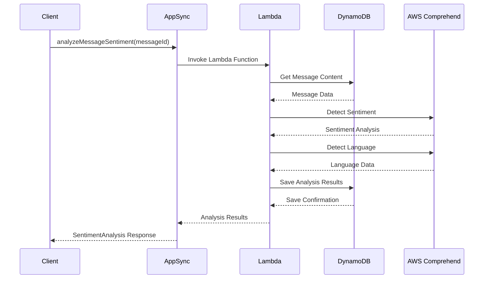
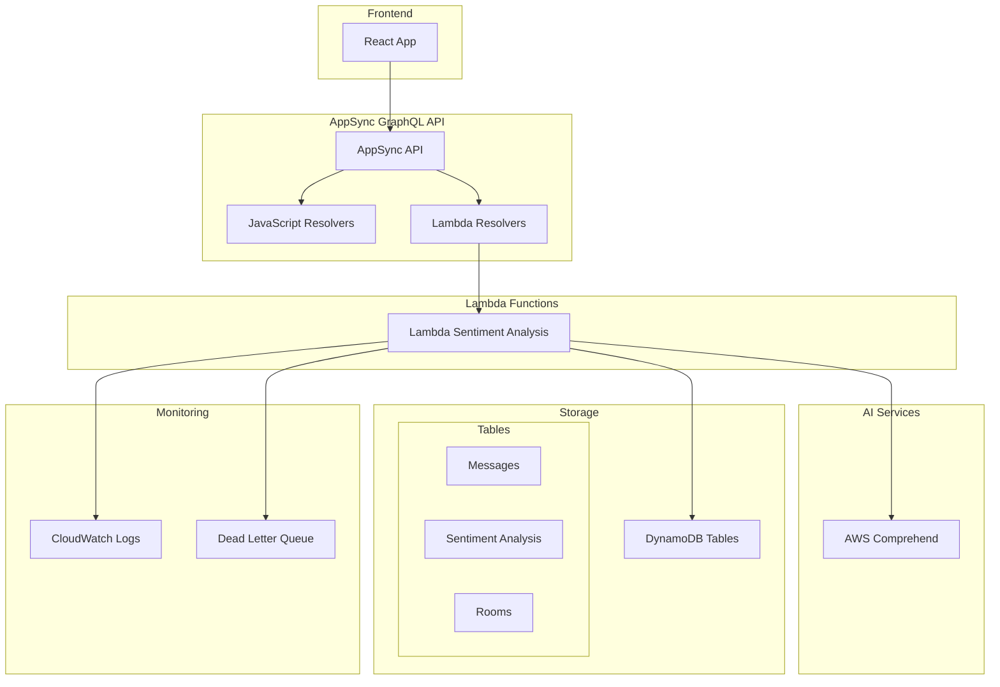

# Lambda リゾルバー機能ガイド 🚀

## 📋 概要

このプロジェクトでは、JavaScript リゾルバーでは実現困難な高度な機能を AWS Lambda を使用して実装しています。Lambda リゾルバーは外部サービス連携や複雑な非同期処理が必要な場合に威力を発揮します。

## 🎯 JavaScript リゾルバー vs Lambda リゾルバー

### JavaScript リゾルバーで実現可能
- ✅ 基本的なCRUD操作
- ✅ 簡単なデータ変換
- ✅ DynamoDB直接操作
- ✅ 高速なリアルタイム処理

### Lambda リゾルバーが必要な機能
- 🚀 **外部AIサービス連携** (AWS Comprehend など)
- 🚀 **複雑な非同期処理制御**
- 🚀 **高度なエラーハンドリング**
- 🚀 **バッチ処理とキューイング**
- 🚀 **サードパーティAPI連携**
- 🚀 **画像・動画処理**
- 🚀 **暗号化・セキュリティ処理**

## 🎨 実装済み機能: 感情分析システム

### 機能概要
メッセージの感情分析を AWS Comprehend を使用して実行し、以下の高度な分析を提供：



### 分析機能詳細

#### 1. 感情分析 (Sentiment Analysis)
```javascript
// 感情スコア例
{
  sentiment: "POSITIVE",     // 感情タイプ
  confidence: 0.8542,       // 信頼度 (85.42%)
  scores: {
    positive: 0.8542,       // ポジティブ度
    negative: 0.0234,       // ネガティブ度
    neutral: 0.1123,        // 中立度
    mixed: 0.0101          // 混合度
  }
}
```

#### 2. 言語検出
```javascript
// 検出される言語例
{
  languageCode: "ja",       // 日本語
  confidence: 0.9876,       // 信頼度 (98.76%)
  dominantLanguage: true
}
```

#### 3. コンテンツ安全性チェック
```javascript
// 安全性チェック結果例
{
  isAppropriate: true,      // 適切なコンテンツか
  flags: [],               // 問題のあるコンテンツ種別
  confidence: 0.95         // 判定信頼度
}
```

## 🔧 GraphQL スキーマ定義

### 型定義
```graphql
# 感情分析結果
type SentimentAnalysis {
  messageId: ID!              # 分析対象メッセージID
  sentiment: String!          # 感情 (POSITIVE/NEGATIVE/NEUTRAL/MIXED)
  confidence: Float!          # 全体信頼度
  scores: SentimentScore!     # 詳細スコア
  language: String            # 検出言語
  languageConfidence: Float   # 言語検出信頼度
  isAppropriate: Boolean!     # コンテンツ安全性
  flags: [String!]!          # 警告フラグ
  analyzedAt: AWSDateTime!    # 分析日時
  processingTime: Int!        # 処理時間(ms)
}

# 感情スコア詳細
type SentimentScore {
  positive: Float!            # ポジティブ度 (0.0-1.0)
  negative: Float!            # ネガティブ度 (0.0-1.0)
  neutral: Float!             # 中立度 (0.0-1.0)
  mixed: Float!              # 混合度 (0.0-1.0)
}

# クエリ定義
type Query {
  # 感情分析実行
  analyzeMessageSentiment(messageId: ID!): SentimentAnalysis
}
```

### 使用例
```graphql
# 感情分析実行クエリ
query AnalyzeMessage {
  analyzeMessageSentiment(messageId: "msg-12345") {
    messageId
    sentiment
    confidence
    scores {
      positive
      negative
      neutral
      mixed
    }
    language
    languageConfidence
    isAppropriate
    flags
    analyzedAt
    processingTime
  }
}
```

## 🏗️ アーキテクチャ構成

### AWS サービス構成


### Lambda 関数詳細

#### 環境変数
| 変数名 | 説明 | 例 |
|--------|------|-----|
| `AWS_REGION` | AWS リージョン | `us-east-1` |
| `MESSAGE_TABLE_NAME` | メッセージテーブル名 | `appsync-chat-app-message` |
| `SENTIMENT_ANALYSIS_TABLE_NAME` | 感情分析テーブル名 | `appsync-chat-app-sentiment-analysis` |
| `LOG_LEVEL` | ログレベル | `INFO` |

#### IAM 権限
```json
{
  "DynamoDB": [
    "dynamodb:GetItem",
    "dynamodb:PutItem", 
    "dynamodb:UpdateItem",
    "dynamodb:Query",
    "dynamodb:Scan"
  ],
  "Comprehend": [
    "comprehend:DetectSentiment",
    "comprehend:DetectDominantLanguage",
    "comprehend:DetectEntities",
    "comprehend:DetectKeyPhrases"
  ]
}
```

## 🚀 デプロイ手順

### 1. Terraform でインフラ構築
```bash
cd infra/
terraform init
terraform plan
terraform apply
```

### 2. Lambda 関数の依存関係
```json
{
  "dependencies": {
    "aws-sdk": "^2.1400.0"
  }
}
```

### 3. 環境設定確認
```bash
# Terraform outputs で設定値確認
terraform output lambda_function_name
terraform output sentiment_analysis_table_name
```

## 🔍 使用方法とベストプラクティス

### フロントエンド実装例

#### React Hook での使用
```javascript
import { API, graphqlOperation } from 'aws-amplify';

const ANALYZE_MESSAGE_SENTIMENT = `
  query AnalyzeMessageSentiment($messageId: ID!) {
    analyzeMessageSentiment(messageId: $messageId) {
      sentiment
      confidence
      scores {
        positive
        negative
        neutral
        mixed
      }
      language
      isAppropriate
      flags
    }
  }
`;

function useMessageSentiment() {
  const analyzeSentiment = async (messageId) => {
    try {
      const result = await API.graphql(
        graphqlOperation(ANALYZE_MESSAGE_SENTIMENT, { messageId })
      );
      return result.data.analyzeMessageSentiment;
    } catch (error) {
      console.error('感情分析エラー:', error);
      throw error;
    }
  };

  return { analyzeSentiment };
}
```

#### 感情表示コンポーネント
```javascript
function SentimentIndicator({ analysis }) {
  const getSentimentColor = (sentiment) => {
    switch (sentiment) {
      case 'POSITIVE': return '#10B981'; // Green
      case 'NEGATIVE': return '#EF4444'; // Red
      case 'NEUTRAL': return '#6B7280';  // Gray
      case 'MIXED': return '#F59E0B';    // Yellow
      default: return '#6B7280';
    }
  };

  const getSentimentEmoji = (sentiment) => {
    switch (sentiment) {
      case 'POSITIVE': return '😊';
      case 'NEGATIVE': return '😔';
      case 'NEUTRAL': return '😐';
      case 'MIXED': return '🤔';
      default: return '❓';
    }
  };

  if (!analysis) return null;

  return (
    <div className="sentiment-indicator">
      <span 
        style={{ color: getSentimentColor(analysis.sentiment) }}
        title={`信頼度: ${(analysis.confidence * 100).toFixed(1)}%`}
      >
        {getSentimentEmoji(analysis.sentiment)}
      </span>
      
      {!analysis.isAppropriate && (
        <span className="warning" title="不適切なコンテンツの可能性">
          ⚠️
        </span>
      )}
    </div>
  );
}
```

### パフォーマンス最適化

#### 1. キャッシュ戦略
```javascript
// DynamoDBでの結果キャッシュ
const cacheKey = `sentiment:${messageId}`;
const cached = await getCachedResult(cacheKey);
if (cached && !isExpired(cached)) {
  return cached.result;
}
```

#### 2. バッチ処理
```javascript
// 複数メッセージの一括分析
const batchAnalyzeMessages = async (messageIds) => {
  const chunks = chunkArray(messageIds, 25); // Comprehend制限
  const results = await Promise.all(
    chunks.map(chunk => analyzeMessageBatch(chunk))
  );
  return results.flat();
};
```

#### 3. エラーハンドリング
```javascript
// グレースフルデグラデーション
try {
  return await comprehend.detectSentiment(params).promise();
} catch (error) {
  if (error.code === 'ThrottlingException') {
    // リトライ戦略
    await sleep(exponentialBackoff(retryCount));
    return await retryAnalysis(params, retryCount + 1);
  }
  
  // フォールバック: 基本的な分析
  return await fallbackSentimentAnalysis(text);
}
```

## 📊 モニタリングとトラブルシューティング

### CloudWatch メトリクス
- Lambda 実行時間
- Comprehend API 呼び出し回数
- エラー率
- DynamoDB 読み書き性能

### よくある問題と解決策

#### 1. Comprehend 制限エラー
```
ThrottlingException: Rate exceeded
```
**解決策**: 
- リトライ戦略の実装
- バッチサイズの調整
- 指数バックオフの実装

#### 2. DynamoDB 書き込みエラー
```
ProvisionedThroughputExceededException
```
**解決策**: 
- オンデマンド課金への変更
- 書き込み頻度の調整

#### 3. Lambda タイムアウト
```
Task timed out after 30.00 seconds
```
**解決策**: 
- タイムアウト値の増加
- 処理の最適化
- 非同期処理の実装

## 🔮 将来の拡張予定

### 追加予定機能
1. **感情トレンド分析**
   - 時系列での感情変化追跡
   - ルーム全体の感情分析

2. **多言語対応強化**
   - より多くの言語での感情分析
   - 翻訳機能との連携

3. **リアルタイム分析**
   - WebSocket経由での即時分析
   - ストリーミング処理

4. **AI機能拡張**
   - トピック検出
   - エンティティ抽出
   - キーフレーズ抽出

### パフォーマンス最適化
- Lambda コールドスタート対策
- 結果キャッシュ戦略
- 分析結果の事前計算

## 📚 関連ドキュメント

- [GraphQL スキーマ設計書](../design/GraphQLスキーマ設計書.md)
- [API追加ガイド](../API追加ガイド.md)
- [Terraform テンプレート](../templates/terraform-template.md)
- [JavaScript リゾルバーテンプレート](../templates/javascript-resolver-template.md)

---

**次のステップ**: 
1. [フロントエンド実装ガイド](../guides/フロントエンド実装ガイド.md) で UI 統合
2. [テスト戦略ガイド](../guides/テスト戦略ガイド.md) でテスト実装
3. [デプロイガイド](../guides/デプロイガイド.md) で本番環境構築
