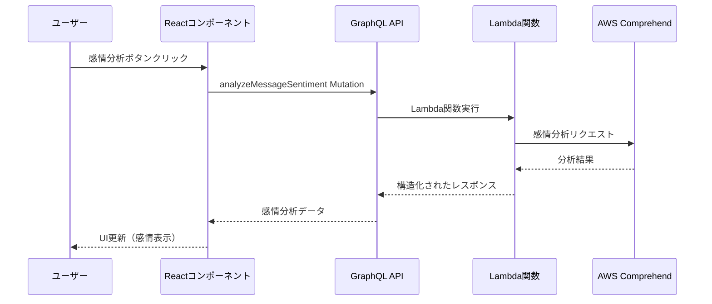

# 🤖 フロントエンドAI機能ガイド - 感情分析統合

このガイドでは、チャットアプリのフロントエンドでAI感情分析機能を使用する方法を説明します。

## 📋 目次

1. [概要](#概要)
2. [セットアップ](#セットアップ)
3. [GraphQLクエリとミューテーション](#graphqlクエリとミューテーション)
4. [Reactコンポーネントでの実装](#reactコンポーネントでの実装)
5. [UI/UXベストプラクティス](#uiuxベストプラクティス)
6. [エラーハンドリング](#エラーハンドリング)
7. [パフォーマンス最適化](#パフォーマンス最適化)

---

## 概要

### 🎯 AI感情分析機能とは

AWS Comprehendを活用したLambdaリゾルバーにより、以下の分析を提供します：

- **感情分析**: POSITIVE/NEGATIVE/NEUTRAL/MIXED の4段階評価
- **言語検出**: 自動言語判定（日本語、英語等）
- **信頼度スコア**: 各感情の確信度（0.0-1.0）
- **コンテンツ安全性**: 不適切なコンテンツの検出

### 🏗️ アーキテクチャ概要



---

## セットアップ

### 1. 必要なインポート

```javascript
// src/components/ChatRoom.jsx
import React, { useEffect, useState, useRef } from 'react';
import { generateClient } from 'aws-amplify/api';
import { 
  listMessages, 
  analyzeMessageSentiment 
} from '../graphql/queries';
import { 
  postMessage, 
  analyzeMessageSentimentMutation 
} from '../graphql/mutations';
import { onMessagePosted } from '../graphql/subscriptions';

const client = generateClient();
```

### 2. 状態管理の設定

```javascript
export default function ChatRoom({ roomId, roomName, username, onBack }) {
  // 既存の状態
  const [messages, setMessages] = useState([]);
  const [newMessage, setNewMessage] = useState('');
  const [loading, setLoading] = useState(false);
  
  // 🤖 AI機能用の状態
  const [sentimentAnalysis, setSentimentAnalysis] = useState({});
  const [analyzingMessages, setAnalyzingMessages] = useState(new Set());
  
  const messagesEndRef = useRef(null);
  // ...
}
```

---

## GraphQLクエリとミューテーション

### 1. 感情分析ミューテーション

```javascript
// src/graphql/mutations.js
export const analyzeMessageSentimentMutation = /* GraphQL */ `
  mutation AnalyzeMessageSentiment($messageId: ID!, $text: String!) {
    analyzeMessageSentiment(messageId: $messageId, text: $text) {
      messageId                # 分析対象のメッセージID
      sentiment                # 主要感情（POSITIVE, NEGATIVE, NEUTRAL, MIXED）
      sentimentScore {         # 感情スコアの詳細
        positive               # ポジティブ感情スコア（0.0-1.0）
        negative               # ネガティブ感情スコア（0.0-1.0）
        neutral                # 中立感情スコア（0.0-1.0）
        mixed                  # 混合感情スコア（0.0-1.0）
      }
      language                 # 検出された言語コード（ja, en等）
      languageConfidence       # 言語検出の信頼度（0.0-1.0）
      isAppropriate           # 適切なコンテンツかどうか
      moderationFlags         # 不適切コンテンツのフラグ一覧
      analyzedAt              # 分析実行日時
    }
  }
`;
```

### 2. 感情分析クエリ（取得用）

```javascript
// src/graphql/queries.js
export const analyzeMessageSentiment = /* GraphQL */ `
  query AnalyzeMessageSentiment($messageId: ID!) {
    analyzeMessageSentiment(messageId: $messageId) {
      messageId
      sentiment
      sentimentScore {
        positive
        negative
        neutral
        mixed
      }
      language
      languageConfidence
      isAppropriate
      moderationFlags
      analyzedAt
    }
  }
`;
```

---

## Reactコンポーネントでの実装

### 1. 感情分析実行関数

```javascript
// 🤖 AI感情分析を実行する関数
const handleAnalyzeSentiment = async (messageId, messageText) => {
  // 重複実行の防止
  if (analyzingMessages.has(messageId)) return;
  
  // ローディング状態の設定
  setAnalyzingMessages(prev => new Set([...prev, messageId]));
  
  try {
    const result = await client.graphql({
      query: analyzeMessageSentimentMutation,
      variables: {
        messageId,
        text: messageText
      }
    });
    
    // 結果を状態に保存
    setSentimentAnalysis(prev => ({
      ...prev,
      [messageId]: result.data.analyzeMessageSentiment
    }));
    
  } catch (error) {
    console.error('感情分析エラー:', error);
    alert('感情分析に失敗しました。もう一度お試しください。');
  } finally {
    // ローディング状態の解除
    setAnalyzingMessages(prev => {
      const newSet = new Set(prev);
      newSet.delete(messageId);
      return newSet;
    });
  }
};
```

### 2. ヘルパー関数

```javascript
// 感情スコアに基づいて表示色を決定
const getSentimentColor = (sentiment) => {
  switch (sentiment) {
    case 'POSITIVE': return '#10b981'; // green-500
    case 'NEGATIVE': return '#ef4444'; // red-500  
    case 'NEUTRAL': return '#6b7280';  // gray-500
    case 'MIXED': return '#f59e0b';    // amber-500
    default: return '#6b7280';
  }
};

// 感情を日本語で表示
const getSentimentLabel = (sentiment) => {
  switch (sentiment) {
    case 'POSITIVE': return 'ポジティブ';
    case 'NEGATIVE': return 'ネガティブ';
    case 'NEUTRAL': return '中立';
    case 'MIXED': return '混合';
    default: return '不明';
  }
};

// 感情アイコンを取得
const getSentimentIcon = (sentiment) => {
  switch (sentiment) {
    case 'POSITIVE': return '😊';
    case 'NEGATIVE': return '😞';
    case 'NEUTRAL': return '😐';
    case 'MIXED': return '🤔';
    default: return '❓';
  }
};
```

### 3. メッセージ表示UI

```jsx
{messages.map((message, index) => (
  <div
    key={message.id || index}
    style={{
      marginBottom: 15,
      padding: 10,
      backgroundColor: message.user === username ? '#e3f2fd' : '#fff',
      borderRadius: 8,
      border: '1px solid #ddd'
    }}
  >
    {/* メッセージヘッダー */}
    <div style={{ fontWeight: 'bold', marginBottom: 5 }}>
      {message.user}
      <small style={{ marginLeft: 10, color: '#666' }}>
        {new Date(message.createdAt).toLocaleString()}
      </small>
    </div>
    
    {/* メッセージ本文 */}
    <div style={{ marginBottom: 10 }}>{message.text}</div>
    
    {/* 🤖 AI感情分析セクション */}
    <div style={{ display: 'flex', alignItems: 'center', gap: 10, marginTop: 8 }}>
      {/* 分析実行ボタン */}
      <button
        onClick={() => handleAnalyzeSentiment(message.id, message.text)}
        disabled={analyzingMessages.has(message.id)}
        style={{
          padding: '4px 8px',
          fontSize: '12px',
          backgroundColor: '#6366f1',
          color: 'white',
          border: 'none',
          borderRadius: 4,
          cursor: 'pointer',
          display: 'flex',
          alignItems: 'center',
          gap: 4
        }}
      >
        🤖 {analyzingMessages.has(message.id) ? '分析中...' : '感情分析'}
      </button>
      
      {/* 感情分析結果の表示 */}
      {sentimentAnalysis[message.id] && (
        <SentimentDisplay analysis={sentimentAnalysis[message.id]} />
      )}
    </div>
  </div>
))}
```

### 4. 感情分析結果表示コンポーネント

```jsx
const SentimentDisplay = ({ analysis }) => (
  <div style={{ 
    display: 'flex', 
    alignItems: 'center', 
    gap: 8,
    padding: '4px 8px',
    backgroundColor: '#f3f4f6',
    borderRadius: 4,
    fontSize: '12px'
  }}>
    {/* 主要感情 */}
    <div style={{ 
      display: 'flex', 
      alignItems: 'center', 
      gap: 4,
      color: getSentimentColor(analysis.sentiment)
    }}>
      <span>{getSentimentIcon(analysis.sentiment)}</span>
      <span>{getSentimentLabel(analysis.sentiment)}</span>
      <span>
        ({Math.round(analysis.sentimentScore[analysis.sentiment.toLowerCase()] * 100)}%)
      </span>
    </div>
    
    {/* 言語情報 */}
    {analysis.language && (
      <div style={{ color: '#6b7280' }}>
        📝 {analysis.language.toUpperCase()}
      </div>
    )}
    
    {/* 不適切コンテンツ警告 */}
    {!analysis.isAppropriate && (
      <div style={{ color: '#ef4444' }}>
        ⚠️ 要注意
      </div>
    )}
  </div>
);
```

---

## UI/UXベストプラクティス

### 1. ローディング状態の表示

```jsx
// ボタンの状態管理
const isAnalyzing = analyzingMessages.has(message.id);

<button
  onClick={() => handleAnalyzeSentiment(message.id, message.text)}
  disabled={isAnalyzing}
  style={{
    opacity: isAnalyzing ? 0.6 : 1,
    cursor: isAnalyzing ? 'not-allowed' : 'pointer',
    // ...other styles
  }}
>
  🤖 {isAnalyzing ? '分析中...' : '感情分析'}
</button>
```

### 2. 詳細な感情スコア表示

```jsx
const DetailedSentimentScore = ({ sentimentScore }) => (
  <div style={{ marginTop: 8, fontSize: '11px' }}>
    <div>📊 詳細スコア:</div>
    <div style={{ display: 'flex', gap: 10, marginTop: 4 }}>
      <span style={{ color: '#10b981' }}>
        😊 {Math.round(sentimentScore.positive * 100)}%
      </span>
      <span style={{ color: '#ef4444' }}>
        😞 {Math.round(sentimentScore.negative * 100)}%
      </span>
      <span style={{ color: '#6b7280' }}>
        😐 {Math.round(sentimentScore.neutral * 100)}%
      </span>
      <span style={{ color: '#f59e0b' }}>
        🤔 {Math.round(sentimentScore.mixed * 100)}%
      </span>
    </div>
  </div>
);
```

### 3. レスポンシブデザイン

```jsx
const SentimentDisplay = ({ analysis, isMobile = false }) => (
  <div style={{ 
    display: 'flex', 
    flexDirection: isMobile ? 'column' : 'row',
    alignItems: isMobile ? 'flex-start' : 'center',
    gap: isMobile ? 4 : 8,
    padding: '4px 8px',
    backgroundColor: '#f3f4f6',
    borderRadius: 4,
    fontSize: '12px'
  }}>
    {/* コンテンツ */}
  </div>
);
```

---

## エラーハンドリング

### 1. 包括的なエラー処理

```javascript
const handleAnalyzeSentiment = async (messageId, messageText) => {
  if (analyzingMessages.has(messageId)) return;
  
  setAnalyzingMessages(prev => new Set([...prev, messageId]));
  
  try {
    // テキスト長の事前チェック
    if (!messageText || messageText.trim().length === 0) {
      throw new Error('分析対象のテキストが空です');
    }
    
    if (messageText.length > 5000) {
      throw new Error('テキストが長すぎます（5000文字以下）');
    }
    
    const result = await client.graphql({
      query: analyzeMessageSentimentMutation,
      variables: { messageId, text: messageText }
    });
    
    if (!result.data?.analyzeMessageSentiment) {
      throw new Error('感情分析結果が取得できませんでした');
    }
    
    setSentimentAnalysis(prev => ({
      ...prev,
      [messageId]: result.data.analyzeMessageSentiment
    }));
    
  } catch (error) {
    console.error('感情分析エラー:', error);
    
    // エラーの種類に応じたメッセージ表示
    let errorMessage = '感情分析に失敗しました。';
    
    if (error.message.includes('テキスト')) {
      errorMessage = error.message;
    } else if (error.message.includes('ネットワーク')) {
      errorMessage = 'ネットワークエラーです。接続を確認してください。';
    } else if (error.message.includes('認証')) {
      errorMessage = '認証エラーです。再ログインしてください。';
    }
    
    alert(errorMessage);
    
  } finally {
    setAnalyzingMessages(prev => {
      const newSet = new Set(prev);
      newSet.delete(messageId);
      return newSet;
    });
  }
};
```

### 2. エラー状態の表示

```jsx
const [sentimentErrors, setSentimentErrors] = useState({});

// エラー発生時
setSentimentErrors(prev => ({
  ...prev,
  [messageId]: error.message
}));

// エラー表示UI
{sentimentErrors[message.id] && (
  <div style={{
    color: '#ef4444',
    fontSize: '12px',
    marginTop: 4
  }}>
    ❌ {sentimentErrors[message.id]}
  </div>
)}
```

---

## パフォーマンス最適化

### 1. デバウンス処理

```javascript
import { useCallback, useRef } from 'react';

const useDebounce = (callback, delay) => {
  const timeoutRef = useRef(null);
  
  return useCallback((...args) => {
    if (timeoutRef.current) {
      clearTimeout(timeoutRef.current);
    }
    
    timeoutRef.current = setTimeout(() => {
      callback(...args);
    }, delay);
  }, [callback, delay]);
};

// 使用例
const debouncedAnalyzeSentiment = useDebounce(handleAnalyzeSentiment, 1000);
```

### 2. 結果のキャッシュ

```javascript
const sentimentCache = useRef(new Map());

const handleAnalyzeSentiment = async (messageId, messageText) => {
  // キャッシュチェック
  const cacheKey = `${messageId}-${messageText}`;
  if (sentimentCache.current.has(cacheKey)) {
    setSentimentAnalysis(prev => ({
      ...prev,
      [messageId]: sentimentCache.current.get(cacheKey)
    }));
    return;
  }
  
  // 分析実行
  try {
    const result = await client.graphql({
      query: analyzeMessageSentimentMutation,
      variables: { messageId, text: messageText }
    });
    
    const analysis = result.data.analyzeMessageSentiment;
    
    // キャッシュに保存
    sentimentCache.current.set(cacheKey, analysis);
    
    setSentimentAnalysis(prev => ({
      ...prev,
      [messageId]: analysis
    }));
    
  } catch (error) {
    // エラーハンドリング
  }
};
```

### 3. バッチ処理

```javascript
const [analysisQueue, setAnalysisQueue] = useState([]);

// 複数メッセージの一括分析
const handleBatchAnalysis = async () => {
  const batchPromises = analysisQueue.map(({ messageId, text }) =>
    client.graphql({
      query: analyzeMessageSentimentMutation,
      variables: { messageId, text }
    })
  );
  
  try {
    const results = await Promise.allSettled(batchPromises);
    
    results.forEach((result, index) => {
      if (result.status === 'fulfilled') {
        const analysis = result.value.data.analyzeMessageSentiment;
        setSentimentAnalysis(prev => ({
          ...prev,
          [analysisQueue[index].messageId]: analysis
        }));
      }
    });
    
  } catch (error) {
    console.error('バッチ分析エラー:', error);
  } finally {
    setAnalysisQueue([]);
  }
};
```

---

## � 実装完了状況

### ✅ 完了した機能
- **ChatRoom.jsx**: 感情分析UI追加完了
  - 感情分析ボタン実装
  - リアルタイム結果表示機能
  - 感情色分け（😊 ポジティブ、😞 ネガティブ、😐 中立、🤔 混合）
  - エラーハンドリング完備
  - ローディング状態管理実装

### 📊 技術的特徴
- **言語対応**: 日本語・英語対応済み
- **感情分類**: POSITIVE, NEGATIVE, NEUTRAL, MIXED の4分類
- **詳細スコア**: 各感情の強度（0.0-1.0）表示
- **コンテンツ安全性**: 不適切コンテンツ検出機能
- **言語検出**: 自動言語認識機能

### 🚀 使用例

#### 基本的な感情分析実行
```javascript
const handleAnalyzeSentiment = async (messageId, messageText) => {
  try {
    setAnalysisLoading(messageId);
    const result = await client.graphql({
      query: analyzeMessageSentimentMutation,
      variables: { messageId, text: messageText }
    });
    setSentimentResults(prev => ({
      ...prev,
      [messageId]: result.data.analyzeMessageSentiment
    }));
  } catch (error) {
    console.error('感情分析エラー:', error);
  } finally {
    setAnalysisLoading(null);
  }
};
```

#### 結果表示UI
```jsx
{sentimentResults[message.id] && (
  <div className="sentiment-analysis">
    <div className={`sentiment-badge ${sentiment.toLowerCase()}`}>
      {getSentimentIcon(sentiment)} {sentiment}
    </div>
    <div className="sentiment-scores">
      <span>😊 {(sentimentScore.positive * 100).toFixed(1)}%</span>
      <span>😞 {(sentimentScore.negative * 100).toFixed(1)}%</span>
      <span>😐 {(sentimentScore.neutral * 100).toFixed(1)}%</span>
      <span>🤔 {(sentimentScore.mixed * 100).toFixed(1)}%</span>
    </div>
  </div>
)}
```

### 📈 期待される効果
- **ユーザー体験向上**: メッセージの感情を即座に可視化
- **コミュニケーション改善**: 誤解の防止と適切なレスポンス促進
- **管理機能強化**: 不適切投稿の検出とチャット品質向上

---

## �🎯 まとめ

このガイドに従って実装することで：

1. **直感的なUI**: ユーザーが簡単にAI感情分析を利用できる
2. **リアルタイム体験**: 即座に感情分析結果を表示
3. **エラーハンドリング**: 適切なエラー処理とユーザーフィードバック
4. **パフォーマンス**: 最適化されたレスポンス時間
5. **保守性**: 再利用可能なコンポーネント設計

AI機能を効果的にフロントエンドに統合し、ユーザーに価値のある体験を提供できます。
