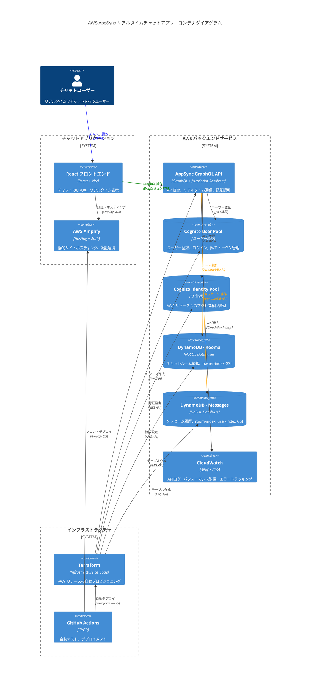
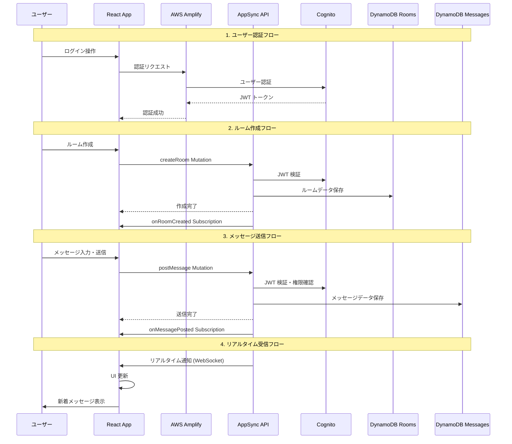
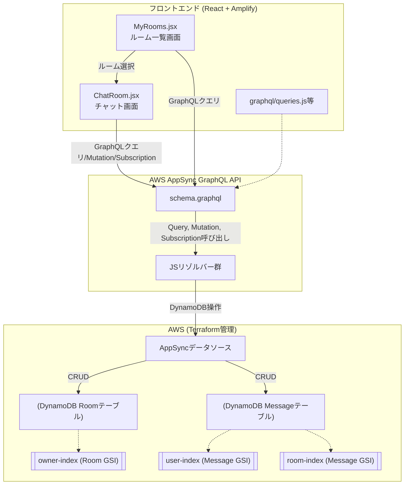

# AWS AppSync×DynamoDB チャットアプリ README

---

## 概要

このプロジェクトは、AWSフルマネージド（AppSync, DynamoDB, Cognito, Lambda, S3）＋IaC（Terraform）＋React（Amplify）で実装するSlack風リアルタイム・チャットアプリの学習用リポジトリです。

## 📊 技術スタック

- **GraphQL API**: AppSync（スキーマ・リゾルバーJS）
- **データストア**: DynamoDB（Room/Messageテーブル＋GSI）
- **ユーザー認証**: Cognito（User Pool + Identity Pool）
- **フロントエンド**: React＋Vite＋Amplify v6
- **IaC**: Terraform
- **CI/CD**: GitHub Actions等（自動デプロイ可能）

---

## 🏗️ システムアーキテクチャ

### 全体アーキテクチャ図

```mermaid
architecture-beta
    group frontend(computer)[Frontend Layer]
    group aws(cloud)[AWS Cloud Services]
    group data(database)[Data Layer]
    group auth(shield)[Authentication]
    group infra(server)[Infrastructure]

    service react(internet)[React App] in frontend
    service amplify(server)[AWS Amplify] in frontend
    
    service appsync(api)[AppSync GraphQL API] in aws
    service cognito(users)[Cognito User Pool] in auth
    service identity(key)[Cognito Identity Pool] in auth
    
    service dynamodb_rooms(database)[DynamoDB Rooms] in data
    service dynamodb_messages(database)[DynamoDB Messages] in data
    
    service terraform(server)[Terraform] in infra
    service cloudwatch(monitor)[CloudWatch] in infra

    react:R --> L:amplify
    amplify:R --> L:appsync
    appsync:B --> T:cognito
    appsync:B --> T:identity
    appsync:R --> L:dynamodb_rooms
    appsync:R --> L:dynamodb_messages
    terraform:T --> B:appsync
    terraform:R --> L:dynamodb_rooms
    terraform:R --> L:dynamodb_messages
    terraform:T --> B:cognito
    cloudwatch:L --> R:appsync
```

### コンテナダイアグラム（C4モデル）



### データフロー図



---

## 📁 ディレクトリ構成

```
.
├── amplify/                # Amplify CLI管理ディレクトリ
├── infra/                  # Terraform Infrastructure as Code
│   ├── main.tf            # メイン設定
│   ├── dynamodb.tf        # DynamoDBテーブル定義
│   ├── appsync.tf         # AppSync設定
│   └── cognito.tf         # 認証設定
├── resolvers/              # AppSync JavaScriptリゾルバー
│   ├── Mutation.createRoom.js
│   ├── Mutation.postMessage.js
│   ├── Query.myOwnedRooms.js
│   ├── Query.myActiveRooms.js
│   └── Query.listMessages.js
├── src/
│   ├── components/
│   │   ├── ChatRoom.jsx    # チャットルーム画面
│   │   └── MyRooms.jsx     # 自分のルーム一覧
│   ├── graphql/            # GraphQLクエリ/Mutation/Subscription
│   │   ├── queries.js
│   │   ├── mutations.js
│   │   └── subscriptions.js
│   └── aws-exports.js      # Amplify自動生成
├── schema.graphql          # GraphQLスキーマ定義
└── package.json
```

---

## 🚀 初期セットアップ

### 1. リポジトリクローン・依存関係

```sh
git clone <your-repo-url>
cd <your-project-dir>
npm install
```

### 2. AWSリソースのデプロイ（Terraform推奨）

```sh
cd infra
terraform init
terraform apply
```

### 3. Amplifyセットアップ（初回）

```sh
npx amplify@latest init
npx amplify@latest pull  # 既存AppSync連携用
```

### 4. ローカル開発起動

```sh
npm start
```

---

## 📊 DynamoDB設計のポイント

### テーブル構造とGSI戦略

- **Roomテーブル**：
  - Primary Key: `id`
  - GSI: `owner-index` → 自分が作成したルームを高速検索
  
- **Messageテーブル**：
  - Primary Key: `id`
  - GSI: `user-index` → 自分が発言したルームを取得
  - GSI: `room-index` (roomId + createdAt) → ルームのメッセージ一覧を時系列順で取得

### クエリパターンとパフォーマンス

1. **自分の作成ルーム一覧**: `owner-index`で1回のクエリ
2. **自分の参加ルーム一覧**: `user-index`でメッセージ履歴から抽出
3. **ルーム内メッセージ履歴**: `room-index`で時系列ソート済み取得

---

## 🔄 システム処理フロー図



---

## 🔧 開発・デバッグのベストプラクティス

### AppSyncリゾルバーのポイント

- **認証情報の取得**: `ctx.identity?.username`でログインユーザーを特定
- **エラーハンドリング**: バリデーション＋適切な例外スロー
- **GSI活用**: 複雑な検索条件はGSIで事前最適化
- **バッチ処理**: 複数ルーム情報取得時は`batchGet`で効率化

### フロントエンド実装のポイント

- **リアルタイム更新**: `onMessagePosted`サブスクリプションで即座に反映
- **状態管理**: `useState`+`useEffect`でローカル状態とサーバー状態を同期
- **パフォーマンス**: 必要な時のみAPIコール、適切なキャッシュ戦略

---

## 🚀 CI/CD・本番運用

### 自動デプロイフロー

1. **コード変更**: GraphQLスキーマ、リゾルバー、フロントエンド
2. **GitHub Actions**: Terraform + Amplify自動デプロイ
3. **テスト**: スキーマバリデーション、リゾルバーユニットテスト
4. **本番反映**: 段階的ロールアウト

### 監視・ログ

- **CloudWatch**: AppSync APIのレスポンス時間、エラー率
- **X-Ray**: 分散トレーシングでボトルネック特定
- **DynamoDB Metrics**: 読み込み/書き込みキャパシティ監視

---

## 🎯 拡張・発展設計例

### 機能拡張

- **ファイル添付**: S3 + Pre-signed URL
- **絵文字・リアクション**: Message拡張
- **プライベートルーム**: 招待制＋認可ロジック
- **通知機能**: SNS + Push Notification

### パフォーマンス最適化

- **DynamoDB設計見直し**: 複合GSI、パーティション分散
- **GraphQL最適化**: DataLoader、N+1問題解決
- **CDN活用**: CloudFront + S3で静的コンテンツ配信
- **キャッシュ戦略**: AppSync Cache、ブラウザキャッシュ

### 開発効率向上

- **TypeScript**: GraphQL Code Generator
- **テスト自動化**: Jest + React Testing Library
- **E2Eテスト**: Playwright + モックAPI
- **モバイル対応**: React Native + Expo

---

## 📄 ライセンス・問い合わせ

- 本リポジトリは学習・社内利用自由。
- ご不明点・拡張相談はIssueまたはコントリビューションへどうぞ。

---

## 主要構成

- **GraphQL API**: AppSync（スキーマ・リゾルバーJS）
- **データストア**: DynamoDB（Room/Messageテーブル＋GSI）
- **ユーザー認証**: Cognito
- **フロントエンド**: React＋Amplify v6
- **IaC**: Terraform
- **CI/CD**: GitHub Actions等（自動デプロイ可能）

---

## 🏗️ 詳細仕様・実装例

### 1. GraphQLスキーマ定義

```graphql
# Message型: チャットメッセージ
type Message {
  id: ID!
  text: String!
  user: String!
  createdAt: AWSDateTime!
  roomId: ID!
}

# Room型: チャットルーム
type Room {
  id: ID!
  name: String!
  owner: String!
  createdAt: AWSDateTime!
  messages: [Message]
}

# Mutation: 投稿・ルーム作成
type Mutation {
  createRoom(name: String!): Room
  postMessage(roomId: ID!, text: String!): Message
}

# Query: 取得系
type Query {
  myOwnedRooms: [Room]
  myActiveRooms: [Room]
  getRoom(id: ID!): Room
  listMessages(roomId: ID!, limit: Int): [Message]
}

# Subscription: リアルタイム受信
type Subscription {
  onRoomCreated: Room @aws_subscribe(mutations: ["createRoom"])
  onMessagePosted(roomId: ID!): Message @aws_subscribe(mutations: ["postMessage"])
}
```

### 2. DynamoDBテーブル設計（Terraform）

#### Roomテーブル
```hcl
resource "aws_dynamodb_table" "room" {
  name         = "Room"
  billing_mode = "PAY_PER_REQUEST"
  hash_key     = "id"

  attribute { name = "id"; type = "S" }
  attribute { name = "owner"; type = "S" }
  attribute { name = "createdAt"; type = "S" }

  global_secondary_index {
    name            = "owner-index"
    hash_key        = "owner"
    projection_type = "ALL"
  }
}
```

#### Messageテーブル
```hcl
resource "aws_dynamodb_table" "message" {
  name         = "Message"
  billing_mode = "PAY_PER_REQUEST"
  hash_key     = "id"

  attribute { name = "id"; type = "S" }
  attribute { name = "roomId"; type = "S" }
  attribute { name = "user"; type = "S" }
  attribute { name = "createdAt"; type = "S" }

  global_secondary_index {
    name            = "user-index"
    hash_key        = "user"
    projection_type = "ALL"
  }

  global_secondary_index {
    name            = "room-index"
    hash_key        = "roomId"
    range_key       = "createdAt"
    projection_type = "ALL"
  }
}
```

### 3. AppSyncリゾルバー実装例（JavaScript）

#### createRoom Mutation
```js
export const handler = (ctx) => {
  const username = ctx.identity?.username || "guest";
  const id = uuid();
  const createdAt = new Date().toISOString();
  return {
    operation: 'PutItem',
    key: { id },
    attributeValues: {
      id, name: ctx.args.name, owner: username, createdAt
    }
  };
};
```

#### myOwnedRooms Query
```js
export const handler = (ctx) => {
  const username = ctx.identity?.username;
  if (!username) throw new Error("認証ユーザーのみ");
  return {
    operation: "Query",
    query: { owner: { eq: username } },
    index: "owner-index"
  };
};
```

#### myActiveRooms Query（2段階クエリ例・擬似コード）
```js
export const handler = async (ctx) => {
  const username = ctx.identity?.username;
  if (!username) throw new Error("認証ユーザーのみ");
  // 1. 自分の投稿したメッセージ(roomIdリスト抽出)
  const messagesResult = await ctx.appsync.dynamodb.query({
    operation: "Query",
    index: "user-index",
    query: { user: { eq: username } },
    limit: 1000
  });
  const roomIds = [...new Set(messagesResult.items.map(msg => msg.roomId))];
  // 2. ルーム情報をまとめて取得
  const roomsResult = await ctx.appsync.dynamodb.batchGet({
    keys: roomIds.map(id => ({ id })),
    table: "Room"
  });
  return roomsResult.items;
};
```

#### postMessage Mutation
```js
export const handler = (ctx) => {
  const user = ctx.identity?.username || "guest";
  if (!ctx.args.text || ctx.args.text.length > 500) {
    throw new Error("textは1～500文字で入力してください");
  }
  const id = uuid();
  const createdAt = new Date().toISOString();
  return {
    operation: 'PutItem',
    key: { id },
    attributeValues: {
      id,
      text: ctx.args.text,
      user,
      createdAt,
      roomId: ctx.args.roomId
    }
  };
};
```

### 4. フロントエンド実装例（React+Amplify）

#### MyRooms.jsx - ルーム一覧コンポーネント
```jsx
import React, { useEffect, useState } from 'react';
import { generateClient } from 'aws-amplify/api';
import { myOwnedRooms, myActiveRooms } from './graphql/queries';

const client = generateClient();

export default function MyRooms({ username, onRoomSelect }) {
  const [ownedRooms, setOwnedRooms] = useState([]);
  const [activeRooms, setActiveRooms] = useState([]);

  useEffect(() => {
    client.graphql({ query: myOwnedRooms })
      .then(res => setOwnedRooms(res.data.myOwnedRooms));
    client.graphql({ query: myActiveRooms })
      .then(res => setActiveRooms(res.data.myActiveRooms));
  }, []);

  const allRooms = [
    ...ownedRooms,
    ...activeRooms.filter(r => !ownedRooms.some(or => or.id === r.id))
  ];

  return (
    <div style={{ maxWidth: 480, margin: "0 auto" }}>
      <h3>自分のルーム</h3>
      {allRooms.length === 0 && <div>参加したルームはありません。</div>}
      <ul>
        {allRooms.map(room => (
          <li key={room.id}>
            <button
              style={{ 
                background: "#fafafa", 
                border: "1px solid #ccc", 
                padding: 8, 
                borderRadius: 8, 
                width: "100%", 
                textAlign: "left", 
                margin: "6px 0" 
              }}
              onClick={() => onRoomSelect(room.id)}
            >
              <b>{room.name}</b> <br />
              ルームID: {room.id} <br />
              作成者: {room.owner} <br />
              作成日: {new Date(room.createdAt).toLocaleString()}
            </button>
          </li>
        ))}
      </ul>
    </div>
  );
}
```

#### ChatRoom.jsx - チャット画面コンポーネント
```jsx
import React, { useEffect, useState } from 'react';
import { generateClient } from 'aws-amplify/api';
import { listMessages } from './graphql/queries';
import { postMessage } from './graphql/mutations';
import { onMessagePosted } from './graphql/subscriptions';

const client = generateClient();

export default function ChatRoom({ roomId, username }) {
  const [messages, setMessages] = useState([]);
  const [newMessage, setNewMessage] = useState('');

  useEffect(() => {
    // メッセージ一覧取得
    client.graphql({ 
      query: listMessages, 
      variables: { roomId, limit: 100 } 
    }).then(res => {
      setMessages(res.data.listMessages || []);
    });

    // リアルタイム購読
    const subscription = client.graphql({
      query: onMessagePosted,
      variables: { roomId }
    }).subscribe({
      next: (data) => {
        const newMsg = data.data.onMessagePosted;
        setMessages(prev => [...prev, newMsg]);
      }
    });

    return () => subscription.unsubscribe();
  }, [roomId]);

  const handleSend = async () => {
    if (!newMessage.trim()) return;
    
    try {
      await client.graphql({
        query: postMessage,
        variables: { roomId, text: newMessage }
      });
      setNewMessage('');
    } catch (error) {
      console.error('Error posting message:', error);
    }
  };

  return (
    <div style={{ maxWidth: 600, margin: "0 auto" }}>
      <h3>チャットルーム: {roomId}</h3>
      
      <div style={{ height: 400, overflowY: 'auto', border: '1px solid #ccc', padding: 10 }}>
        {messages.map(msg => (
          <div key={msg.id} style={{ marginBottom: 10 }}>
            <strong>{msg.user}</strong>: {msg.text}
            <br />
            <small>{new Date(msg.createdAt).toLocaleString()}</small>
          </div>
        ))}
      </div>
      
      <div style={{ marginTop: 10 }}>
        <input
          type="text"
          value={newMessage}
          onChange={(e) => setNewMessage(e.target.value)}
          placeholder="メッセージを入力..."
          style={{ width: '70%', padding: 8 }}
          onKeyPress={(e) => e.key === 'Enter' && handleSend()}
        />
        <button onClick={handleSend} style={{ marginLeft: 10, padding: 8 }}>
          送信
        </button>
      </div>
    </div>
  );
}
```
---