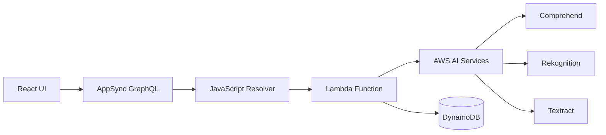

# 🤖 Lambda Resolver Template - AI機能統合テンプレート

[](#lambda統合)
[](#ai機能対応)
[](#パフォーマンス最適化)

このテンプレートは、AWS AppSync で高度なAI機能やLambda統合を実装するためのベストプラクティスを提供します。

---

## 🎯 テンプレートの特徴

### ✅ 実装される機能
- **AI機能統合**: AWS Comprehend、Rekognition、Textract等
- **複雑な非同期処理**: 並列処理・バッチ処理・外部API連携
- **エラーハンドリング**: 強固なエラー処理とロールバック機能
- **パフォーマンス最適化**: キャッシュ・並列実行・タイムアウト制御
- **セキュリティ**: 入力検証・認証・認可チェック
- **ファイル分離**: AppSyncリゾルバーとLambda関数の適切な分離

### 🏗️ アーキテクチャパターン



---

## 📁 ファイル構成（改良版）

このテンプレートは以下の2つのファイルで構成されます：

```
project/
├── resolvers/
│   └── Lambda_yourFeature.js          # AppSyncリゾルバー（データ検証・Lambda呼び出し）
└── lambda/
    └── yourFeature.js                 # Lambda関数（ビジネスロジック・AI処理）
```

> 🔧 **アーキテクチャ改善**: AppSyncリゾルバーと実際のLambda関数を分離し、
> それぞれの責任を明確化。メンテナンス性とテスト性が大幅に向上。

// 外部サービスクライアント（例：Comprehend）
const comprehend = new AWS.Comprehend({
  region: process.env.AWS_REGION
});

/**
 * メイン処理関数
 */
exports.handler = async (event, context) => {
  // CloudWatch ログ設定
  console.log('Event:', JSON.stringify(event, null, 2));
  
  try {
    // 1. 引数の取得と検証
    const { arguments: args, identity } = event;
    
    if (!args.requiredParam) {
      throw new Error('必須パラメータが不足しています');
    }
    
    // 2. 認証・権限チェック
    if (!identity || !identity.sub) {
      throw new Error('認証が必要です');
    }
    
    const userId = identity.sub;
    
    // 3. 入力データの検証
    const validatedData = await validateInput(args);
    
    // 4. ビジネスロジック実行
    const result = await processBusinessLogic(validatedData, userId);
    
    // 5. 結果の返却
    return {
      success: true,
      data: result,
      timestamp: new Date().toISOString()
    };
    
  } catch (error) {
    // エラーハンドリング
    console.error('処理エラー:', error);
    
    return {
      success: false,
      error: {
        message: error.message,
        type: error.name,
        timestamp: new Date().toISOString()
      }
    };
  }
};

/**
 * 入力データの検証
 */
async function validateInput(args) {
  // バリデーションロジック
  const validated = {
    ...args
  };
  
  // 必要に応じて外部サービスでの検証
  // const validationResult = await externalValidation(args);
  
  return validated;
}

/**
 * メインのビジネスロジック
 */
async function processBusinessLogic(data, userId) {
  const startTime = Date.now();
  
  try {
    // 1. DynamoDB からのデータ取得
    const existingData = await getDynamoDBData(data.id);
    
    // 2. 外部サービス呼び出し（例：AI分析）
    const analysisResult = await callExternalService(data);
    
    // 3. 結果の保存
    const savedResult = await saveToDynamoDB({
      ...data,
      analysisResult,
      userId,
      processedAt: new Date().toISOString()
    });
    
    const processingTime = Date.now() - startTime;
    
    return {
      ...savedResult,
      processingTime
    };
    
  } catch (error) {
    console.error('ビジネスロジックエラー:', error);
    throw error;
  }
}

/**
 * DynamoDB データ取得
 */
async function getDynamoDBData(id) {
  const params = {
    TableName: process.env.TABLE_NAME,
    Key: { id }
  };
  
  try {
    const result = await dynamoDB.get(params).promise();
    return result.Item;
  } catch (error) {
    console.error('DynamoDB取得エラー:', error);
    throw new Error('データの取得に失敗しました');
  }
}

/**
 * 外部サービス呼び出し
 */
async function callExternalService(data) {
  try {
    // 例：AWS Comprehend での感情分析
    const params = {
      Text: data.text,
      LanguageCode: 'ja' // または自動検出
    };
    
    const result = await comprehend.detectSentiment(params).promise();
    return result;
    
  } catch (error) {
    console.error('外部サービスエラー:', error);
    
    // フォールバック処理
    return {
      fallback: true,
      message: '外部サービスが利用できません'
    };
  }
}

/**
 * DynamoDB データ保存
 */
async function saveToDynamoDB(data) {
  const params = {
    TableName: process.env.RESULT_TABLE_NAME,
    Item: {
      id: generateId(),
      ...data,
      ttl: Math.floor(Date.now() / 1000) + (30 * 24 * 60 * 60) // 30日後に自動削除
    }
  };
  
  try {
    await dynamoDB.put(params).promise();
    return params.Item;
  } catch (error) {
    console.error('DynamoDB保存エラー:', error);
    throw new Error('データの保存に失敗しました');
  }
}

/**
 * ユニークID生成
 */
function generateId() {
  return `${Date.now()}-${Math.random().toString(36).substr(2, 9)}`;
}

/**
 * バッチ処理用のヘルパー関数
 */
async function processBatch(items, batchSize = 25) {
  const chunks = [];
  for (let i = 0; i < items.length; i += batchSize) {
    chunks.push(items.slice(i, i + batchSize));
  }
  
  const results = [];
  for (const chunk of chunks) {
    const chunkResults = await Promise.all(
      chunk.map(item => processItem(item))
    );
    results.push(...chunkResults);
    
    // レート制限対策：少し待機
    if (chunks.length > 1) {
      await sleep(100);
    }
  }
  
  return results;
}

/**
 * スリープ関数
 */
function sleep(ms) {
  return new Promise(resolve => setTimeout(resolve, ms));
}

/**
 * 指数バックオフによるリトライ
 */
async function retryWithBackoff(fn, maxRetries = 3) {
  for (let attempt = 1; attempt <= maxRetries; attempt++) {
    try {
      return await fn();
    } catch (error) {
      if (attempt === maxRetries) {
        throw error;
      }
      
      const delay = Math.pow(2, attempt) * 1000; // 2^attempt 秒
      console.log(`リトライ ${attempt}/${maxRetries}, ${delay}ms 後に再試行...`);
      await sleep(delay);
    }
  }
}
```

## 🔧 Terraform 設定テンプレート

### Lambda 関数の定義

```terraform
# Lambda実行ロール
resource "aws_iam_role" "lambda_function_role" {
  name = "${var.project_name}-lambda-function-role"

  assume_role_policy = jsonencode({
    Version = "2012-10-17"
    Statement = [
      {
        Action = "sts:AssumeRole"
        Effect = "Allow"
        Principal = {
          Service = "lambda.amazonaws.com"
        }
      }
    ]
  })
}

# Lambda基本実行ポリシー
resource "aws_iam_role_policy_attachment" "lambda_basic_execution" {
  role       = aws_iam_role.lambda_function_role.name
  policy_arn = "arn:aws:iam::aws:policy/service-role/AWSLambdaBasicExecutionRole"
}

# DynamoDB アクセスポリシー
resource "aws_iam_role_policy" "lambda_dynamodb_policy" {
  name = "${var.project_name}-lambda-dynamodb-policy"
  role = aws_iam_role.lambda_function_role.id

  policy = jsonencode({
    Version = "2012-10-17"
    Statement = [
      {
        Effect = "Allow"
        Action = [
          "dynamodb:GetItem",
          "dynamodb:PutItem",
          "dynamodb:UpdateItem",
          "dynamodb:Query",
          "dynamodb:Scan"
        ]
        Resource = [
          "arn:aws:dynamodb:*:*:table/${var.project_name}-*"
        ]
      }
    ]
  })
}

# Lambda関数のZIPファイル
data "archive_file" "lambda_zip" {
  type        = "zip"
  source_file = "${path.module}/../resolvers/Lambda_functionName.js"
  output_path = "${path.module}/lambda_function.zip"
}

# Lambda関数
resource "aws_lambda_function" "function" {
  filename         = data.archive_file.lambda_zip.output_path
  function_name    = "${var.project_name}-function-name"
  role            = aws_iam_role.lambda_function_role.arn
  handler         = "Lambda_functionName.handler"
  runtime         = "nodejs18.x"
  timeout         = 30
  memory_size     = 256

  source_code_hash = data.archive_file.lambda_zip.output_base64sha256

  environment {
    variables = {
      AWS_REGION      = var.aws_region
      TABLE_NAME      = aws_dynamodb_table.main_table.name
      RESULT_TABLE_NAME = aws_dynamodb_table.result_table.name
      LOG_LEVEL       = "INFO"
    }
  }

  # デッドレターキュー
  dead_letter_config {
    target_arn = aws_sqs_queue.lambda_dlq.arn
  }
}

# AppSync データソース
resource "aws_appsync_datasource" "lambda_datasource" {
  api_id           = aws_appsync_graphql_api.api.id
  name             = "LambdaDataSource"
  type             = "AWS_LAMBDA"
  service_role_arn = aws_iam_role.appsync_lambda_role.arn

  lambda_config {
    function_arn = aws_lambda_function.function.arn
  }
}

# AppSync リゾルバー
resource "aws_appsync_resolver" "lambda_resolver" {
  api_id      = aws_appsync_graphql_api.api.id
  type        = "Query"  # または "Mutation"
  field       = "functionName"
  data_source = aws_appsync_datasource.lambda_datasource.name

  request_template = <<EOF
{
  "version": "2017-02-28",
  "operation": "Invoke",
  "payload": {
    "arguments": $util.toJson($context.arguments),
    "identity": $util.toJson($context.identity),
    "source": $util.toJson($context.source),
    "request": $util.toJson($context.request)
  }
}
EOF

  response_template = <<EOF
#if($context.error)
  $util.error($context.error.message, $context.error.type)
#else
  $util.toJson($context.result)
#end
EOF
}
```

## 📊 GraphQL スキーマ定義

```graphql
# カスタム型定義
type ProcessingResult {
  id: ID!
  success: Boolean!
  data: AWSJSON
  error: ErrorInfo
  processingTime: Int!
  timestamp: AWSDateTime!
}

type ErrorInfo {
  message: String!
  type: String!
  timestamp: AWSDateTime!
}

# クエリ/ミューテーション定義
type Query {
  processFunction(
    requiredParam: String!
    optionalParam: String
  ): ProcessingResult
}

type Mutation {
  executeFunction(
    data: AWSJSON!
  ): ProcessingResult
}
```

## 🚀 デプロイ手順

### 1. Lambda 関数の作成
```bash
# 1. リゾルバーファイルの作成
cp templates/lambda-resolver-template.js resolvers/Lambda_yourFunction.js

# 2. 関数の実装
vim resolvers/Lambda_yourFunction.js

# 3. Terraform 設定の更新
vim infra/lambda.tf
```

### 2. GraphQL スキーマの更新
```bash
# スキーマファイルの編集
vim schema.graphql
```

### 3. インフラの更新
```bash
cd infra/
terraform plan
terraform apply
```

## 🔍 テスト方法

### 単体テスト例
```javascript
// test/lambda-function.test.js
const { handler } = require('../resolvers/Lambda_functionName');

describe('Lambda Function Tests', () => {
  test('正常系: 基本的な処理', async () => {
    const event = {
      arguments: {
        requiredParam: 'test-value'
      },
      identity: {
        sub: 'test-user-id'
      }
    };

    const result = await handler(event, {});
    
    expect(result.success).toBe(true);
    expect(result.data).toBeDefined();
  });

  test('異常系: パラメータ不足', async () => {
    const event = {
      arguments: {},
      identity: { sub: 'test-user' }
    };

    const result = await handler(event, {});
    
    expect(result.success).toBe(false);
    expect(result.error.message).toContain('必須パラメータ');
  });
});
```

### GraphQL テスト例
```graphql
# 正常系テスト
query TestFunction {
  processFunction(requiredParam: "test") {
    success
    data
    processingTime
    timestamp
  }
}

# エラーハンドリングテスト
query TestFunctionError {
  processFunction(requiredParam: "") {
    success
    error {
      message
      type
    }
  }
}
```

## 📈 監視・ログ

### CloudWatch ログ
```javascript
// 構造化ログの出力
console.log(JSON.stringify({
  level: 'INFO',
  message: 'Processing started',
  userId: identity.sub,
  requestId: context.awsRequestId,
  timestamp: new Date().toISOString()
}));
```

### メトリクス監視
- Lambda 実行時間
- エラー率
- 外部サービス呼び出し回数
- DynamoDB 読み書き性能

## 💡 ベストプラクティス

### 1. エラーハンドリング
- グレースフルデグラデーション
- リトライ戦略の実装
- 適切なエラーメッセージ

### 2. パフォーマンス最適化
- コールドスタート対策
- 接続プールの活用
- バッチ処理の実装

### 3. セキュリティ
- 最小権限の原則
- 機密情報の環境変数化
- 入力データの検証

### 4. 運用性
- 構造化ログ
- 適切な監視メトリクス
- デッドレターキューの設定

## 📚 関連ドキュメント

- [Lambda機能ガイド](../guides/Lambda機能ガイド.md)
- [GraphQLスキーマ設計書](../design/GraphQLスキーマ設計書.md)
- [Terraform テンプレート](./terraform-template.md)
- [JavaScript リゾルバーテンプレート](./javascript-resolver-template.md)
