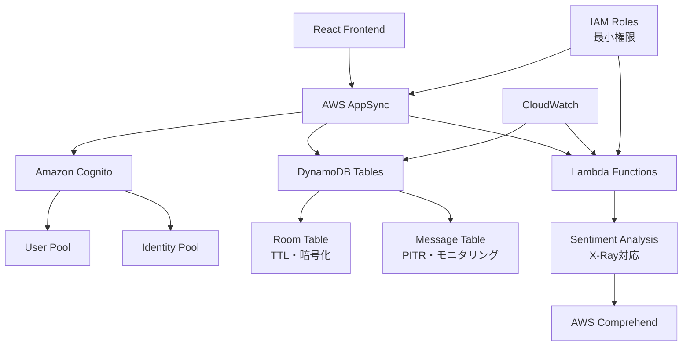

# Terraform Infrastructure Documentation

## 📊 概要

このディレクトリには、AWS AppSyncベースのチャットアプリケーション用のTerraformインフラストラクチャコード（**最適化版**）が含まれています。エンタープライズグレードのファイル分割戦略とベストプラクティスに従って構成されています。

## 🎯 最適化のハイライト

> **✅ 2024年インフラ最適化完了**
> - **ファイル分割**: 責任領域別の明確な分離
> - **セキュリティ**: 最小権限IAMとデータ暗号化
> - **モニタリング**: CloudWatch統合と詳細ログ
> - **効率化**: リソース最適化とコスト削減
> - **運用性**: 環境別設定とスケーラビリティ

## 🏗️ アーキテクチャ概要



## 📁 ファイル構造（最適化版）

```
infra/
├── main.tf                    # メイン設定・プロバイダー設定
├── variables.tf               # 🆕 変数定義・検証ルール
├── locals.tf                  # 🆕 ローカル値・設定管理
├── iam.tf                     # 🆕 IAMロール・ポリシー
├── dynamodb.tf               # 🆕 DynamoDB最適化設定
├── cognito_optimized.tf      # 🆕 Cognito強化設定
├── lambda_optimized.tf       # 🆕 Lambda最適化・監視
├── appsync_optimized.tf      # 🆕 AppSync強化設定
├── resolvers_optimized.tf    # 🆕 リゾルバー最適化
├── outputs.tf                # 出力値定義
├── variables.tf               # 変数定義（検証ルール付き）
├── locals.tf                  # ローカル値・計算値定義
├── outputs.tf                 # 出力値定義
├── terraform.tfvars.example   # 設定例ファイル
├── iam.tf                     # IAMロール・ポリシー定義
├── dynamodb.tf                # DynamoDBテーブル定義
├── cognito_optimized.tf       # Cognito認証設定
├── appsync_optimized.tf       # AppSync GraphQL API設定
├── lambda_optimized.tf        # Lambda関数設定
├── resolvers_optimized.tf     # GraphQLリゾルバー設定
└── resolver_templates/        # リゾルバーテンプレート
    └── pipeline_resolver.js.tpl
```

## 主要な最適化ポイント

### 1. ファイル分割戦略

- **責務別分離**: 各AWSサービスごとにファイルを分割
- **設定の集約**: 変数とローカル値を専用ファイルに集約
- **IAMの分離**: セキュリティ関連設定を独立したファイルに配置

### 2. リソース最適化

- **DynamoDB最適化**:
  - 環境別のPoint-in-Time Recovery設定
  - TTL設定によるメッセージ自動削除
  - 効率的なGSI設計

- **Lambda最適化**:
  - 環境変数の動的設定
  - X-Ray トレーシング対応
  - プロビジョニング済み同時実行設定

- **AppSync最適化**:
  - 環境別ログレベル設定
  - CloudWatch Dashboardの自動作成
  - X-Ray トレーシング対応

### 3. セキュリティ強化

- **最小権限の原則**: IAMポリシーの最適化
- **暗号化**: DynamoDBとLambdaでの暗号化有効化
- **MFA対応**: 本番環境でのMFA設定
- **API Key制限**: 本番環境でのAPI Key無効化

## 使用方法

### 初期セットアップ

1. **設定ファイルの準備**:
   ```bash
   cp terraform.tfvars.example terraform.tfvars
   # terraform.tfvarsを環境に応じて編集
   ```

2. **Terraformの初期化**:
   ```bash
   terraform init
   ```

3. **プランの確認**:
   ```bash
   terraform plan
   ```

4. **リソースの作成**:
   ```bash
   terraform apply
   ```

### 環境別デプロイ

#### 開発環境
```bash
terraform workspace new dev
terraform apply -var="environment=dev"
```

#### ステージング環境
```bash
terraform workspace new staging
terraform apply -var="environment=staging"
```

#### 本番環境
```bash
terraform workspace new prod
terraform apply -var="environment=prod"
```

## 主要な設定変数

| 変数名 | 説明 | デフォルト値 | 本番推奨値 |
|--------|------|-------------|-----------|
| `environment` | 環境名 | `dev` | `prod` |
| `dynamodb_billing_mode` | DynamoDB課金モード | `PAY_PER_REQUEST` | `PAY_PER_REQUEST` |
| `cognito_password_minimum_length` | パスワード最小文字数 | `8` | `12` |
| `enable_comprehend` | Comprehend有効化 | `true` | `true` |
| `enable_xray_tracing` | X-Ray有効化 | `false` | `true` |
| `appsync_log_level` | AppSyncログレベル | `ERROR` | `ERROR` |

## 出力値

### フロントエンド設定用
- `frontend_config`: React アプリケーション用の設定オブジェクト
- `appsync_graphql_endpoint`: GraphQL エンドポイントURL
- `cognito_user_pool_id`: Cognito ユーザープールID

### インフラ管理用
- `appsync_api_id`: AppSync API ID
- `dynamodb_room_table_name`: ルームテーブル名
- `lambda_sentiment_analysis_function_arn`: 感情分析Lambda ARN

## メンテナンス

### 定期的な作業

1. **セキュリティアップデート**:
   - プロバイダーバージョンの更新
   - Lambda ランタイムの更新

2. **コスト最適化**:
   - DynamoDB使用量の監視
   - Lambda実行時間の最適化

3. **バックアップ確認**:
   - DynamoDBのPoint-in-Time Recoveryステータス
   - Terraformステートファイルのバックアップ

### トラブルシューティング

#### よくある問題

1. **API Key期限切れ**:
   ```bash
   terraform refresh
   terraform apply  # API Keyが自動更新される
   ```

2. **Lambda権限エラー**:
   - IAMロールの権限を確認
   - リソースポリシーの確認

3. **DynamoDB容量エラー**:
   - GSIの設定確認
   - 課金モードの見直し

## セキュリティ考慮事項

### 本番環境での推奨設定

1. **Terraformステート管理**:
   - S3バックエンドの使用
   - ステートファイルの暗号化
   - バージョニングの有効化

2. **アクセス制御**:
   - IAMユーザーではなくロールベースアクセス
   - MFA必須化
   - 最小権限の原則

3. **監視・ログ**:
   - CloudTrailの有効化
   - CloudWatch Alarmsの設定
   - 異常検知の実装

## パフォーマンス最適化

### DynamoDB最適化

1. **アクセスパターンの最適化**:
   - ホットパーティションの回避
   - 効率的なクエリ設計

2. **コスト最適化**:
   - オンデマンド課金の使用
   - TTLによるデータライフサイクル管理

### Lambda最適化

1. **コールドスタート対策**:
   - プロビジョニング済み同時実行
   - 適切なメモリサイズ設定

2. **実行時間最適化**:
   - 不要なライブラリの削除
   - 接続プールの活用

## 関連ドキュメント

- [API設計詳細](../design/API設計詳細.md)
- [データベース設計詳細](../design/データベース設計詳細.md)
- [デプロイメント動作確認ガイド](../guides/デプロイメント動作確認ガイド.md)
- [システムアーキテクチャ図集](../architecture/システムアーキテクチャ図集.md)
