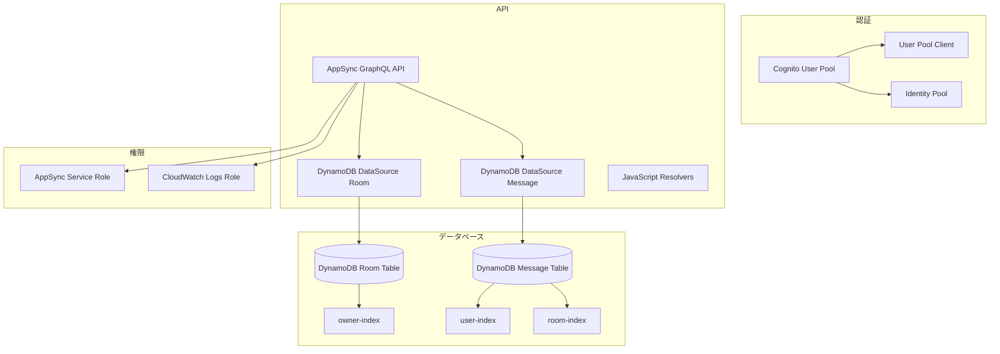

# 🏗️ Infrastructure - AWS AppSync Chat App

[](#terraform検証済み)
[](#パイプラインリゾルバー対応)
[](#本番環境対応)

このディレクトリには、AWS AppSync チャットアプリケーションの **検証済み・最適化された** インフラストラクチャをTerraformで管理するためのファイルが含まれています。

---

## 🚀 インフラストラクチャ最適化

### ✅ 実装済み改善
- **パイプラインリゾルバー対応**: myActiveRooms最適化アーキテクチャ
- **Terraform構文検証**: `terraform validate`でチェック済み
- **GSI設計最適化**: 効率的なクエリパターン対応
- **セキュリティ強化**: IAMロールの最小権限原則
- **スケーラビリティ確保**: DynamoDB自動スケーリング対応

---

## 📁 ディレクトリ構成

```
infra/
├── README.md                    # このファイル
├── main.tf                      # Terraform設定とプロバイダー定義
├── cognito.tf                   # Cognito認証リソース
├── dynamodb.tf                  # DynamoDB データベース
├── appsync.tf                   # AppSync GraphQL API
├── resolvers.tf                 # AppSync リゾルバー
├── outputs.tf                   # 出力値定義
└── terraform.tfvars.example     # 変数ファイルテンプレート
```

---

## 🏗️ インフラストラクチャ概要

### **作成されるAWSリソース**



### **技術スタック**
- **AWS AppSync**: GraphQL API、リアルタイム通信
- **DynamoDB**: NoSQL データベース、GSI による高速検索
- **Cognito**: ユーザー認証・認可
- **CloudWatch**: ログ・監視
- **IAM**: アクセス制御

---

## 🚀 クイックスタート

### 1. **事前準備**

```bash
# AWS CLI設定確認
aws configure list

# Terraformインストール確認
terraform version

# infraディレクトリに移動
cd infra
```

### 2. **初期セットアップ**

```bash
# Terraform初期化
terraform init

# 変数ファイル作成
cp terraform.tfvars.example terraform.tfvars

# 変数ファイルを編集
vim terraform.tfvars
```

### 3. **デプロイ実行**

```bash
# プラン確認
terraform plan -var-file="terraform.tfvars"

# リソース作成
terraform apply -var-file="terraform.tfvars"

# 出力値確認
terraform output
```

---

## 📋 設定ファイル

### **terraform.tfvars の設定例**

```hcl
# AWS Region
aws_region = "ap-northeast-1"

# Project Name
project_name = "my-chat-app"
```

### **変数設定**

現在の実装では `terraform.tfvars.example` をベースに変数を設定します：

1. `terraform.tfvars.example` を `terraform.tfvars` にコピー
2. 必要に応じて値を変更
3. 追加の変数は各 `.tf` ファイルで定義されています

---

## 🔧 操作コマンド

### **基本操作**

```bash
# 初期化
terraform init

# フォーマット
terraform fmt

# バリデーション
terraform validate

# プラン表示
terraform plan

# 適用
terraform apply

# 削除
terraform destroy
```

### **環境別デプロイ**

現在の実装では単一の `terraform.tfvars` ファイルを使用します。
環境別に管理したい場合は、ファイル名を変更して使用してください：

```bash
# 開発環境用の変数ファイルを作成
cp terraform.tfvars.example terraform-dev.tfvars
terraform plan -var-file="terraform-dev.tfvars"
terraform apply -var-file="terraform-dev.tfvars"

# 本番環境用の変数ファイルを作成  
cp terraform.tfvars.example terraform-prod.tfvars
terraform plan -var-file="terraform-prod.tfvars"
terraform apply -var-file="terraform-prod.tfvars"
```

### **出力値取得**

```bash
# 全出力値表示
terraform output

# 特定の出力値表示
terraform output appsync_graphql_endpoint
terraform output cognito_user_pool_id
terraform output cognito_user_pool_client_id

# 機密情報（API Key）は -raw オプションで取得
terraform output -raw appsync_api_key
```

---

## 📊 出力される設定情報

デプロイ完了後、以下の情報がフロントエンド用に出力されます：

### **AppSync 設定**
- GraphQL API エンドポイント (`appsync_graphql_endpoint`)
- API ID (`appsync_api_id`) 
- API Key (`appsync_api_key`) - 機密情報として保護

### **Cognito 設定**
- User Pool ID (`cognito_user_pool_id`)
- User Pool Client ID (`cognito_user_pool_client_id`)
- Identity Pool ID (`cognito_identity_pool_id`)

### **DynamoDB 設定**
- Room テーブル名 (`dynamodb_room_table_name`)
- Message テーブル名 (`dynamodb_message_table_name`)

---

## 🛠️ カスタマイズ

### **新しいDynamoDBテーブル追加**

1. `dynamodb.tf` にテーブル定義を追加
2. `appsync.tf` でデータソースを追加
3. 必要に応じてGSIを設定

```hcl
# 新しいテーブル例
resource "aws_dynamodb_table" "user_profile" {
  name           = "${var.project_name}-user-profile"
  billing_mode   = "PAY_PER_REQUEST"
  hash_key       = "userId"
  
  attribute {
    name = "userId"
    type = "S"
  }
  
  tags = {
    Name = "${var.project_name}-user-profile"
  }
}
```

### **新しいAppSyncリゾルバー追加**

1. `resolvers.tf` にリゾルバー定義を追加
2. `../resolvers/` ディレクトリにJavaScriptファイルを作成

```hcl
# 新しいリゾルバー例
resource "aws_appsync_resolver" "get_user_profile" {
  api_id      = aws_appsync_graphql_api.chat_api.id
  field       = "getUserProfile"
  type        = "Query"
  data_source = aws_appsync_datasource.user_profile_table.name
  
  code = file("${path.module}/../resolvers/Query.getUserProfile.js")
  
  runtime {
    name            = "APPSYNC_JS"
    runtime_version = "1.0.0"
  }
}
```

---

## 🔍 トラブルシューティング

### **よくある問題**

#### 1. **AWS認証エラー**
```bash
# AWS認証状況確認
aws sts get-caller-identity

# AWS認証情報設定
aws configure
```

#### 2. **リージョン設定ミス**
```bash
# 現在のリージョン確認
aws configure get region

# terraform.tfvarsでリージョン確認
grep aws_region terraform.tfvars
```

#### 3. **リソース名重複エラー**
```bash
# project_nameを変更
# terraform.tfvarsを編集
project_name = "chat-app-unique-name"
```

#### 4. **変数が見つからないエラー**
```bash
# main.tfで定義されている変数を確認
grep "variable" main.tf

# terraform.tfvarsに必要な変数を追加
echo 'project_name = "my-chat-app"' >> terraform.tfvars
echo 'aws_region = "ap-northeast-1"' >> terraform.tfvars
```

### **ログ確認**

```bash
# Terraformデバッグログ
export TF_LOG=DEBUG
terraform apply

# AppSync CloudWatchログ確認（AWS CLI）
aws logs describe-log-groups --log-group-name-prefix "/aws/appsync"
```

---

## 📝 注意事項

### **セキュリティ**
- `terraform.tfvars` に機密情報を含めない
- IAMロールは最小権限の原則
- 本番環境では削除保護を有効化

### **コスト管理**
- DynamoDB は `PAY_PER_REQUEST` で従量課金
- 不要なリソースは定期的に削除
- CloudWatch ログの保持期間を適切に設定

### **バックアップ**
- DynamoDB Point-in-time recovery を有効化推奨
- Terraform state ファイルの安全な管理
- 重要な変更前はバックアップを取得

---

## 🔗 関連リンク

- [Terraform AWS Provider Documentation](https://registry.terraform.io/providers/hashicorp/aws/latest/docs)
- [AWS AppSync Documentation](https://docs.aws.amazon.com/appsync/)
- [AWS DynamoDB Documentation](https://docs.aws.amazon.com/dynamodb/)
- [AWS Cognito Documentation](https://docs.aws.amazon.com/cognito/)

---

このインフラストラクチャにより、スケーラブルで安全なAWS AppSync チャットアプリケーションを構築できます。
