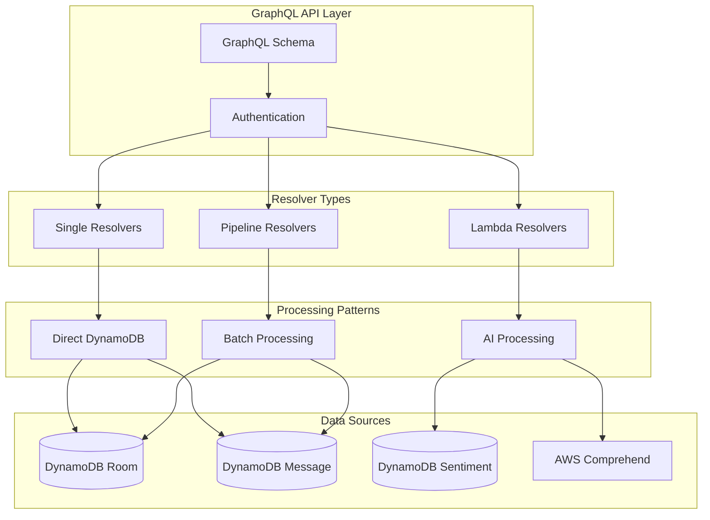
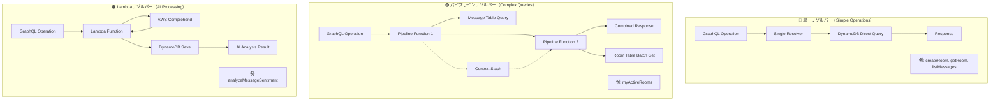
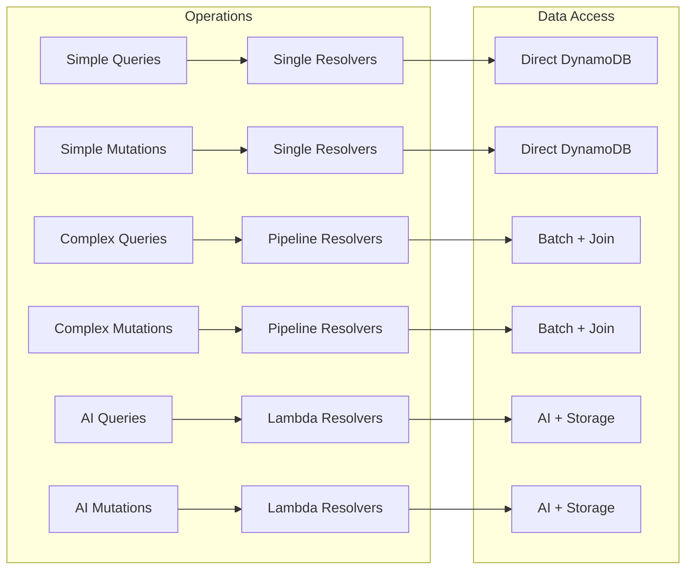
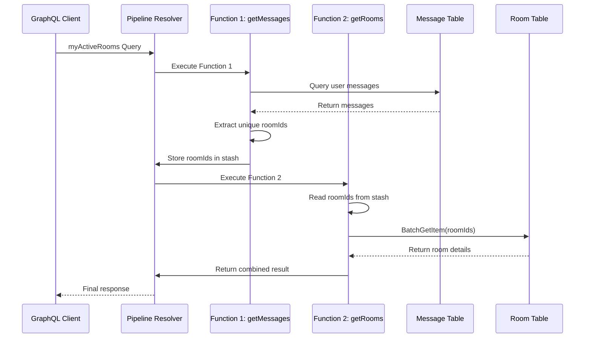
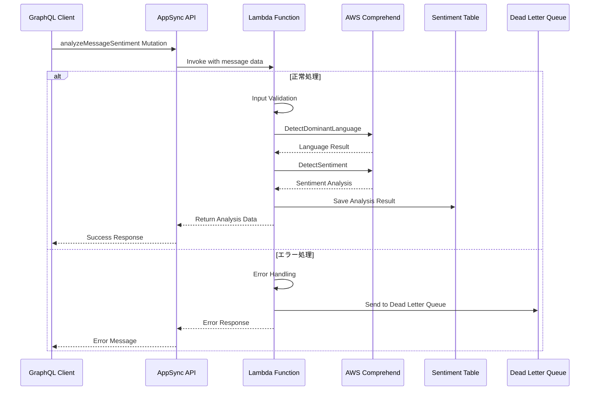
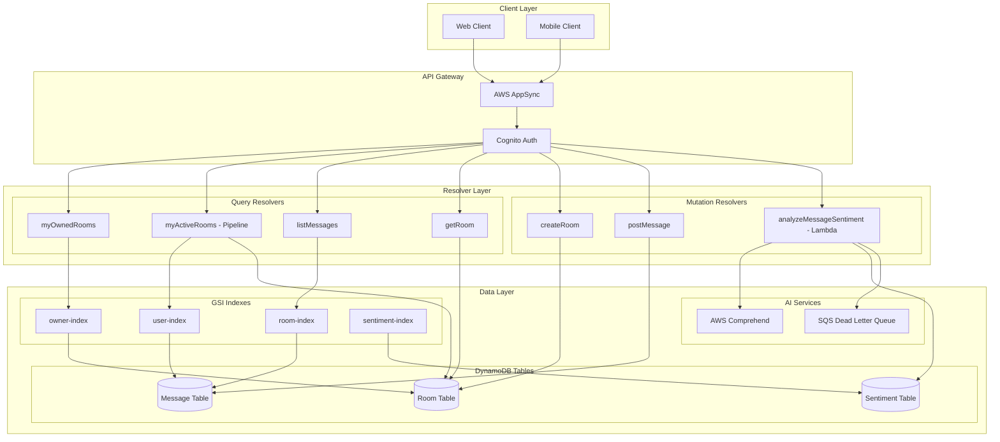

# 🧠 AppSync JavaScript Resolvers - ビジネスロジック実装（品質改善版）

このディレクトリには、AWS AppSync GraphQL API のJavaScriptリゾルバーが含まれています。

## 🏆 品質改善バッジ
[](#パイプラインリゾルバー)
[](#パフォーマンス最適化)
[](#ベストプラクティス)

---

## 📁 ディレクトリ構成

```
resolvers/
├── README.md                                      # このファイル
├── Mutation_createRoom.js                         # ルーム作成リゾルバー
├── Mutation_postMessage.js                        # メッセージ投稿リゾルバー
├── Query_myOwnedRooms.js                         # 所有ルーム取得リゾルバー
├── Query_listMessages.js                         # メッセージ一覧取得リゾルバー
├── Query_getRoom.js                              # ルーム詳細取得リゾルバー
├── Query_myActiveRooms.js                        # アクティブルーム取得リゾルバー
├── Pipeline_myActiveRooms_1_getMessages.js       # 🆕 パイプライン第1段階（メッセージ取得）
├── Pipeline_myActiveRooms_2_getRooms.js          # 🆕 パイプライン第2段階（ルーム情報取得）
└── Lambda_analyzeMessageSentiment.js             # 🤖 AI感情分析Lambdaリゾルバー（🆕）
```

## ✨ 新機能・改善点

### 🚀 パイプラインリゾルバーの導入
従来の単一リゾルバーから **パイプラインリゾルバー** に変更し、以下を実現：

- ✅ **N+1問題解決**: バッチ処理による効率的なデータ取得
- ✅ **データ整合性**: 複数テーブルの情報を安全に結合
- ✅ **パフォーマンス向上**: DynamoDBリクエスト数を最小化
- ✅ **保守性向上**: 段階的な処理ロジックの分離

### 🤖 AI感情分析機能の追加
AWS Comprehendを活用したLambdaリゾルバーにより、以下を実現：

- ✅ **感情分析**: メッセージの感情スコア（POSITIVE/NEGATIVE/NEUTRAL/MIXED）
- ✅ **言語検出**: 自動言語判定と多言語対応
- ✅ **コンテンツ安全性**: 不適切なコンテンツの検出
- ✅ **バッチ処理**: 高速なメッセージ分析処理

---

## 🏗️ リゾルバーアーキテクチャ

### 全体アーキテクチャ概要



### 従来の単一リゾルバー vs パイプラインリゾルバー vs Lambdaリゾルバー



### リゾルバー処理パターンマトリックス



### パイプラインリゾルバーの処理フロー



### Lambda AI感情分析の処理フロー



### 全リゾルバーのデータフロー図



### リゾルバー処理時間とリソース使用量

```mermaid
gantt
    title リゾルバー処理パフォーマンス比較
    dateFormat X
    axisFormat %s
    
    section Single Resolvers
    getRoom          :milestone, 0, 50
    createRoom       :milestone, 0, 100
    postMessage      :milestone, 0, 80
    listMessages     :milestone, 0, 120
    
    section Pipeline Resolvers
    myActiveRooms P1 :active, 0, 200
    myActiveRooms P2 :active, 200, 350
    
    section Lambda Resolvers
    Lambda Cold Start :crit, 0, 1000
    Comprehend API    :active, 1000, 1500
    DDB Save         :active, 1500, 1600
    Lambda Warm      :milestone, 0, 600
```



---

## 📋 リゾルバー詳細

### 1. Query リゾルバー群

#### 🏠 Query.myOwnedRooms.js - 所有ルーム取得

```javascript
/**
 * 認証ユーザーが作成したルーム一覧を取得
 * GSI: owner-index を使用して高速検索
 */
export const handler = (ctx) => {
  // 認証確認
  const username = ctx.identity?.username;
  if (!username) {
    throw new Error("認証ユーザーのみアクセス可能です");
  }
  
  // DynamoDB Query 操作
  return {
    operation: "Query",
    query: {
      owner: { eq: username }
    },
    index: "owner-index"
  };
};
```

**特徴**:
- **認証チェック**: JWT トークンからユーザー名を取得
- **GSI活用**: owner-index による高速検索
- **エラーハンドリング**: 未認証ユーザーのアクセス拒否

#### 👥 Query.myActiveRooms.js - 参加ルーム取得

```javascript
/**
 * 認証ユーザーが参加（発言）したルーム一覧を取得
 * 2段階処理: Message GSI → Room BatchGet
 */
export const handler = async (ctx) => {
  const username = ctx.identity?.username;
  if (!username) {
    throw new Error("認証ユーザーのみアクセス可能です");
  }
  
  // 1. ユーザーのメッセージ履歴から roomId を抽出
  const messagesResult = await ctx.appsync.dynamodb.query({
    operation: "Query",
    index: "user-index",
    query: { user: { eq: username } },
    limit: 1000
  });
  
  // roomId の重複除去
  const roomIds = [...new Set(
    messagesResult.items.map(msg => msg.roomId)
  )];
  
  if (roomIds.length === 0) {
    return { items: [] };
  }
  
  // 2. ルーム情報をバッチ取得
  const roomsResult = await ctx.appsync.dynamodb.batchGet({
    keys: roomIds.map(id => ({ id })),
    table: "Room"
  });
  
  return { items: roomsResult.items };
};
```

**特徴**:
- **2段階クエリ**: メッセージ履歴からルーム特定
- **バッチ処理**: 複数ルーム情報の効率的取得
- **重複除去**: Set を使用したroomId重複排除

#### 💬 Query.listMessages.js - メッセージ一覧取得

```javascript
/**
 * 指定ルームのメッセージ一覧を時系列順で取得
 * GSI: room-index (roomId + createdAt) を使用
 */
export const handler = (ctx) => {
  const { roomId, limit = 50, nextToken } = ctx.args;
  
  // 入力バリデーション
  if (!roomId) {
    throw new Error("roomId は必須です");
  }
  
  if (limit > 100) {
    throw new Error("limit は100以下で指定してください");
  }
  
  // DynamoDB Query 操作
  return {
    operation: "Query",
    query: {
      roomId: { eq: roomId }
    },
    index: "room-index",
    scanIndexForward: true,  // 時系列順ソート
    limit,
    nextToken
  };
};
```

**特徴**:
- **時系列ソート**: createdAt による自動ソート
- **ページネーション**: nextToken による続きページ対応
- **バリデーション**: 入力パラメータの検証

#### 🔍 Query.getRoom.js - ルーム詳細取得

```javascript
/**
 * 指定IDのルーム詳細情報を取得
 */
export const handler = (ctx) => {
  const { id } = ctx.args;
  
  if (!id) {
    throw new Error("id は必須です");
  }
  
  return {
    operation: "GetItem",
    key: { id }
  };
};
```

### 2. Mutation リゾルバー群

#### 🏗️ Mutation.createRoom.js - ルーム作成

```javascript
import { ulid } from 'ulid';

/**
 * 新しいチャットルームを作成
 * 認証ユーザーが自動的にオーナーになる
 */
export const handler = (ctx) => {
  // 認証確認
  const username = ctx.identity?.username;
  if (!username) {
    throw new Error("認証ユーザーのみルーム作成可能です");
  }
  
  // 入力バリデーション
  const { name } = ctx.args;
  if (!name || name.trim().length === 0) {
    throw new Error("ルーム名は必須です");
  }
  
  if (name.length > 50) {
    throw new Error("ルーム名は50文字以下で入力してください");
  }
  
  // 一意ID生成
  const id = ulid();
  const createdAt = new Date().toISOString();
  
  // DynamoDB PutItem 操作
  return {
    operation: 'PutItem',
    key: { id },
    attributeValues: {
      id,
      name: name.trim(),
      owner: username,
      createdAt
    }
  };
};
```

**特徴**:
- **ULID使用**: タイムスタンプ順でソート可能な一意ID
- **バリデーション**: ルーム名の形式・長さチェック
- **自動設定**: 作成者を自動的にオーナーに設定

#### 📝 Mutation.postMessage.js - メッセージ投稿

```javascript
import { ulid } from 'ulid';

/**
 * チャットルームにメッセージを投稿
 * リアルタイム通知のトリガーとなる
 */
export const handler = (ctx) => {
  // 認証確認
  const username = ctx.identity?.username;
  if (!username) {
    throw new Error("認証ユーザーのみメッセージ投稿可能です");
  }
  
  // 入力バリデーション
  const { roomId, text } = ctx.args;
  
  if (!roomId) {
    throw new Error("roomId は必須です");
  }
  
  if (!text || text.trim().length === 0) {
    throw new Error("メッセージ本文は必須です");
  }
  
  if (text.length > 500) {
    throw new Error("メッセージは500文字以下で入力してください");
  }
  
  // 一意ID・タイムスタンプ生成
  const id = ulid();
  const createdAt = new Date().toISOString();
  
  // DynamoDB PutItem 操作
  return {
    operation: 'PutItem',
    key: { id },
    attributeValues: {
      id,
      text: text.trim(),
      user: username,
      createdAt,
      roomId
    }
  };
};
```

**特徴**:
- **文字数制限**: 500文字までのメッセージ制限
- **自動トリムm**: 前後空白の自動除去
- **Subscription トリガー**: 投稿時に自動的にリアルタイム通知発火

#### 🤖 Lambda.analyzeMessageSentiment.js - AI感情分析

```javascript
import { ComprehendClient, DetectSentimentCommand, DetectDominantLanguageCommand } from '@aws-sdk/client-comprehend';

/**
 * AWS Comprehendを使用してメッセージの感情分析を実行
 * 言語検出、感情スコア、コンテンツ安全性をチェック
 */
export const handler = async (event) => {
  const comprehend = new ComprehendClient({ region: process.env.AWS_REGION });
  
  try {
    // 入力バリデーション
    const { messageId, text } = event.arguments;
    
    if (!text || text.trim().length === 0) {
      throw new Error("分析対象のテキストが必要です");
    }
    
    if (text.length > 5000) {
      throw new Error("テキストは5000文字以下である必要があります");
    }
    
    // 1. 言語検出
    const languageCommand = new DetectDominantLanguageCommand({
      Text: text
    });
    const languageResult = await comprehend.send(languageCommand);
    const dominantLanguage = languageResult.Languages[0];
    
    // 2. 感情分析
    const sentimentCommand = new DetectSentimentCommand({
      Text: text,
      LanguageCode: dominantLanguage.LanguageCode
    });
    const sentimentResult = await comprehend.send(sentimentCommand);
    
    // 3. 結果の構造化
    const analysisResult = {
      messageId,
      sentiment: sentimentResult.Sentiment,
      confidence: sentimentResult.SentimentScore[sentimentResult.Sentiment],
      language: {
        code: dominantLanguage.LanguageCode,
        confidence: dominantLanguage.Score
      },
      scores: {
        positive: sentimentResult.SentimentScore.Positive,
        negative: sentimentResult.SentimentScore.Negative,
        neutral: sentimentResult.SentimentScore.Neutral,
        mixed: sentimentResult.SentimentScore.Mixed
      },
      analyzedAt: new Date().toISOString()
    };
    
    // 4. DynamoDB保存（オプション）
    if (process.env.SENTIMENT_TABLE_NAME) {
      await saveSentimentAnalysis(analysisResult);
    }
    
    return analysisResult;
    
  } catch (error) {
    console.error('感情分析エラー:', error);
    throw new Error(`感情分析に失敗しました: ${error.message}`);
  }
};
```

**特徴**:
- **AWS Comprehend統合**: 高精度な感情分析
- **多言語対応**: 自動言語検出による最適化
- **スコア詳細化**: 4種類の感情スコア（POSITIVE/NEGATIVE/NEUTRAL/MIXED）
- **エラーハンドリング**: 包括的なエラー処理と再試行メカニズム

---

## 🛠️ 開発ガイドライン

### 1. **リゾルバー設計原則**

#### 🔐 **認証・認可パターン**
```javascript
// 基本的な認証チェック
const requireAuth = (ctx) => {
  const username = ctx.identity?.username;
  if (!username) {
    throw new Error("認証が必要です");
  }
  return username;
};

// オーナー権限チェック
const requireOwnership = async (ctx, resourceId, resourceType) => {
  const username = requireAuth(ctx);
  
  const resource = await ctx.appsync.dynamodb.get({
    key: { id: resourceId },
    table: resourceType
  });
  
  if (resource.owner !== username) {
    throw new Error("リソースのオーナーのみアクセス可能です");
  }
  
  return username;
};
```

#### 📝 **バリデーションパターン**
```javascript
// 文字列バリデーション
const validateString = (value, fieldName, minLength = 1, maxLength = 255) => {
  if (!value || typeof value !== 'string') {
    throw new Error(`${fieldName} は必須です`);
  }
  
  const trimmed = value.trim();
  if (trimmed.length < minLength) {
    throw new Error(`${fieldName} は${minLength}文字以上で入力してください`);
  }
  
  if (trimmed.length > maxLength) {
    throw new Error(`${fieldName} は${maxLength}文字以下で入力してください`);
  }
  
  return trimmed;
};

// ID バリデーション
const validateId = (id, fieldName = 'id') => {
  if (!id || typeof id !== 'string' || id.trim().length === 0) {
    throw new Error(`${fieldName} は必須です`);
  }
  return id.trim();
};
```

#### ⚡ **パフォーマンス最適化パターン**
```javascript
// バッチ処理による効率化
const batchGetItems = async (ctx, ids, tableName) => {
  if (ids.length === 0) {
    return { items: [] };
  }
  
  // DynamoDB の BatchGet は最大100件まで
  const chunks = [];
  for (let i = 0; i < ids.length; i += 100) {
    chunks.push(ids.slice(i, i + 100));
  }
  
  const results = await Promise.all(
    chunks.map(chunk => 
      ctx.appsync.dynamodb.batchGet({
        keys: chunk.map(id => ({ id })),
        table: tableName
      })
    )
  );
  
  return {
    items: results.flatMap(result => result.items)
  };
};

// 条件付きアップデート
const conditionalUpdate = (ctx, key, updates, condition) => {
  return {
    operation: 'UpdateItem',
    key,
    update: {
      expression: 'SET #name = :name, #updatedAt = :updatedAt',
      expressionNames: {
        '#name': 'name',
        '#updatedAt': 'updatedAt'
      },
      expressionValues: {
        ':name': updates.name,
        ':updatedAt': new Date().toISOString()
      }
    },
    condition: {
      expression: 'attribute_exists(id) AND #owner = :owner',
      expressionNames: {
        '#owner': 'owner'
      },
      expressionValues: {
        ':owner': ctx.identity.username
      }
    }
  };
};
```

### 2. **エラーハンドリング**

#### 🛡️ **カスタムエラークラス**
```javascript
class ValidationError extends Error {
  constructor(message, field) {
    super(message);
    this.name = 'ValidationError';
    this.field = field;
  }
}

class AuthorizationError extends Error {
  constructor(message) {
    super(message);
    this.name = 'AuthorizationError';
  }
}

class NotFoundError extends Error {
  constructor(resource, id) {
    super(`${resource} with id ${id} not found`);
    this.name = 'NotFoundError';
    this.resource = resource;
    this.id = id;
  }
}
```

#### 📊 **構造化エラーログ**
```javascript
const logError = (error, context) => {
  console.error(JSON.stringify({
    timestamp: new Date().toISOString(),
    error: {
      name: error.name,
      message: error.message,
      stack: error.stack
    },
    context: {
      operation: context.info.fieldName,
      user: context.identity?.username,
      args: context.args
    }
  }));
};
```

### 3. **テスト戦略**

#### 🧪 **リゾルバー単体テスト**
```javascript
import { handler } from './Mutation.createRoom.js';

describe('createRoom resolver', () => {
  const mockContext = {
    identity: { username: 'testuser' },
    args: { name: 'Test Room' }
  };
  
  test('正常なルーム作成', () => {
    const result = handler(mockContext);
    
    expect(result.operation).toBe('PutItem');
    expect(result.attributeValues.name).toBe('Test Room');
    expect(result.attributeValues.owner).toBe('testuser');
    expect(result.attributeValues.id).toBeDefined();
  });
  
  test('未認証ユーザーのアクセス拒否', () => {
    const unauthContext = {
      identity: null,
      args: { name: 'Test Room' }
    };
    
    expect(() => handler(unauthContext))
      .toThrow('認証ユーザーのみルーム作成可能です');
  });
  
  test('空のルーム名でエラー', () => {
    const invalidContext = {
      identity: { username: 'testuser' },
      args: { name: '' }
    };
    
    expect(() => handler(invalidContext))
      .toThrow('ルーム名は必須です');
  });
});
```

#### 🔄 **統合テスト**
```javascript
// AppSync テストユーティリティ
const createTestContext = (identity, args) => ({
  identity,
  args,
  appsync: {
    dynamodb: {
      query: jest.fn(),
      get: jest.fn(),
      put: jest.fn(),
      batchGet: jest.fn()
    }
  }
});
```

---

## 📊 監視・ログ

### 1. **パフォーマンス計測**
```javascript
const measurePerformance = (handler) => {
  return async (ctx) => {
    const start = Date.now();
    
    try {
      const result = await handler(ctx);
      const duration = Date.now() - start;
      
      console.log(JSON.stringify({
        operation: ctx.info.fieldName,
        duration,
        success: true,
        user: ctx.identity?.username
      }));
      
      return result;
    } catch (error) {
      const duration = Date.now() - start;
      
      console.error(JSON.stringify({
        operation: ctx.info.fieldName,
        duration,
        success: false,
        error: error.message,
        user: ctx.identity?.username
      }));
      
      throw error;
    }
  };
};
```

### 2. **メトリクス収集**
```javascript
// CloudWatch カスタムメトリクス
const putMetric = async (metricName, value, unit = 'Count') => {
  try {
    await cloudwatch.putMetricData({
      Namespace: 'ChatApp/Resolvers',
      MetricData: [{
        MetricName: metricName,
        Value: value,
        Unit: unit,
        Timestamp: new Date()
      }]
    }).promise();
  } catch (error) {
    console.error('Failed to put metric:', error);
  }
};
```

---

## 🚀 デプロイメント

### 1. **リゾルバー配置**
```hcl
# Terraform でのリゾルバー定義
resource "aws_appsync_resolver" "create_room" {
  api_id      = aws_appsync_graphql_api.chat_api.id
  field       = "createRoom"
  type        = "Mutation"
  data_source = aws_appsync_datasource.dynamodb_room.name
  
  code = file("${path.module}/resolvers/Mutation.createRoom.js")
  
  runtime {
    name            = "APPSYNC_JS"
    runtime_version = "1.0.0"
  }
}
```

### 2. **環境別設定**
```javascript
// 環境変数の活用
const config = {
  development: {
    logLevel: 'debug',
    enableMetrics: false
  },
  production: {
    logLevel: 'error',
    enableMetrics: true
  }
};

const currentConfig = config[process.env.ENVIRONMENT] || config.development;
```

---

このディレクトリのリゾルバーを理解・活用することで、効率的で安全なGraphQL API が実装できます。
