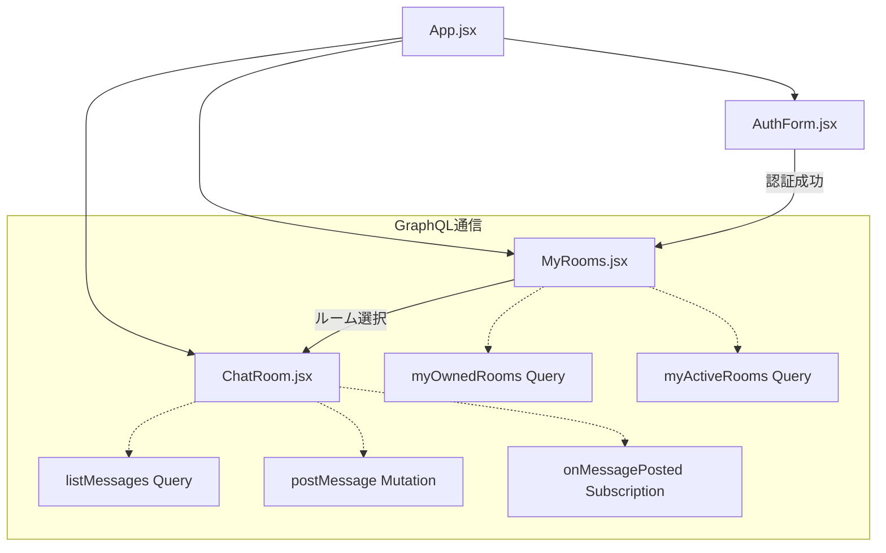

# 🎨 React Components - フロントエンド コンポーネント

このディレクトリには、AWS AppSync チャットアプリのReactコンポーネントが含まれています。

---

## 📁 ディレクトリ構成

```
components/
├── README.md           # このファイル
├── ChatRoom.jsx        # チャット画面コンポーネント
├── MyRooms.jsx         # ルーム一覧画面コンポーネント
└── AuthForm.jsx        # 認証フォームコンポーネント
```

---

## 🏗️ アーキテクチャ概要



---

## 🧩 コンポーネント詳細

### 1. ChatRoom.jsx - チャット画面コンポーネント

#### 🎯 **主要機能**
- リアルタイムメッセージ表示
- メッセージ送信機能
- メッセージ履歴取得
- WebSocketベースのリアルタイム通信

#### 📡 **使用するGraphQL操作**
```javascript
// データ取得
import { listMessages } from '../graphql/queries';
// データ変更
import { postMessage } from '../graphql/mutations';
// リアルタイム購読
import { onMessagePosted } from '../graphql/subscriptions';
```

#### 🔄 **状態管理**
```javascript
const [messages, setMessages] = useState([]);     // メッセージ一覧
const [newMessage, setNewMessage] = useState(''); // 入力中メッセージ
```

#### 🎣 **主要なフック使用パターン**
```javascript
useEffect(() => {
  // 1. 初期メッセージ履歴取得
  loadInitialMessages();
  
  // 2. リアルタイム購読開始
  const subscription = subscribeToNewMessages();
  
  // 3. クリーンアップ
  return () => subscription.unsubscribe();
}, [roomId]);
```

#### 🔗 **Props仕様**
```typescript
interface ChatRoomProps {
  roomId: string;        // 表示するルームのID
  username: string;      // 現在のユーザー名
  onBack?: () => void;   // 戻るボタンのコールバック
}
```

### 2. MyRooms.jsx - ルーム一覧画面コンポーネント

#### 🎯 **主要機能**
- 自分が作成したルーム一覧表示
- 自分が参加したルーム一覧表示
- ルーム情報の統合・重複除去
- ルーム選択ナビゲーション

#### 📡 **使用するGraphQL操作**
```javascript
// 自分が作成したルーム取得
import { myOwnedRooms } from '../graphql/queries';
// 自分が参加したルーム取得  
import { myActiveRooms } from '../graphql/queries';
```

#### 🔄 **状態管理**
```javascript
const [ownedRooms, setOwnedRooms] = useState([]);   // 所有ルーム
const [activeRooms, setActiveRooms] = useState([]); // 参加ルーム
const [loading, setLoading] = useState(true);       // ローディング状態
```

#### 🧮 **データ統合ロジック**
```javascript
// 重複除去してルーム一覧を統合
const allRooms = [
  ...ownedRooms,
  ...activeRooms.filter(room => 
    !ownedRooms.some(owned => owned.id === room.id)
  )
];
```

#### 🔗 **Props仕様**
```typescript
interface MyRoomsProps {
  username: string;                    // 現在のユーザー名
  onRoomSelect: (roomId: string) => void; // ルーム選択時のコールバック
}
```

### 3. AuthForm.jsx - 認証フォームコンポーネント

#### 🎯 **主要機能**
- ユーザーログイン
- 新規ユーザー登録
- パスワードリセット
- 認証状態管理

#### 🔐 **Amplify Auth統合**
```javascript
import { signIn, signUp, confirmSignUp } from 'aws-amplify/auth';
```

#### 🔄 **認証フロー**
```javascript
// ログインフロー
const handleSignIn = async (email, password) => {
  try {
    await signIn({ username: email, password });
    onAuthSuccess();
  } catch (error) {
    setError(error.message);
  }
};
```

---

## 🛠️ 開発ガイドライン

### 1. **コンポーネント設計原則**

#### 📦 **単一責任の原則**
- 各コンポーネントは1つの明確な責任を持つ
- 再利用可能な小さなコンポーネントに分割
- ビジネスロジックとUI ロジックの分離

#### 🎭 **Props設計**
```javascript
// ❌ 悪い例：大きすぎるProps
<ChatRoom 
  user={user} 
  rooms={rooms} 
  messages={messages} 
  settings={settings} 
/>

// ✅ 良い例：必要最小限のProps
<ChatRoom 
  roomId={selectedRoomId}
  username={user.username}
  onBack={handleBack}
/>
```

#### 🔄 **状態管理戦略**
```javascript
// ローカル状態：コンポーネント固有の一時的なデータ
const [inputValue, setInputValue] = useState('');

// 共有状態：複数コンポーネントで使用するデータ
const { user, setUser } = useContext(AuthContext);

// サーバー状態：GraphQLで管理されるデータ
const { data, loading, error } = useQuery(listMessages);
```

### 2. **GraphQL統合パターン**

#### 📡 **クエリパターン**
```javascript
// 基本的なクエリ実行
const loadData = async () => {
  try {
    setLoading(true);
    const result = await client.graphql({
      query: myQuery,
      variables: { id: itemId }
    });
    setData(result.data.myQuery);
  } catch (error) {
    setError(error.message);
  } finally {
    setLoading(false);
  }
};
```

#### ✏️ **ミューテーションパターン**
```javascript
// 楽観的更新付きミューテーション
const handleSubmit = async (formData) => {
  // 楽観的更新
  const optimisticItem = { ...formData, id: Date.now() };
  setItems(prev => [...prev, optimisticItem]);
  
  try {
    const result = await client.graphql({
      query: createItem,
      variables: formData
    });
    
    // 実際のデータで更新
    setItems(prev => 
      prev.map(item => 
        item.id === optimisticItem.id ? result.data.createItem : item
      )
    );
  } catch (error) {
    // エラー時は楽観的更新をロールバック
    setItems(prev => 
      prev.filter(item => item.id !== optimisticItem.id)
    );
    setError(error.message);
  }
};
```

#### 🔔 **サブスクリプションパターン**
```javascript
useEffect(() => {
  const subscription = client.graphql({
    query: onDataChange,
    variables: { filter: { roomId } }
  }).subscribe({
    next: ({ data }) => {
      setItems(prev => [...prev, data.onDataChange]);
    },
    error: (error) => {
      console.error('Subscription error:', error);
    }
  });

  return () => subscription.unsubscribe();
}, [roomId]);
```

### 3. **パフォーマンス最適化**

#### ⚡ **React最適化**
```javascript
// メモ化によるレンダリング最適化
const MemoizedMessageItem = React.memo(({ message }) => (
  <div>{message.text}</div>
));

// コールバック関数のメモ化
const handleSend = useCallback((text) => {
  postMessage({ roomId, text });
}, [roomId]);

// 計算結果のメモ化
const sortedMessages = useMemo(
  () => messages.sort((a, b) => new Date(a.createdAt) - new Date(b.createdAt)),
  [messages]
);
```

#### 🎯 **仮想化（大量データ対応）**
```javascript
import { FixedSizeList as List } from 'react-window';

const MessageList = ({ messages }) => (
  <List
    height={400}
    itemCount={messages.length}
    itemSize={60}
    itemData={messages}
  >
    {({ index, style, data }) => (
      <div style={style}>
        <MessageItem message={data[index]} />
      </div>
    )}
  </List>
);
```

### 4. **エラーハンドリング**

#### 🛡️ **エラー境界**
```javascript
class ErrorBoundary extends React.Component {
  constructor(props) {
    super(props);
    this.state = { hasError: false };
  }

  static getDerivedStateFromError(error) {
    return { hasError: true };
  }

  componentDidCatch(error, errorInfo) {
    console.error('Component error:', error, errorInfo);
  }

  render() {
    if (this.state.hasError) {
      return <ErrorFallback onRetry={() => this.setState({ hasError: false })} />;
    }
    return this.props.children;
  }
}
```

#### 📡 **GraphQLエラーハンドリング**
```javascript
const handleGraphQLError = (error) => {
  if (error.errors) {
    // GraphQLエラー
    const message = error.errors[0]?.message || 'GraphQL エラーが発生しました';
    setError(message);
  } else if (error.networkError) {
    // ネットワークエラー
    setError('ネットワークエラーが発生しました');
  } else {
    // その他のエラー
    setError('予期しないエラーが発生しました');
  }
};
```

---

## 🧪 テスト戦略

### 1. **単体テスト**
```javascript
import { render, screen, fireEvent } from '@testing-library/react';
import ChatRoom from './ChatRoom';

describe('ChatRoom', () => {
  test('メッセージ送信機能', async () => {
    const onSend = jest.fn();
    render(<ChatRoom roomId="test" onSend={onSend} />);
    
    const input = screen.getByPlaceholderText('メッセージを入力...');
    const button = screen.getByText('送信');
    
    fireEvent.change(input, { target: { value: 'テストメッセージ' } });
    fireEvent.click(button);
    
    expect(onSend).toHaveBeenCalledWith('テストメッセージ');
  });
});
```

### 2. **統合テスト**
```javascript
import { MockedProvider } from '@apollo/client/testing';

const mocks = [
  {
    request: { query: listMessages, variables: { roomId: 'test' } },
    result: { data: { listMessages: [] } }
  }
];

test('GraphQL統合テスト', () => {
  render(
    <MockedProvider mocks={mocks}>
      <ChatRoom roomId="test" />
    </MockedProvider>
  );
});
```

---

## 🚀 デプロイメント

### 1. **ビルド最適化**
```javascript
// webpack.config.js での最適化
module.exports = {
  optimization: {
    splitChunks: {
      chunks: 'all',
      cacheGroups: {
        vendor: {
          test: /[\\/]node_modules[\\/]/,
          name: 'vendors',
          chunks: 'all',
        },
      },
    },
  },
};
```

### 2. **環境別設定**
```javascript
// 環境変数での設定切り替え
const config = {
  development: {
    apiUrl: 'http://localhost:3000/graphql',
    logLevel: 'debug'
  },
  production: {
    apiUrl: process.env.VITE_API_URL,
    logLevel: 'error'
  }
};
```

---

このディレクトリのコンポーネントを理解・活用することで、効率的なReactアプリケーション開発が可能になります。
