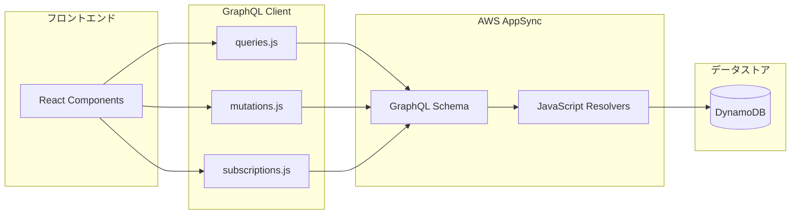

# 📡 GraphQL - API通信定義

このディレクトリには、AWS AppSync との GraphQL 通信を定義するファイルが含まれています。

---

## 📁 ディレクトリ構成

```
graphql/
├── README.md           # このファイル
├── queries.js          # データ取得クエリ
├── mutations.js        # データ変更ミューテーション
└── subscriptions.js    # リアルタイム購読
```

---

## 🏗️ GraphQL アーキテクチャ



---

## 📋 ファイル詳細

### 1. queries.js - データ取得クエリ

#### 🎯 **役割**
- サーバーからのデータ読み取り専用操作
- 冪等性を持つ（何度実行しても同じ結果）
- キャッシュ可能な操作

#### 📊 **定義されているクエリ**

##### 🏠 ルーム関連クエリ
```javascript
// 自分が作成したルーム一覧取得
export const myOwnedRooms = `
  query MyOwnedRooms {
    myOwnedRooms {
      id
      name
      owner
      createdAt
    }
  }
`;

// 自分が参加したルーム一覧取得
export const myActiveRooms = `
  query MyActiveRooms {
    myActiveRooms {
      id
      name
      owner
      createdAt
    }
  }
`;

// 特定のルーム詳細取得
export const getRoom = `
  query GetRoom($id: ID!) {
    getRoom(id: $id) {
      id
      name
      owner
      createdAt
    }
  }
`;
```

##### 💬 メッセージ関連クエリ
```javascript
// ルーム内のメッセージ一覧取得
export const listMessages = `
  query ListMessages($roomId: ID!, $limit: Int) {
    listMessages(roomId: $roomId, limit: $limit) {
      id
      text
      user
      createdAt
      roomId
    }
  }
`;
```

#### 🔍 **使用例**
```javascript
import { generateClient } from 'aws-amplify/api';
import { myOwnedRooms, listMessages } from './queries';

const client = generateClient();

// ルーム一覧取得
const loadRooms = async () => {
  try {
    const result = await client.graphql({
      query: myOwnedRooms
    });
    return result.data.myOwnedRooms;
  } catch (error) {
    console.error('Error loading rooms:', error);
  }
};

// メッセージ履歴取得
const loadMessages = async (roomId, limit = 50) => {
  try {
    const result = await client.graphql({
      query: listMessages,
      variables: { roomId, limit }
    });
    return result.data.listMessages;
  } catch (error) {
    console.error('Error loading messages:', error);
  }
};
```

### 2. mutations.js - データ変更ミューテーション

#### 🎯 **役割**
- サーバーデータの作成・更新・削除
- 副作用を持つ操作
- Subscriptionトリガーの発火元

#### ✏️ **定義されているミューテーション**

##### 🏠 ルーム関連ミューテーション
```javascript
// 新しいルーム作成
export const createRoom = `
  mutation CreateRoom($name: String!) {
    createRoom(name: $name) {
      id
      name
      owner
      createdAt
    }
  }
`;

// ルーム情報更新
export const updateRoom = `
  mutation UpdateRoom($id: ID!, $name: String!) {
    updateRoom(id: $id, name: $name) {
      id
      name
      owner
      createdAt
    }
  }
`;

// ルーム削除
export const deleteRoom = `
  mutation DeleteRoom($id: ID!) {
    deleteRoom(id: $id) {
      id
    }
  }
`;
```

##### 💬 メッセージ関連ミューテーション
```javascript
// メッセージ投稿
export const postMessage = `
  mutation PostMessage($roomId: ID!, $text: String!) {
    postMessage(roomId: $roomId, text: $text) {
      id
      text
      user
      createdAt
      roomId
    }
  }
`;

// メッセージ編集
export const updateMessage = `
  mutation UpdateMessage($id: ID!, $text: String!) {
    updateMessage(id: $id, text: $text) {
      id
      text
      user
      createdAt
      roomId
    }
  }
`;

// メッセージ削除
export const deleteMessage = `
  mutation DeleteMessage($id: ID!) {
    deleteMessage(id: $id) {
      id
    }
  }
`;
```

#### 🔧 **使用例**
```javascript
import { createRoom, postMessage } from './mutations';

// ルーム作成
const handleCreateRoom = async (roomName) => {
  try {
    const result = await client.graphql({
      query: createRoom,
      variables: { name: roomName }
    });
    return result.data.createRoom;
  } catch (error) {
    console.error('Error creating room:', error);
  }
};

// メッセージ送信
const handleSendMessage = async (roomId, messageText) => {
  try {
    const result = await client.graphql({
      query: postMessage,
      variables: { roomId, text: messageText }
    });
    return result.data.postMessage;
  } catch (error) {
    console.error('Error sending message:', error);
  }
};
```

### 3. subscriptions.js - リアルタイム購読

#### 🎯 **役割**
- サーバーからのリアルタイムデータ受信
- WebSocketベースの双方向通信
- 特定のミューテーション実行時の自動通知

#### 🔔 **定義されているサブスクリプション**

##### 🏠 ルーム関連サブスクリプション
```javascript
// 新しいルーム作成通知
export const onRoomCreated = `
  subscription OnRoomCreated {
    onRoomCreated {
      id
      name
      owner
      createdAt
    }
  }
`;

// ルーム更新通知
export const onRoomUpdated = `
  subscription OnRoomUpdated($id: ID!) {
    onRoomUpdated(id: $id) {
      id
      name
      owner
      createdAt
    }
  }
`;
```

##### 💬 メッセージ関連サブスクリプション
```javascript
// 新しいメッセージ投稿通知
export const onMessagePosted = `
  subscription OnMessagePosted($roomId: ID!) {
    onMessagePosted(roomId: $roomId) {
      id
      text
      user
      createdAt
      roomId
    }
  }
`;

// メッセージ更新通知
export const onMessageUpdated = `
  subscription OnMessageUpdated($roomId: ID!) {
    onMessageUpdated(roomId: $roomId) {
      id
      text
      user
      createdAt
      roomId
    }
  }
`;
```

#### 🎣 **使用例**
```javascript
import { onMessagePosted, onRoomCreated } from './subscriptions';

// メッセージのリアルタイム購読
useEffect(() => {
  const subscription = client.graphql({
    query: onMessagePosted,
    variables: { roomId }
  }).subscribe({
    next: ({ data }) => {
      const newMessage = data.onMessagePosted;
      setMessages(prev => [...prev, newMessage]);
    },
    error: (error) => {
      console.error('Subscription error:', error);
    }
  });

  return () => subscription.unsubscribe();
}, [roomId]);

// ルーム作成のリアルタイム購読
useEffect(() => {
  const subscription = client.graphql({
    query: onRoomCreated
  }).subscribe({
    next: ({ data }) => {
      const newRoom = data.onRoomCreated;
      setRooms(prev => [...prev, newRoom]);
    }
  });

  return () => subscription.unsubscribe();
}, []);
```

---

## 🛠️ 開発ガイドライン

### 1. **クエリ設計原則**

#### 📊 **フィールド選択の最適化**
```javascript
// ❌ 悪い例：不要なフィールドも取得
export const getUserInfo = `
  query GetUser($id: ID!) {
    getUser(id: $id) {
      id
      name
      email
      avatar
      settings
      preferences
      lastLoginAt
      # 実際には name だけ必要
    }
  }
`;

// ✅ 良い例：必要なフィールドのみ取得
export const getUserName = `
  query GetUserName($id: ID!) {
    getUser(id: $id) {
      id
      name
    }
  }
`;
```

#### 🔄 **ページネーション対応**
```javascript
export const listMessagesWithPagination = `
  query ListMessages($roomId: ID!, $limit: Int, $nextToken: String) {
    listMessages(roomId: $roomId, limit: $limit, nextToken: $nextToken) {
      items {
        id
        text
        user
        createdAt
        roomId
      }
      nextToken
    }
  }
`;
```

### 2. **エラーハンドリング**

#### 🛡️ **GraphQLエラーの種類と対応**
```javascript
const handleGraphQLOperation = async (operation) => {
  try {
    const result = await client.graphql(operation);
    return result.data;
  } catch (error) {
    if (error.errors) {
      // GraphQLエラー（バリデーション、認証等）
      error.errors.forEach(gqlError => {
        switch (gqlError.errorType) {
          case 'Unauthorized':
            redirectToLogin();
            break;
          case 'ValidationError':
            showValidationMessage(gqlError.message);
            break;
          default:
            showGenericError(gqlError.message);
        }
      });
    } else if (error.networkError) {
      // ネットワークエラー
      showNetworkError();
    } else {
      // その他のエラー
      showGenericError('予期しないエラーが発生しました');
    }
  }
};
```

#### 🔄 **リトライ機能**
```javascript
const withRetry = async (operation, maxRetries = 3) => {
  for (let attempt = 1; attempt <= maxRetries; attempt++) {
    try {
      return await client.graphql(operation);
    } catch (error) {
      if (attempt === maxRetries) {
        throw error;
      }
      
      // 指数バックオフでリトライ
      const delay = Math.pow(2, attempt) * 1000;
      await new Promise(resolve => setTimeout(resolve, delay));
    }
  }
};
```

### 3. **パフォーマンス最適化**

#### 💾 **キャッシュ戦略**
```javascript
// Apollo Client風のキャッシュ設定例
const cacheConfig = {
  typePolicies: {
    Room: {
      fields: {
        messages: {
          merge(existing = [], incoming) {
            return [...existing, ...incoming];
          }
        }
      }
    }
  }
};
```

#### 🎯 **バッチ処理**
```javascript
// 複数のクエリを並行実行
const loadDashboardData = async () => {
  const [roomsResult, messagesResult, userResult] = await Promise.all([
    client.graphql({ query: myOwnedRooms }),
    client.graphql({ query: recentMessages }),
    client.graphql({ query: userProfile })
  ]);
  
  return {
    rooms: roomsResult.data.myOwnedRooms,
    messages: messagesResult.data.recentMessages,
    user: userResult.data.userProfile
  };
};
```

### 4. **型安全性の向上**

#### 📝 **TypeScript統合**
```typescript
// 型定義の例
interface Room {
  id: string;
  name: string;
  owner: string;
  createdAt: string;
}

interface Message {
  id: string;
  text: string;
  user: string;
  createdAt: string;
  roomId: string;
}

// GraphQL操作の型付け
type MyOwnedRoomsQuery = {
  myOwnedRooms: Room[];
};

type PostMessageMutation = {
  postMessage: Message;
};
```

#### 🔧 **Code Generation**
```javascript
// graphql-code-generator を使用した自動型生成
// codegen.yml 設定例
const config = {
  schema: 'schema.graphql',
  documents: 'src/graphql/**/*.js',
  generates: {
    'src/generated/graphql.ts': {
      plugins: [
        'typescript',
        'typescript-operations',
        'typescript-react-apollo'
      ]
    }
  }
};
```

---

## 🧪 テスト戦略

### 1. **クエリテスト**
```javascript
import { queries } from './queries';

describe('GraphQL Queries', () => {
  test('myOwnedRooms query structure', () => {
    expect(queries.myOwnedRooms).toContain('myOwnedRooms');
    expect(queries.myOwnedRooms).toContain('id');
    expect(queries.myOwnedRooms).toContain('name');
  });
});
```

### 2. **モック化**
```javascript
// テスト用のGraphQLモック
const mockGraphQLClient = {
  graphql: jest.fn().mockImplementation(({ query }) => {
    if (query.includes('myOwnedRooms')) {
      return Promise.resolve({
        data: {
          myOwnedRooms: [
            { id: '1', name: 'Test Room', owner: 'testuser' }
          ]
        }
      });
    }
  })
};
```

---

## 📊 監視・デバッグ

### 1. **GraphQL操作のログ**
```javascript
// 開発環境でのクエリログ
const logGraphQLOperation = (operation, variables, result) => {
  if (process.env.NODE_ENV === 'development') {
    console.group('GraphQL Operation');
    console.log('Query:', operation.query);
    console.log('Variables:', variables);
    console.log('Result:', result);
    console.groupEnd();
  }
};
```

### 2. **パフォーマンス計測**
```javascript
const measureGraphQLPerformance = async (operation) => {
  const startTime = performance.now();
  
  try {
    const result = await client.graphql(operation);
    const endTime = performance.now();
    
    console.log(`GraphQL operation took ${endTime - startTime} milliseconds`);
    return result;
  } catch (error) {
    const endTime = performance.now();
    console.error(`GraphQL operation failed after ${endTime - startTime} milliseconds`);
    throw error;
  }
};
```

---

このディレクトリのGraphQL定義を適切に活用することで、効率的で保守性の高いAPI通信が実現できます。
